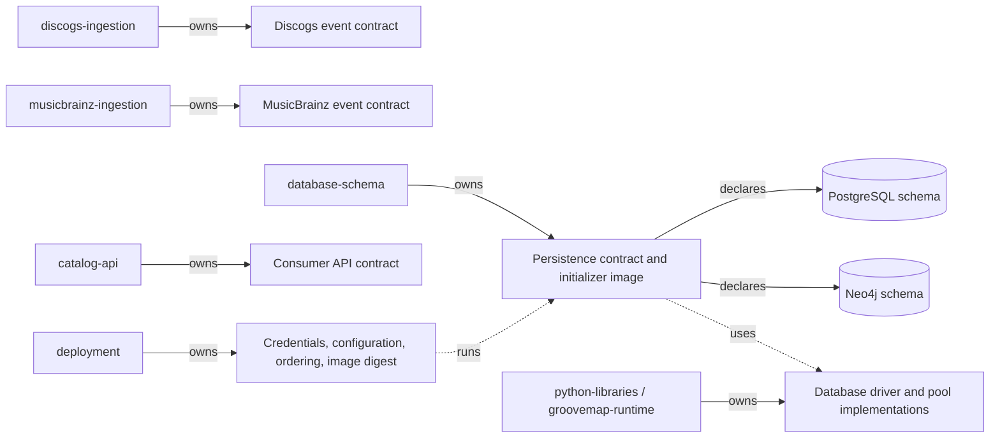
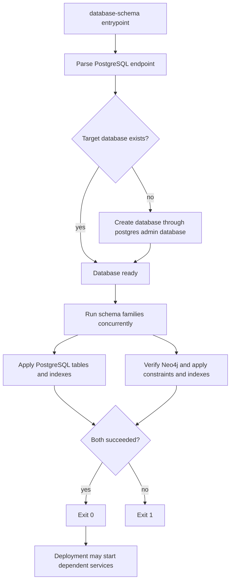

# Initializer architecture

`database-schema` owns the executable Neo4j and PostgreSQL definitions, their compatibility
contract, and the one-shot initializer image. Deployment owns credentials, service ordering,
resource policy, and the released image digest. Schema implementation files do not move into
deployment.

The source-specific ingestion repositories own their event shapes. This repository owns only
the persistence definitions and compatibility metadata; it does not own producer payloads,
consumer API shape, credentials, or rollout orchestration. The former combined
`catalog-ingestion` repository is retired and is not an active owner.

## Execution flow

The PostgreSQL administrative connection has a bounded connection timeout. Each schema
statement is idempotent, and a partial statement failure is still fatal to the initializer.
The Neo4j path verifies connectivity before applying definitions. Both clients are closed on
success or failure.

## Health and failure contract

The image intentionally has no listening port or Docker health check. Its process exit status
is the health contract: zero means the target database exists and both schema families were
applied; any administrative connection, connectivity, or schema failure returns nonzero.
Deployment may retry or stop the rollout, but it must not reinterpret a failed initializer as
healthy.

The image runs as numeric user and group `1000:1000`, writes optional logs under `/logs`, and
is named `ghcr.io/groovemap-music/database-schema` when released.

## Neo4j media schema

[ADR 0007](https://github.com/groovemap-music/design/blob/main/docs/adr/0007-canonical-media-taxonomy.md)
introduces a canonical media taxonomy, with the canonical block shape defined by
[`taxonomy/media/v1/media-block.schema.json`](https://github.com/groovemap-music/design/blob/main/taxonomy/media/v1/media-block.schema.json)
in the design repository. Neo4j gains two supporting node types alongside the existing
Artist, Label, Master, Release, Genre, Style, User, and Person nodes:

- `Medium` — one canonical medium (for example `vinyl_lp`), unique on `id`, with `family` and
  `label` properties.
- `MediaFamily` — one of the closed set of media families (for example `vinyl`), unique on
  `name`.

Two relationships connect them into the existing graph:

- `(:Medium)-[:IN_FAMILY]->(:MediaFamily)` — the medium's family.
- `(:Release)-[:ISSUED_ON {qty, source}]->(:Medium)` — the media a release was issued on.
  `qty` is the unit count for that medium on that release (Discogs `qty`, or `1` per
  MusicBrainz medium); `source` names the producer that asserted the edge (`discogs` or
  `musicbrainz`), so a release known to both catalogs can carry both catalogs' media and the
  API can reconcile disagreements between them.

`Release` also carries a `media_families` list property — the sorted, unique family names
present on that release — so consumers can filter by family without traversing `ISSUED_ON`
edges. See `SCHEMA_STATEMENTS` in `src/groovemap_schema/neo4j.py` for the backing
constraints and index.

The complete executable inventory is `SCHEMA_STATEMENTS` in
[`src/groovemap_schema/neo4j.py`](../src/groovemap_schema/neo4j.py). It currently declares
unique constraints for `Artist.id`, `Label.id`, `Master.id`, `Release.id`, `Genre.name`,
`Style.name`, `Medium.id`, `MediaFamily.name`, `User.id`, and `Person.name`. Constraint-backed
properties deliberately have no duplicate range index. Additional range indexes cover
ingestion hashes, selected names and years, `Release.media_families`, genre/style first years,
`Person.credit_count`, and MusicBrainz identifiers; six full-text indexes cover artist,
release, label, genre, style, and person text search. These are schema declarations, not node
or relationship creation: the source-specific producers populate the graph.

## PostgreSQL media schema

The PostgreSQL family gains an indexed `media JSONB` column, holding the canonical media
block, on every release-shaped table: `releases`, `musicbrainz.releases`, `user_collections`,
and `user_wantlists`. `releases`, `musicbrainz.releases`, and `user_collections` each carry a
GIN index on `media->'families'` for medium-family filtering; the raw provider fields
(`data`, `formats`, `format`) are unchanged and remain the provenance record.
`insights.release_rarity` gains `media_families`, `family_signals`, and `medium_rarity` as
additive, media-neutral rarity signals alongside the retained `format_rarity`. Every change
is additive within persistence contract v1 — see
[the persistence compatibility contract](../contracts/persistence/).

The executable PostgreSQL inventory is in
[`src/groovemap_schema/postgres.py`](../src/groovemap_schema/postgres.py):

- public Discogs document tables: `artists`, `labels`, `masters`, and `releases`;
- account and operational tables: `users`, `oauth_tokens`, `app_tokens`, `app_config`,
  `user_collections`, `user_wantlists`, `sync_history`, `extraction_history`, `queue_metrics`,
  `service_health_metrics`, and `admin_audit_log`;
- insight tables in the `insights` schema: `artist_centrality`, `genre_trends`,
  `label_longevity`, `monthly_anniversaries`, `data_completeness`, `release_rarity`,
  `community_counts`, and `computation_log`; and
- MusicBrainz tables in the `musicbrainz` schema: `artists`, `labels`, `releases`,
  `release_groups`, `relationships`, and `external_links`.

The statement lists also carry the migrations required for an existing database: additive
authentication and media columns, rarity-signal columns, Discogs cross-reference widening to
`BIGINT`, and the widened `musicbrainz.relationships` natural key. The latter uses `UNIQUE NULLS
NOT DISTINCT` across both entity identifiers and types, relationship type, dates, and
attributes. These statements intentionally run with the table/index declarations because
`CREATE TABLE IF NOT EXISTS` cannot update an existing table. Do not translate them into an
out-of-band migration or remove retained provenance fields.

## Media schema consumer promotion

Downstream services do not track `database-schema` continuously; each pins
`contracts/persistence/v1` to a specific, reviewed `database-schema` commit and promotes to a
later commit deliberately, the same way
[`compatibility.json`](../contracts/persistence/v1/compatibility.json) pins the tested
`groovemap-runtime` commit for that contract version. The Neo4j and PostgreSQL media changes
described above are additive within persistence contract version 1: no rename, removal, type
change, or relationship-semantics change, so a consumer promotes to a commit that includes
them without a migration or a lockstep upgrade across services. See
[the persistence compatibility contract](../contracts/README.md) for the full
additive-versus-destructive policy and the expand/migrate/contract ordering a breaking change
would require.
