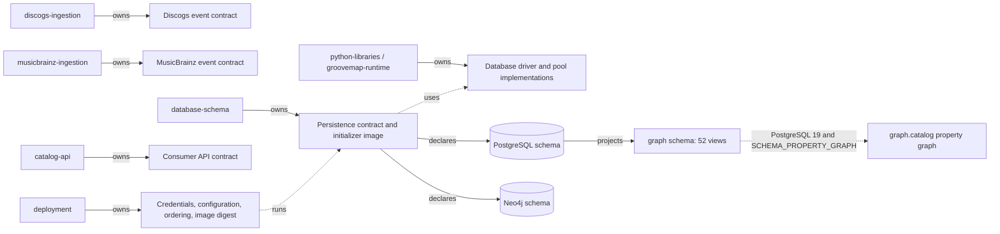
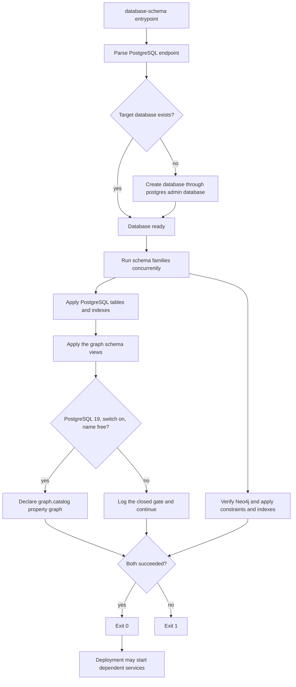

# Initializer architecture

`database-schema` owns the executable Neo4j and PostgreSQL definitions, their compatibility
contract, and the one-shot initializer image. Deployment owns credentials, service ordering,
resource policy, and the released image digest. Schema implementation files do not move into
deployment.



The source-specific ingestion repositories own their event shapes. This repository owns only
the persistence definitions and compatibility metadata; it does not own producer payloads,
consumer API shape, credentials, or rollout orchestration. The former combined
`catalog-ingestion` repository is retired and is not an active owner.

## Execution flow



The PostgreSQL administrative connection has a bounded connection timeout. Each schema
statement is idempotent, and a partial statement failure is still fatal to the initializer.
The property graph branch is the one place a statement is skipped rather than executed; a
closed gate is logged and the run continues, and only a failure once every gate is open counts
against the exit status. See [the property graph](#property-graph).
The Neo4j path verifies connectivity before applying definitions. Both clients are closed on
success or failure.

## Health and failure contract

The image intentionally has no listening port or Docker health check. Its process exit status
is the health contract: zero means the target database exists and both schema families were
applied; any administrative connection, connectivity, or schema failure returns nonzero.
Deployment may retry or stop the rollout, but it must not reinterpret a failed initializer as
healthy.

The image runs as numeric user and group `1000:1000`, writes optional logs under `/logs`, and
is named `ghcr.io/groovemap-music/database-schema` when released.

## Integration tiers

The real-engine proof runs twice over one script, `scripts/test-integration.sh`. The script
takes its engine images from `POSTGRES_INTEGRATION_IMAGE` and `NEO4J_INTEGRATION_IMAGE`, so a
tier is an image choice rather than a second copy of the test. Both tiers apply the production
initializers twice, compare the PostgreSQL and Neo4j catalogs across the two passes, assert
that the six native identity tables carry an engine `uuidv7()` default, and prove sentinel
rows survive the second pass.

| Tier | Recipe | PostgreSQL engine | CI status |
| --- | --- | --- | --- |
| Required | `just test-integration` | `postgres:18-alpine`, digest-pinned | Blocks merge |
| Advisory | `just test-integration-pg19` | `postgres:19beta3-alpine`, digest-pinned | Reports only |

The required tier is the gate. It pins the PostgreSQL major version deployment runs, and the
shared reusable workflow executes it as `integration-command`. The advisory tier exists so the
schema has a real PostgreSQL 19 engine to test on before general availability, and so a
regression in a beta is visible here rather than on the day deployment upgrades. Because the
reusable workflow accepts a single integration command, the advisory tier is a
repository-local job in [`.github/workflows/ci.yml`](../.github/workflows/ci.yml) that calls
the recipe directly and carries `continue-on-error: true`. A beta failure is therefore a
signal, not a merge block. Both tiers share the same Neo4j image; only the PostgreSQL engine
differs, so a divergence between them is attributable to the engine.

### Promoting the beta tier at general availability

When PostgreSQL 19 reaches general availability, promote the advisory tier in this order:

1. Repoint `test-integration-pg19` in the [`Justfile`](../Justfile) at the digest of the
   released `postgres:19-alpine` image and confirm the tier passes locally.
2. Move the released digest onto `test-integration` so the required tier gates on
   PostgreSQL 19, and coordinate that change with the deployment repository, which owns the
   running engine version.
3. Delete the `postgres-19-beta` job from `ci.yml`, drop the `test-integration-pg19` recipe,
   and remove the two-tier assertions from
   [`scripts/check-repository.py`](../scripts/check-repository.py), which enforces that the
   required job stays free of `continue-on-error` and that the advisory job keeps it.
4. Update this section and the README so the repository again documents a single required
   integration tier.

Until step 2 lands, the PostgreSQL 18 digest and recipe are the gate and must not be changed
to accommodate a beta result.

## Neo4j media schema

[ADR 0007](https://github.com/groovemap-music/design/blob/main/docs/adr/0007-canonical-media-taxonomy.md)
introduces a canonical media taxonomy, with the canonical block shape defined by
[`taxonomy/media/v1/media-block.schema.json`](https://github.com/groovemap-music/design/blob/main/taxonomy/media/v1/media-block.schema.json)
in the design repository. Neo4j gains two supporting node types alongside the existing
Artist, Label, Master, Release, Genre, Style, User, and Person nodes:

- `Medium` — one canonical medium (for example `vinyl_lp`), unique on `id`, with `family` and
  `label` properties.
- `MediaFamily` — one of the closed set of media families (for example `vinyl`), unique on
  `name`.

Two relationships connect them into the existing graph:

- `(:Medium)-[:IN_FAMILY]->(:MediaFamily)` — the medium's family.
- `(:Release)-[:ISSUED_ON {qty, source}]->(:Medium)` — the media a release was issued on.
  `qty` is the unit count for that medium on that release (Discogs `qty`, or `1` per
  MusicBrainz medium); `source` names the producer that asserted the edge (`discogs` or
  `musicbrainz`), so a release known to both catalogs can carry both catalogs' media and the
  API can reconcile disagreements between them.

`Release` also carries a `media_families` list property — the sorted, unique family names
present on that release — so consumers can filter by family without traversing `ISSUED_ON`
edges. See `SCHEMA_STATEMENTS` in `src/groovemap_schema/neo4j.py` for the backing
constraints and index.

The complete executable inventory is `SCHEMA_STATEMENTS` in
[`src/groovemap_schema/neo4j.py`](../src/groovemap_schema/neo4j.py). It currently declares
unique constraints for `Artist.id`, `Label.id`, `Master.id`, `Release.id`, `Genre.name`,
`Style.name`, `Medium.id`, `MediaFamily.name`, `User.id`, and `Person.name`. Constraint-backed
properties deliberately have no duplicate range index. Additional range indexes cover
ingestion hashes, selected names and years, `Release.media_families`, genre/style first years,
`Person.credit_count`, and MusicBrainz identifiers; six full-text indexes cover artist,
release, label, genre, style, and person text search. These are schema declarations, not node
or relationship creation: the source-specific producers populate the graph.

## Neo4j identity projection

[ADR 0009](https://github.com/groovemap-music/design/blob/main/docs/adr/0009-native-identity-and-provider-aliases.md)
introduces GrooveMap-minted native identity in PostgreSQL (see Identity below). Neo4j's
share of that is four range indexes — `artist_gm_id`, `label_gm_id`, `master_gm_id`, and
`release_gm_id` — on a `gm_id` property on `Artist`, `Label`, `Master`, and `Release`. Nodes
keep their existing provider `id` and its unique constraint; `gm_id` carries no constraint of
its own because the property is additive and null until a projection job backfills it from
`provider_aliases`, and a uniqueness constraint cannot be declared over a property most nodes
don't yet have. See `SCHEMA_STATEMENTS` in `src/groovemap_schema/neo4j.py` for the four
statements.

## Identity

[ADR 0009](https://github.com/groovemap-music/design/blob/main/docs/adr/0009-native-identity-and-provider-aliases.md)
adds GrooveMap-minted UUIDv7 identity for five entities in PostgreSQL, so every catalog row
and physical copy has an id that does not depend on any one provider staying alive or
consistent. Six new tables carry this, declared in `_USER_TABLES` in
[`src/groovemap_schema/postgres.py`](../src/groovemap_schema/postgres.py) after `users`,
`user_collections`, and `user_wantlists` because they reference those tables:

- `catalog_items` — one row per native entity (`release`, `master`, `artist`, or `label`);
  the id every other identity table and the additive `gm_item_id` columns point at.
- `artifacts` — an edition of a catalog item, optionally attributed to the user who first
  captured it.
- `owned_copies` — the physical copy a user holds. It exists because a user says it does, not
  because a provider listed it, and its optional `collection_row_id` back-link to
  `user_collections` is set to `NULL` on delete rather than cascading, so the copy survives a
  collection resync.
- `collection_snapshots` — a point-in-time content hash and copy-id list for a user's
  collection, for detecting drift between syncs.
- `observations` — user-captured evidence about a copy or an edition (a matrix inscription, a
  grading, a purchase price); a check constraint requires at least one of `owned_copy_id` or
  `artifact_id` to be set.
- `provider_aliases` — maps every external namespace (Discogs, MusicBrainz, Wikidata,
  barcodes, catalogue numbers, ISRCs, matrix inscriptions, …) onto a native id, with a
  validity interval so a provider merge or split is a new row rather than an in-place
  rewrite.

`provider_aliases` carries the lookup-or-create key: a unique index on
`(provider, entity_kind, external_id)` scoped to `WHERE valid_to IS NULL`. Because the
uniqueness holds only over the currently valid row rather than the whole table, any number of
concurrent writers can run the same `SELECT` / `INSERT ... ON CONFLICT DO NOTHING` / re-`SELECT`
sequence against the same external id and converge on one native id, instead of racing to
insert two aliases for the same provider entity.

Every provider-keyed table also gains an additive, nullable `gm_item_id UUID` column pointing
at `catalog_items`, each with a plain index: the four Discogs entity tables (`artists`,
`labels`, `masters`, `releases`, added in `_entity_schema_statements()`), the four
`musicbrainz.*` entity tables (`artists`, `labels`, `releases`, `release_groups`, indexed by
`idx_mb_artists_gm_item_id`, `idx_mb_labels_gm_item_id`, `idx_mb_releases_gm_item_id`, and
`idx_mb_release_groups_gm_item_id`), and `user_collections` and `user_wantlists`. Discogs
`data_id`/`release_id` and the `musicbrainz.*` `mbid` columns remain each table's primary key;
`gm_item_id` is a pointer into the native identity graph, not a replacement key.
`user_collections` also gains an additive, nullable `owned_copy_id UUID` column (indexed by
`idx_user_collections_owned_copy_id`), the native counterpart to the provider `instance_id`
that will eventually identify the physical copy. Both `release_id`/`instance_id` and the
Discogs/MusicBrainz primary keys stay authoritative until a future contraction decision
retires them.

Every table and column above is additive within persistence contract v1 — see
[the persistence compatibility contract](../contracts/persistence/).

## Activity

[ADR 0010](https://github.com/groovemap-music/design/blob/main/docs/adr/0010-first-party-events-consent-and-deletion.md)
adds a first-party, append-only behavioural record in a new `activity` PostgreSQL schema,
declared in `_ACTIVITY_STATEMENTS` in
[`src/groovemap_schema/postgres.py`](../src/groovemap_schema/postgres.py) after the
user-owned tables because `activity.user_subjects` and `activity.consent_grants` reference
`users(id)`:

- `activity.user_subjects` — the pseudonym link from a user id to a `subject_id`. Events and
  impressions reference only `subject_id`, never the user id, so the behavioural tables can be
  read and joined without carrying account identity, and removing this one row is what makes
  an erased subject unre-associable with the account it belonged to.
- `activity.consent_grants` — per-purpose consent (`product_analytics` or `model_training`); a
  revocation sets `revoked_at` rather than deleting the grant, so history stays
  reconstructible.
- `activity.events` — the typed event envelope: event type, schema/feature/model versions, the
  `subject_id`, and a `consent_purposes` snapshot taken at write time.
- `activity.impressions` — what a shown recommendation needs for later offline evaluation
  (`policy_id`, `candidate_set_id`, `position`, `propensity`); outcomes are recorded as
  `activity.events` rows carrying the impression id, never as columns here, which is what
  keeps an impression row immutable while one impression accrues several outcomes.

`activity.events` and `activity.impressions` are both declared `PARTITION BY RANGE
(occurred_at)` — month-range partitions — and each has a `_default` partition
(`activity.events_default`, `activity.impressions_default`) so an insert into a month with no
partition yet does not fail. The `activity.ensure_month_partition(table_name, month)` function
is what a writer calls before insert to land the row in its own partition: it creates
`<table>_yYYYYmMM` for that month if it doesn't already exist and returns the partition name.

Both tables are immutable by construction, not by convention. The `activity.reject_mutation()`
trigger function raises unless the session-local `groovemap.erasure` setting is `on`, and a
`BEFORE UPDATE OR DELETE` trigger on each of `activity.events` and `activity.impressions`
(`activity_events_reject_mutation`, `activity_impressions_reject_mutation`) invokes it —
declared on the partitioned table, so the trigger applies to every existing partition and is
cloned onto partitions `ensure_month_partition()` creates later. Only the erasure procedure
sets `groovemap.erasure`, and because the setting is session-local the bypass never outlives
the transaction that opened it.

`activity.erasures` records each erasure run: `subject_id`, timing, the count of
events/impressions deleted, and `model_versions_before` — the model versions that had already
trained on the data before it was deleted, so the residual question ("which models saw this
subject's data") stays answerable rather than invisible.

Every table, function, and trigger above is additive within persistence contract v1 — see
[the persistence compatibility contract](../contracts/persistence/).

## PostgreSQL media schema

The PostgreSQL family gains an indexed `media JSONB` column, holding the canonical media
block, on every release-shaped table: `releases`, `musicbrainz.releases`, `user_collections`,
and `user_wantlists`. `releases`, `musicbrainz.releases`, and `user_collections` each carry a
GIN index on `media->'families'` for medium-family filtering; the raw provider fields
(`data`, `formats`, `format`) are unchanged and remain the provenance record.
`insights.release_rarity` gains `media_families`, `family_signals`, and `medium_rarity` as
additive, media-neutral rarity signals alongside the retained `format_rarity`. Every change
is additive within persistence contract v1 — see
[the persistence compatibility contract](../contracts/persistence/).

The executable PostgreSQL inventory is in
[`src/groovemap_schema/postgres.py`](../src/groovemap_schema/postgres.py):

- public Discogs document tables: `artists`, `labels`, `masters`, and `releases`;
- account and operational tables: `users`, `oauth_tokens`, `app_tokens`, `app_config`,
  `user_collections`, `user_wantlists`, `sync_history`, `extraction_history`, `queue_metrics`,
  `service_health_metrics`, and `admin_audit_log`;
- native identity tables (see Identity above): `catalog_items`, `artifacts`, `owned_copies`,
  `collection_snapshots`, `observations`, and `provider_aliases`;
- insight tables in the `insights` schema: `artist_centrality`, `genre_trends`,
  `label_longevity`, `monthly_anniversaries`, `data_completeness`, `release_rarity`,
  `community_counts`, `computation_log`, and `activity_summary` (analytics-engine's
  daily per-dimension rollup of `activity` events and impressions, keyed by
  `summary_date`, `dimension`, and `dimension_key`);
- activity tables in the `activity` schema (see Activity above): `user_subjects`,
  `consent_grants`, `events`, `impressions`, and `erasures`; and
- MusicBrainz tables in the `musicbrainz` schema: `artists`, `labels`, `releases`,
  `release_groups`, `relationships`, and `external_links`.

The statement lists also carry the migrations required for an existing database: additive
authentication and media columns, rarity-signal columns, Discogs cross-reference widening to
`BIGINT`, and the widened `musicbrainz.relationships` natural key. The latter uses `UNIQUE NULLS
NOT DISTINCT` across both entity identifiers and types, relationship type, dates, and
attributes. These statements intentionally run with the table/index declarations because
`CREATE TABLE IF NOT EXISTS` cannot update an existing table. Do not translate them into an
out-of-band migration or remove retained provenance fields.

## Catalog identifiers, manufacturing credits, and release country

[ADR 0011](https://github.com/groovemap-music/design/blob/main/docs/adr/0011-catalog-identifiers-and-manufacturing-credits.md)
adds two PostgreSQL GIN indexes over the additive `identifiers` and `companies` blocks that
`discogs-ingestion` attaches to every Discogs `releases` event, a Neo4j `Company` node, the
`CREDITED_TO` manufacturing-credit edge, and a `Release.country` range index.

PostgreSQL gains `idx_releases_identifiers` on `data->'identifiers'` and
`idx_releases_companies` on `data->'companies'`, GIN indexes declared beside
`idx_releases_genres`, `idx_releases_labels`, and `idx_releases_media_families` in
`_SPECIFIC_INDEXES` in [`src/groovemap_schema/postgres.py`](../src/groovemap_schema/postgres.py).
They serve analytical containment queries over the two blocks; exact barcode and
catalogue-number lookup resolves through `provider_aliases` (see Identity above) instead.

Neo4j gains `Company` — one manufacturing, mastering, or distribution credit party, unique on
`id` (the `company_id` constraint) — alongside the existing Artist, Label, Master, Release,
Genre, Style, Medium, MediaFamily, User, and Person nodes. The credit itself is a
relationship:

- `(:Release)-[:CREDITED_TO {role, role_category, source}]->(:Company)` — a manufacturing,
  mastering, or rights credit a catalog asserts about a release. `role` is the raw credit
  string and `role_category` its closed-vocabulary category, the same pattern
  `(:Person)-[:CREDITED_ON {role}]->(:Release)` already uses for a person credit; `source`
  names the asserting catalog, the same pattern `(:Release)-[:ISSUED_ON {qty, source}]->(:Medium)`
  above already uses. Like those two edges, `CREDITED_TO` is documented here rather than
  declared in `SCHEMA_STATEMENTS` — the source-specific graph enrichers write it, and this
  repository declares only the `Company.id` constraint it depends on.

`Release` also gains a `country` range index (`release_country`), backing an additive
`Release.country` property that the Discogs graph enricher writes from the release's country,
and an additive `Release.mb_country` property the MusicBrainz graph enricher writes on
releases it matches. `releases.data->>'country'` is already indexed in PostgreSQL
(`idx_releases_country`); this closes the same gap in the graph. See `SCHEMA_STATEMENTS` in
[`src/groovemap_schema/neo4j.py`](../src/groovemap_schema/neo4j.py) for the `company_id`
constraint and the `release_country` index.

Every index and constraint above is additive within persistence contract v1 — see
[the persistence compatibility contract](../contracts/persistence/).

## Graph schema

The `graph` schema re-presents the catalog tables as the vertex and edge relations of the
property graph the Neo4j enrichers already build. Every object in it is a `CREATE OR REPLACE
VIEW` over a table declared elsewhere in
[`src/groovemap_schema/postgres.py`](../src/groovemap_schema/postgres.py); nothing is
materialized, nothing is copied, and no base table changes. The schema is additive within
persistence contract v1: [the persistence compatibility contract](../contracts/persistence/)
records the views, the four appended key columns, and the property graph as additive objects
of version 1.

Read the section in two halves. The fifty-two views are unconditional — every supported
engine gets all of them, on PostgreSQL 18 and 19 alike. The `CREATE PROPERTY GRAPH`
declaration layered over them is not: it needs PostgreSQL 19 and an explicit switch, and
[when it is applied](#when-it-is-applied) is the one place those gates are stated. A consumer
reads the views and probes for the graph.

Names are the contract. A vertex view is named for the Neo4j label it mirrors and an edge
view for the relationship type, lowercased and de-reserved, so a later `CREATE PROPERTY
GRAPH` can use the view name as the label verbatim: `:User` becomes `app_user`, the vertex
label ADR 0012 records for it, because `user` is reserved; and the overloaded `[:BY]`,
`[:ON]`, and `[:IS]` types become `by_artist`, `on_label`, `in_genre`, and `in_style`. Where
ADR 0012 names a label, its mapping table is the contract and this schema follows it.

That contract is enforced by the engine, not only by convention. `CREATE OR REPLACE VIEW`
may only append columns to the end of an existing view: PostgreSQL refuses to drop, rename,
reorder, or retype a column the view already exposes, and fails the statement outright rather
than replacing it. So within this no-DROP schema, adding a column to a view is the only
change that is safe to ship on its own. Renaming a view or a view column, removing one,
changing its position, or widening its type is a breaking change to the published contract
and needs a coordinated `DROP ... CASCADE` migration under the persistence contract's
expand/migrate/contract rule — expand with the new shape alongside the old, migrate readers,
then contract — not an edit to the statement list here.

The same rule binds the base tables underneath. PostgreSQL will not retype a column a view
reads, so once a graph view exposes a column, an `ALTER COLUMN ... TYPE` against it fails
while the view exists. The MusicBrainz provider-id widenings in `_MUSICBRAINZ_TABLES` are
gated on both the column still being narrow and no view depending on it, and emit a `NOTICE`
naming the dependent view instead of failing when it is; reaching that state needs the same
coordinated migration rather than a startup `ALTER`.

Discogs ids live inside JSONB documents as numbers while the catalog tables key on `data_id
VARCHAR`, so every id is read with `->>` and compared as text. Every unnest is guarded by a
`jsonb_typeof(...) = 'array'` check, because a malformed document would otherwise fail the
whole view rather than skip one row, and every element whose `id` is missing or `0` is
dropped — exactly what `graphinator` does before it writes an edge.

Two asymmetries in that projection are worth naming. The Discogs edge views unnest a JSONB
array and do not inner-join the vertex view for their target, so an edge may reference an id
no vertex row carries; the MusicBrainz relationship views do inner-join both entity tables,
so an edge appears only once both endpoints are loaded. Both are faithful to the enrichers
they mirror — `graphinator` merges a Discogs target node as it writes the edge, while the
MusicBrainz enricher only relates entities it has already ingested. And `graph.company`
resolves a company id that several credits spell differently by taking the lexicographically
smallest name (`DISTINCT ON` with a matching `ORDER BY`), where Neo4j's last-write-wins merge
would keep whichever credit was written last; the view's answer is stable and reproducible,
which the graph's is not.

One deliberate narrowness: these views trim with `btrim`, which removes spaces only, while
the Python enrichers use `str.strip()`, which removes every kind of whitespace. A value padded
with a tab or a newline — in `country`, in a normalized credit role, or in the fallback
`name:` company key — is therefore trimmed by the enricher but not by the view. Discogs and
MusicBrainz payloads pad with spaces in practice, so the two agree on real data; a document
that pads otherwise is the known gap.

### Neo4j type to view mapping

This is the whole mapping, and it carries three names per row rather than two. The Neo4j label
or relationship type an enricher writes is the first; the view that re-presents it is the
second; and on PostgreSQL 19 the SQL/PGQ label is the third — always the view name, verbatim,
which is what the de-reserving rule in ADR 0012 buys. So `:Release` is `graph.release` is
`MATCH (r IS release)`, and `[:BY]` out of a release is `graph.by_artist` is
`-[IS by_artist]->`, with no second table to consult. See [labels](#labels) for the two
keywords that were checked and for the shared label sixteen views carry on top of their own.

Vertex views. The key column is what edge views join to.

| Neo4j label | View | Key column | Other columns |
| --- | --- | --- | --- |
| `:Artist` | `graph.artist` | `artist_id` | `name`, `gm_item_id`, `hash`, `updated_at`, `artist_key` |
| `:Label` | `graph.label` | `label_id` | `name`, `gm_item_id`, `hash`, `updated_at`, `label_key` |
| `:Master` | `graph.master` | `master_id` | `title`, `year`, `genres`, `styles`, `gm_item_id`, `hash`, `updated_at`, `master_key` |
| `:Release` | `graph.release` | `release_id` | `title`, `year`, `country`, `genres`, `styles`, `media_families`, `gm_item_id`, `hash`, `updated_at`, `release_key` |
| `:Genre` | `graph.genre` | `name` | — |
| `:Style` | `graph.style` | `name` | — |
| `:Person` | `graph.person` | `name` | — |
| `:Company` | `graph.company` | `company_id` | `name`, `discogs_label_id` |
| `:Medium` | `graph.medium` | `medium_id` | `family`, `label` |
| `:MediaFamily` | `graph.media_family` | `name` | — |
| `:User` | `graph.app_user` | `user_id` | `is_active`, `is_admin`, `created_at`, `updated_at` |
| (native identity) | `graph.catalog_item` | `item_id` | `kind`, `created_at` |
| (MusicBrainz artist) | `graph.mb_artist` | `mbid` | `name`, `sort_name`, `type`, `gender`, `begin_date`, `end_date`, `ended`, `area`, `begin_area`, `end_area`, `disambiguation`, `discogs_artist_id`, `updated_at` |
| (MusicBrainz label) | `graph.mb_label` | `mbid` | `name`, `type`, `label_code`, `begin_date`, `end_date`, `ended`, `area`, `disambiguation`, `discogs_label_id`, `updated_at` |
| (MusicBrainz release) | `graph.mb_release` | `mbid` | `name`, `barcode`, `status`, `release_group_mbid`, `discogs_release_id`, `media_families`, `updated_at` |
| (MusicBrainz release group) | `graph.mb_release_group` | `mbid` | `name`, `type`, `secondary_types`, `first_release_date`, `disambiguation`, `discogs_master_id`, `updated_at` |

The four Discogs entity views end with an appended `<entity>_key`: the same value as
`<entity>_id`, typed `text` so the property graph can join on it. It is structural rather than
part of the mapping above — nothing but `CREATE PROPERTY GRAPH` reads it — but it is not
gated, so it is there on PostgreSQL 18 and with the switch off as well. See
[the four restated vertex keys](#the-four-restated-vertex-keys) for why it exists.

`graph.app_user` deliberately omits `email` and every credential column: the Neo4j
`:User` node carries only an id, and a graph relation is the wrong surface on which to widen
personal data.

Edge views. Every one exposes a stable key column set plus the source and target key columns
that join the vertex views above.

| Neo4j relationship | View | Key columns | Source → target | Source |
| --- | --- | --- | --- | --- |
| `(:Release)-[:BY]->(:Artist)` | `graph.by_artist` | `release_id`, `artist_id` | `release_id` → `artist_id` | `releases.data->'artists'` |
| `(:Release)-[:ON]->(:Label)` | `graph.on_label` | `release_id`, `label_id` | `release_id` → `label_id` | `releases.data->'labels'` |
| `(:Release)-[:DERIVED_FROM]->(:Master)` | `graph.derived_from` | `release_id`, `master_id` | `release_id` → `master_id` | `releases.data->>'master_id'` |
| `(:Release)-[:IS]->(:Genre)` | `graph.in_genre` | `release_id`, `genre_name` | `release_id` → `genre_name` | `releases.data->'genres'` |
| `(:Release)-[:IS]->(:Style)` | `graph.in_style` | `release_id`, `style_name` | `release_id` → `style_name` | `releases.data->'styles'` |
| `(:Master)-[:BY]->(:Artist)` | `graph.master_by_artist` | `master_id`, `artist_id` | `master_id` → `artist_id` | `masters.data->'artists'` |
| `(:Master)-[:IS]->(:Genre)` | `graph.master_in_genre` | `master_id`, `genre_name` | `master_id` → `genre_name` | `masters.data->'genres'` |
| `(:Master)-[:IS]->(:Style)` | `graph.master_in_style` | `master_id`, `style_name` | `master_id` → `style_name` | `masters.data->'styles'` |
| `(:Style)-[:PART_OF]->(:Genre)` | `graph.part_of` | `style_name`, `genre_name` | `style_name` → `genre_name` | releases and masters carrying exactly one genre |
| `(:Artist)-[:MEMBER_OF]->(:Artist)` | `graph.member_of` | `member_artist_id`, `group_artist_id` | `member_artist_id` → `group_artist_id` | `artists.data->'members'` and `->'groups'` |
| `(:Artist)-[:ALIAS_OF]->(:Artist)` | `graph.alias_of` | `alias_artist_id`, `artist_id` | `alias_artist_id` → `artist_id` | `artists.data->'aliases'` |
| `(:Label)-[:SUBLABEL_OF]->(:Label)` | `graph.sublabel_of` | `sublabel_id`, `parent_label_id` | `sublabel_id` → `parent_label_id` | `labels.data->'parentLabel'` and `->'sublabels'` |
| `(:Person)-[:CREDITED_ON]->(:Release)` | `graph.credited_on` | `person_name`, `release_id`, `role` | `person_name` → `release_id` | `releases.data->'extraartists'` |
| `(:Person)-[:SAME_AS]->(:Artist)` | `graph.same_as` | `person_name`, `artist_id` | `person_name` → `artist_id` | `releases.data->'extraartists'` |
| `(:Release)-[:CREDITED_TO]->(:Company)` | `graph.credited_to` | `release_id`, `company_id`, `role`, `source` | `release_id` → `company_id` | `releases.data->'companies'` |
| `(:Release)-[:ISSUED_ON]->(:Medium)` | `graph.issued_on` | `release_id`, `medium_id`, `source` | `release_id` → `medium_id` | `releases.media` and `musicbrainz.releases.media` |
| `(:Medium)-[:IN_FAMILY]->(:MediaFamily)` | `graph.in_family` | `medium_id`, `family_name` | `medium_id` → `family_name` | `releases.media` and `musicbrainz.releases.media` |
| `(:User)-[:COLLECTED]->(:Release)` | `graph.collected` | `collection_id` | `user_id` → `release_id` | `user_collections` |
| `(:User)-[:WANTS]->(:Release)` | `graph.wants` | `wantlist_id` | `user_id` → `release_id` | `user_wantlists` |
| (native ownership) | `graph.owns` | `owned_copy_id` | `user_id` → `item_id` | `owned_copies` |
| (MusicBrainz relationship) | `graph.mb_rel_<source>_<target>` | `relationship_id` | `source_mbid` → `target_mbid` | `musicbrainz.relationships` |

`graph.collected` also exposes `instance_id`, `folder_id`, `condition`, `rating`, and
`date_added`; its natural key is `(user_id, release_id, instance_id)`, and `collection_id` is
the single-column key a property graph declaration should use. `graph.wants` exposes `rating`
and `date_added` over a natural key of `(user_id, release_id)`. `graph.owns` also exposes
`artifact_id`, `collection_row_id`, and `acquired_at`.

`user_collections` and `user_wantlists` hold the raw Discogs release id as a `BIGINT` and
carry no foreign key to `releases`, so both edge views cast it to text and inner-join the
catalog. That cast is the join the whole graph turns on: `releases.data_id` is the Discogs id
as a string.

### MusicBrainz relationship edges

`musicbrainz.relationships` is polymorphic — one table holding every (source type, target
type) combination — and carries no foreign keys, so a row can name an mbid the loader has not
stored yet. A property graph needs the opposite: one typed edge relation per endpoint pair,
every row of which resolves to a vertex. The schema therefore declares all sixteen ordered
pairs over the four modelled entity types, named `graph.mb_rel_<source>_<target>` with
`release-group` spelled `release_group`:

`mb_rel_artist_artist`, `mb_rel_artist_label`, `mb_rel_artist_release`,
`mb_rel_artist_release_group`, `mb_rel_label_artist`, `mb_rel_label_label`,
`mb_rel_label_release`, `mb_rel_label_release_group`, `mb_rel_release_artist`,
`mb_rel_release_label`, `mb_rel_release_release`, `mb_rel_release_release_group`,
`mb_rel_release_group_artist`, `mb_rel_release_group_label`, `mb_rel_release_group_release`,
and `mb_rel_release_group_release_group`.

Each one filters on its own `(source_entity_type, target_entity_type)` pair and inner-joins
both endpoint tables, which is what drops the dangling rows. All sixteen are declared rather
than only the pairs some catalog happens to hold today, so the set of relations is a property
of the schema and not of the data loaded into it. Every one exposes `relationship_id`,
`source_mbid`, `target_mbid`, `relationship_type`, `begin_date`, `end_date`, `ended`, and
`attributes`.

### Credits, companies, and media

`graph.credited_on` carries `role` verbatim and `role_category` from the shared
credit-role taxonomy in `groovemap-runtime` (`common.credit_roles`). A view cannot call
Python, so the taxonomy is rendered into an `IMMUTABLE` SQL function,
`graph.credit_role_category(text)`, at statement-build time, from the runtime's own
`ROLE_CATEGORIES` data rather than a second copy of it. The rendered `CASE` reproduces
`categorize_role` exactly: an exact match on the lowered, trimmed role first, then a
fragment scan ordered longest-first globally across categories, so a generic fragment
declared in an earlier category cannot pre-empt a longer, more specific one declared later.
`graph.medium_label(text)` is rendered the same way from the vendored media taxonomy, and
falls back to the id itself for a medium a newer producer taxonomy names. When the
`groovemap-runtime` pin moves, both functions move with it; nothing in this repository
restates a role or a label.

`graph.credited_to` takes `role_category` from the canonical companies block instead: ADR
0011 makes that the producer's mapping, fixed by conformance fixtures, and re-deriving it
here would make this schema a second, unverified implementation of those rules. A
pre-cutover record whose `companies` key still holds the raw Discogs list contributes
nothing, which is the intended reading — such a record is silent about company credits
rather than asserting it has none.

A company's identity follows the producer's rule: a whole Discogs id of at least one when
the source supplies one, otherwise `name:` followed by the name case-folded with inner
whitespace collapsed. PostgreSQL's `lower` approximates Python's `casefold` — they differ
for a handful of characters such as the German eszett — and punctuation is deliberately
left alone, so two spellings differing by a comma stay two companies a later reconciliation
can merge rather than one that cannot be taken apart again.

`:Medium` and `:MediaFamily` are shared across catalogs and each provider writes its own
`[:ISSUED_ON]` edge to them, so `source` is part of the `graph.issued_on` key rather than a
property, and the MusicBrainz side joins down to the Discogs release id the enricher keys
`:Release` on. Two format entries resolving to the same canonical medium — a 2xLP split
across two Discogs entries — are one edge whose `qty` is their sum, and an absent,
non-integer, or non-positive `qty` defaults to one.

`:Person` is keyed on the credit name, verbatim: `Person.name` is the Neo4j key, so folding
it here would key the vertex differently from the node it mirrors.

### Fidelity notes

- `PART_OF` is projected only from a record carrying exactly one genre, because with two,
  nothing in the document says which genre a style sits under. This matches the enricher rule
  and applies to release and master documents alike.
- `member_of` and `sublabel_of` are `UNION`, not `UNION ALL`: Discogs states both relations
  from each end, and a reciprocal pair would otherwise assert the same edge twice.
- `DISTINCT` is used where a source array can repeat a reference — a release lists the same
  label once per catalogue number — and omitted where the source is a scalar.
- `year` is exposed as text because the indexes on `masters` and `releases` are on
  `(data->>'year')`; casting it in the view would defeat them.
- Base tables are schema-qualified so a view's meaning does not depend on the `search_path`
  in force when it was created.
- `ALTER COLUMN ... TYPE BIGINT` on the four `discogs_*_id` columns is now gated on the
  column still being narrow. PostgreSQL refuses to retype a column a view reads even when the
  requested type is the one it already has, and the graph schema exposes exactly those
  columns as the bridge between the MusicBrainz and Discogs halves of the graph.

### Property graph

PostgreSQL 19 adds SQL/PGQ, and with it `CREATE PROPERTY GRAPH`: a named, read-only graph over
relations that a `GRAPH_TABLE` query pattern-matches. `graph.catalog` declares one over every
view above — sixteen vertex tables and thirty-six edge tables, one element per view — so the
same projection serves both a `SELECT` against a view and a graph pattern. Nothing is
materialized and nothing is copied; each element is read from its view at query time.

It is the one conditional object in this schema. On PostgreSQL 18, and on 19 with the switch
off, `graph.catalog` does not exist while all fifty-two views do, so no consumer may assume it
— [the persistence compatibility contract](../contracts/persistence/) records it as additive
but conditional for exactly that reason. The gates are stated once, in
[when it is applied](#when-it-is-applied) below.

The statement is built by `_property_graph_statement()` in
[`src/groovemap_schema/postgres.py`](../src/groovemap_schema/postgres.py) and exported as
`PROPERTY_GRAPH_STATEMENT`, the same `(name, statement)` pair every other schema statement is.
It is deliberately not part of `_schema_statements()`: that list is the unconditional schema
every supported engine gets, and this one is conditional. It is rendered here in full so a
`catalog-api` rewrite can cite an exact label, key, or property without running a 19 server.

```sql
CREATE PROPERTY GRAPH graph.catalog
    VERTEX TABLES (
        graph.artist AS artist KEY (artist_id)
            LABEL artist PROPERTIES ALL COLUMNS,
        graph.label AS label KEY (label_id)
            LABEL label PROPERTIES ALL COLUMNS,
        graph.master AS master KEY (master_id)
            LABEL master PROPERTIES ALL COLUMNS,
        graph.release AS release KEY (release_id)
            LABEL release PROPERTIES ALL COLUMNS,
        graph.genre AS genre KEY (name)
            LABEL genre PROPERTIES ALL COLUMNS,
        graph.style AS style KEY (name)
            LABEL style PROPERTIES ALL COLUMNS,
        graph.person AS person KEY (name)
            LABEL person PROPERTIES ALL COLUMNS,
        graph.company AS company KEY (company_id)
            LABEL company PROPERTIES ALL COLUMNS,
        graph.medium AS medium KEY (medium_id)
            LABEL medium PROPERTIES ALL COLUMNS,
        graph.media_family AS media_family KEY (name)
            LABEL media_family PROPERTIES ALL COLUMNS,
        graph.app_user AS app_user KEY (user_id)
            LABEL app_user PROPERTIES ALL COLUMNS,
        graph.catalog_item AS catalog_item KEY (item_id)
            LABEL catalog_item PROPERTIES ALL COLUMNS,
        graph.mb_artist AS mb_artist KEY (mbid)
            LABEL mb_artist PROPERTIES ALL COLUMNS,
        graph.mb_label AS mb_label KEY (mbid)
            LABEL mb_label PROPERTIES (mbid, name, type, label_code, begin_date, end_date, ended, area, disambiguation, discogs_label_id::text AS discogs_label_id, updated_at),
        graph.mb_release AS mb_release KEY (mbid)
            LABEL mb_release PROPERTIES ALL COLUMNS,
        graph.mb_release_group AS mb_release_group KEY (mbid)
            LABEL mb_release_group PROPERTIES ALL COLUMNS,
        graph.genre_stats AS genre_stats KEY (name)
            LABEL genre_stats PROPERTIES ALL COLUMNS,
        graph.style_stats AS style_stats KEY (name)
            LABEL style_stats PROPERTIES ALL COLUMNS,
        graph.label_stats AS label_stats KEY (label_id)
            LABEL label_stats PROPERTIES ALL COLUMNS,
        graph.artist_degree AS artist_degree KEY (artist_id)
            LABEL artist_degree PROPERTIES ALL COLUMNS,
        graph.release_degree AS release_degree KEY (release_id)
            LABEL release_degree PROPERTIES ALL COLUMNS
    )
    EDGE TABLES (
        graph.by_artist AS by_artist KEY (release_id, artist_id)
            SOURCE KEY (release_id) REFERENCES release (release_id)
            DESTINATION KEY (artist_id) REFERENCES artist (artist_id)
            LABEL by_artist PROPERTIES ALL COLUMNS,
        graph.on_label AS on_label KEY (release_id, label_id)
            SOURCE KEY (release_id) REFERENCES release (release_id)
            DESTINATION KEY (label_id) REFERENCES label (label_id)
            LABEL on_label PROPERTIES ALL COLUMNS,
        graph.derived_from AS derived_from KEY (release_id, master_id)
            SOURCE KEY (release_id) REFERENCES release (release_id)
            DESTINATION KEY (master_id) REFERENCES master (master_id)
            LABEL derived_from PROPERTIES ALL COLUMNS,
        graph.in_genre AS in_genre KEY (release_id, genre_name)
            SOURCE KEY (release_id) REFERENCES release (release_id)
            DESTINATION KEY (genre_name) REFERENCES genre (name)
            LABEL in_genre PROPERTIES ALL COLUMNS,
        graph.in_style AS in_style KEY (release_id, style_name)
            SOURCE KEY (release_id) REFERENCES release (release_id)
            DESTINATION KEY (style_name) REFERENCES style (name)
            LABEL in_style PROPERTIES ALL COLUMNS,
        graph.master_by_artist AS master_by_artist KEY (master_id, artist_id)
            SOURCE KEY (master_id) REFERENCES master (master_id)
            DESTINATION KEY (artist_id) REFERENCES artist (artist_id)
            LABEL master_by_artist PROPERTIES ALL COLUMNS,
        graph.master_in_genre AS master_in_genre KEY (master_id, genre_name)
            SOURCE KEY (master_id) REFERENCES master (master_id)
            DESTINATION KEY (genre_name) REFERENCES genre (name)
            LABEL master_in_genre PROPERTIES ALL COLUMNS,
        graph.master_in_style AS master_in_style KEY (master_id, style_name)
            SOURCE KEY (master_id) REFERENCES master (master_id)
            DESTINATION KEY (style_name) REFERENCES style (name)
            LABEL master_in_style PROPERTIES ALL COLUMNS,
        graph.part_of AS part_of KEY (style_name, genre_name)
            SOURCE KEY (style_name) REFERENCES style (name)
            DESTINATION KEY (genre_name) REFERENCES genre (name)
            LABEL part_of PROPERTIES ALL COLUMNS,
        graph.member_of AS member_of KEY (member_artist_id, group_artist_id)
            SOURCE KEY (member_artist_id) REFERENCES artist (artist_id)
            DESTINATION KEY (group_artist_id) REFERENCES artist (artist_id)
            LABEL member_of PROPERTIES ALL COLUMNS,
        graph.alias_of AS alias_of KEY (alias_artist_id, artist_id)
            SOURCE KEY (alias_artist_id) REFERENCES artist (artist_id)
            DESTINATION KEY (artist_id) REFERENCES artist (artist_id)
            LABEL alias_of PROPERTIES ALL COLUMNS,
        graph.sublabel_of AS sublabel_of KEY (sublabel_id, parent_label_id)
            SOURCE KEY (sublabel_id) REFERENCES label (label_id)
            DESTINATION KEY (parent_label_id) REFERENCES label (label_id)
            LABEL sublabel_of PROPERTIES ALL COLUMNS,
        graph.credited_on AS credited_on KEY (person_name, release_id, role)
            SOURCE KEY (person_name) REFERENCES person (name)
            DESTINATION KEY (release_id) REFERENCES release (release_id)
            LABEL credited_on PROPERTIES ALL COLUMNS,
        graph.same_as AS same_as KEY (person_name, artist_id)
            SOURCE KEY (person_name) REFERENCES person (name)
            DESTINATION KEY (artist_id) REFERENCES artist (artist_id)
            LABEL same_as PROPERTIES ALL COLUMNS,
        graph.credited_to AS credited_to KEY (release_id, company_id, role, source)
            SOURCE KEY (release_id) REFERENCES release (release_id)
            DESTINATION KEY (company_id) REFERENCES company (company_id)
            LABEL credited_to PROPERTIES ALL COLUMNS,
        graph.issued_on AS issued_on KEY (release_id, medium_id, source)
            SOURCE KEY (release_id) REFERENCES release (release_id)
            DESTINATION KEY (medium_id) REFERENCES medium (medium_id)
            LABEL issued_on PROPERTIES ALL COLUMNS,
        graph.in_family AS in_family KEY (medium_id, family_name)
            SOURCE KEY (medium_id) REFERENCES medium (medium_id)
            DESTINATION KEY (family_name) REFERENCES media_family (name)
            LABEL in_family PROPERTIES ALL COLUMNS,
        graph.artist_genre AS artist_genre KEY (artist_id, genre_name)
            SOURCE KEY (artist_id) REFERENCES artist (artist_id)
            DESTINATION KEY (genre_name) REFERENCES genre (name)
            LABEL artist_genre PROPERTIES ALL COLUMNS,
        graph.label_genre AS label_genre KEY (label_id, genre_name)
            SOURCE KEY (label_id) REFERENCES label (label_id)
            DESTINATION KEY (genre_name) REFERENCES genre (name)
            LABEL label_genre PROPERTIES ALL COLUMNS,
        graph.collected AS collected KEY (collection_id)
            SOURCE KEY (user_id) REFERENCES app_user (user_id)
            DESTINATION KEY (release_id) REFERENCES release (release_id)
            LABEL collected PROPERTIES (collection_id, user_id, release_id::text AS release_id, instance_id, folder_id, condition, rating, date_added),
        graph.wants AS wants KEY (wantlist_id)
            SOURCE KEY (user_id) REFERENCES app_user (user_id)
            DESTINATION KEY (release_id) REFERENCES release (release_id)
            LABEL wants PROPERTIES (wantlist_id, user_id, release_id::text AS release_id, rating, date_added),
        graph.owns AS owns KEY (owned_copy_id)
            SOURCE KEY (user_id) REFERENCES app_user (user_id)
            DESTINATION KEY (item_id) REFERENCES catalog_item (item_id)
            LABEL owns PROPERTIES ALL COLUMNS,
        graph.mb_rel_artist_artist AS mb_rel_artist_artist KEY (relationship_id)
            SOURCE KEY (source_mbid) REFERENCES mb_artist (mbid)
            DESTINATION KEY (target_mbid) REFERENCES mb_artist (mbid)
            LABEL mb_rel_artist_artist PROPERTIES ALL COLUMNS LABEL mb_related PROPERTIES ALL COLUMNS,
        graph.mb_rel_artist_label AS mb_rel_artist_label KEY (relationship_id)
            SOURCE KEY (source_mbid) REFERENCES mb_artist (mbid)
            DESTINATION KEY (target_mbid) REFERENCES mb_label (mbid)
            LABEL mb_rel_artist_label PROPERTIES ALL COLUMNS LABEL mb_related PROPERTIES ALL COLUMNS,
        graph.mb_rel_artist_release AS mb_rel_artist_release KEY (relationship_id)
            SOURCE KEY (source_mbid) REFERENCES mb_artist (mbid)
            DESTINATION KEY (target_mbid) REFERENCES mb_release (mbid)
            LABEL mb_rel_artist_release PROPERTIES ALL COLUMNS LABEL mb_related PROPERTIES ALL COLUMNS,
        graph.mb_rel_artist_release_group AS mb_rel_artist_release_group KEY (relationship_id)
            SOURCE KEY (source_mbid) REFERENCES mb_artist (mbid)
            DESTINATION KEY (target_mbid) REFERENCES mb_release_group (mbid)
            LABEL mb_rel_artist_release_group PROPERTIES ALL COLUMNS LABEL mb_related PROPERTIES ALL COLUMNS,
        graph.mb_rel_label_artist AS mb_rel_label_artist KEY (relationship_id)
            SOURCE KEY (source_mbid) REFERENCES mb_label (mbid)
            DESTINATION KEY (target_mbid) REFERENCES mb_artist (mbid)
            LABEL mb_rel_label_artist PROPERTIES ALL COLUMNS LABEL mb_related PROPERTIES ALL COLUMNS,
        graph.mb_rel_label_label AS mb_rel_label_label KEY (relationship_id)
            SOURCE KEY (source_mbid) REFERENCES mb_label (mbid)
            DESTINATION KEY (target_mbid) REFERENCES mb_label (mbid)
            LABEL mb_rel_label_label PROPERTIES ALL COLUMNS LABEL mb_related PROPERTIES ALL COLUMNS,
        graph.mb_rel_label_release AS mb_rel_label_release KEY (relationship_id)
            SOURCE KEY (source_mbid) REFERENCES mb_label (mbid)
            DESTINATION KEY (target_mbid) REFERENCES mb_release (mbid)
            LABEL mb_rel_label_release PROPERTIES ALL COLUMNS LABEL mb_related PROPERTIES ALL COLUMNS,
        graph.mb_rel_label_release_group AS mb_rel_label_release_group KEY (relationship_id)
            SOURCE KEY (source_mbid) REFERENCES mb_label (mbid)
            DESTINATION KEY (target_mbid) REFERENCES mb_release_group (mbid)
            LABEL mb_rel_label_release_group PROPERTIES ALL COLUMNS LABEL mb_related PROPERTIES ALL COLUMNS,
        graph.mb_rel_release_artist AS mb_rel_release_artist KEY (relationship_id)
            SOURCE KEY (source_mbid) REFERENCES mb_release (mbid)
            DESTINATION KEY (target_mbid) REFERENCES mb_artist (mbid)
            LABEL mb_rel_release_artist PROPERTIES ALL COLUMNS LABEL mb_related PROPERTIES ALL COLUMNS,
        graph.mb_rel_release_label AS mb_rel_release_label KEY (relationship_id)
            SOURCE KEY (source_mbid) REFERENCES mb_release (mbid)
            DESTINATION KEY (target_mbid) REFERENCES mb_label (mbid)
            LABEL mb_rel_release_label PROPERTIES ALL COLUMNS LABEL mb_related PROPERTIES ALL COLUMNS,
        graph.mb_rel_release_release AS mb_rel_release_release KEY (relationship_id)
            SOURCE KEY (source_mbid) REFERENCES mb_release (mbid)
            DESTINATION KEY (target_mbid) REFERENCES mb_release (mbid)
            LABEL mb_rel_release_release PROPERTIES ALL COLUMNS LABEL mb_related PROPERTIES ALL COLUMNS,
        graph.mb_rel_release_release_group AS mb_rel_release_release_group KEY (relationship_id)
            SOURCE KEY (source_mbid) REFERENCES mb_release (mbid)
            DESTINATION KEY (target_mbid) REFERENCES mb_release_group (mbid)
            LABEL mb_rel_release_release_group PROPERTIES ALL COLUMNS LABEL mb_related PROPERTIES ALL COLUMNS,
        graph.mb_rel_release_group_artist AS mb_rel_release_group_artist KEY (relationship_id)
            SOURCE KEY (source_mbid) REFERENCES mb_release_group (mbid)
            DESTINATION KEY (target_mbid) REFERENCES mb_artist (mbid)
            LABEL mb_rel_release_group_artist PROPERTIES ALL COLUMNS LABEL mb_related PROPERTIES ALL COLUMNS,
        graph.mb_rel_release_group_label AS mb_rel_release_group_label KEY (relationship_id)
            SOURCE KEY (source_mbid) REFERENCES mb_release_group (mbid)
            DESTINATION KEY (target_mbid) REFERENCES mb_label (mbid)
            LABEL mb_rel_release_group_label PROPERTIES ALL COLUMNS LABEL mb_related PROPERTIES ALL COLUMNS,
        graph.mb_rel_release_group_release AS mb_rel_release_group_release KEY (relationship_id)
            SOURCE KEY (source_mbid) REFERENCES mb_release_group (mbid)
            DESTINATION KEY (target_mbid) REFERENCES mb_release (mbid)
            LABEL mb_rel_release_group_release PROPERTIES ALL COLUMNS LABEL mb_related PROPERTIES ALL COLUMNS,
        graph.mb_rel_release_group_release_group AS mb_rel_release_group_release_group KEY (relationship_id)
            SOURCE KEY (source_mbid) REFERENCES mb_release_group (mbid)
            DESTINATION KEY (target_mbid) REFERENCES mb_release_group (mbid)
            LABEL mb_rel_release_group_release_group PROPERTIES ALL COLUMNS LABEL mb_related PROPERTIES ALL COLUMNS
    );
```

#### When it is applied

Three gates, evaluated in that order, and every one of them must open:

1. `SCHEMA_PROPERTY_GRAPH` is enabled. It defaults to off and is read from the environment, so
   the common case settles without a round trip. See
   [the runtime configuration](runtime-configuration.md).
2. `current_setting('server_version_num')::int` is at least `190000`. On PostgreSQL 18 the
   statement is a syntax error, so the version is asked before it is sent.
3. No relation named `catalog` already exists in schema `graph`.

A closed gate logs one line naming which gate closed and is not a failure: running on 18, or
with the switch off, is the supported default. A statement that fails once all three are open
is counted like any other failed schema statement and makes the initializer exit nonzero.

The third gate is what makes a second apply a no-op. `CREATE PROPERTY GRAPH` has no
`IF NOT EXISTS` spelling, and this schema never drops a relation a consumer may be reading, so
an existing `graph.catalog` is left exactly as it is — including one an operator edited by
hand. The check is against `pg_class` rather than a property-graph-specific catalog, so a table
or a view squatting the name also closes the gate, which is the conservative answer.

Changing the declaration therefore does not roll out on its own. A property graph is replaced
with `CREATE OR REPLACE PROPERTY GRAPH` or dropped and recreated, both of which this
initializer refuses to do; moving an already-created `graph.catalog` to a new shape is a
deliberate operator action, the same coordinated migration a view rename would need.

#### How it appears in the catalog

A property graph is a relation with its own `relkind`:

| Catalog | Value |
| --- | --- |
| `pg_class.relkind` for `graph.catalog` | `g` |
| Elements, labels, and properties | `pg_propgraph_element`, `pg_propgraph_label`, `pg_propgraph_element_label`, `pg_propgraph_property`, `pg_propgraph_label_property` |
| Elements declared | 52, matching the 52 views one for one |
| Labels declared | 53 — one per view, plus the shared `mb_related` |
| Distinct property names | 74, each with exactly one data type |

`pg_propgraph_property` is the engine's own register of the SQL/PGQ rule that one property name
carries one data type across a whole graph, so a single row per name is that rule holding
rather than a restatement of it. The integration suite asserts it directly.

`pg_dump --schema-only` on 19beta3 does emit the property graph: a `CREATE PROPERTY GRAPH`
block followed by `ALTER PROPERTY GRAPH graph.catalog OWNER TO ...`, placed after the views it
reads. The round trip is faithful but not textual — `PROPERTIES ALL COLUMNS` comes back expanded
into an explicit alphabetized column list, and a label matching its element alias is dropped
rather than written out, because it is what the grammar already defaults to. Thirty-six of the
fifty-two elements therefore dump with no label clause at all. The sixteen carrying a second
label keep both, as `DEFAULT LABEL` for their own and `LABEL mb_related` for the shared one,
since dropping the first would silently change which labels the element has. A dump taken from
a 19 server therefore restores onto another 19 server and fails on an 18 one, which is the same
boundary the switch draws.

On PostgreSQL 18 the property graph object does not exist: no `graph.catalog`, no relation of
relkind `g` in schema `graph`, and the `pg_propgraph_*` catalogs are absent. The views it would
have been declared over are all still there, and so are the four columns added for it — see
[the four restated vertex keys](#the-four-restated-vertex-keys) below. The 18 schema is
therefore not identical to its pre-property-graph state; it differs by exactly those four
additive columns and by nothing else.

#### Labels

Every element carries its view name as its label, verbatim. That is what the naming rule in ADR
0012 buys: `:User` is projected as `graph.app_user` because `user` is reserved, and the
overloaded `[:BY]`, `[:ON]`, and `[:IS]` types as `by_artist`, `on_label`, `in_genre`, and
`in_style`. Checked against `pg_get_keywords()` on 19beta3, only `label` and `release` are
keywords at all and both are unreserved, so no label here needs quoting.

The sixteen `mb_rel_<source>_<target>` views carry a second, shared label, `mb_related`. SQL/PGQ
allows one label across several element tables only when every one of them exposes the same
property names and types, and these sixteen do: each projects the same eight columns of
`musicbrainz.relationships`. Keeping the per-pair label as well costs nothing and loses nothing,
so a query picks its own altitude — `[IS mb_rel_artist_label]` for one endpoint pair, or
`[IS mb_related]` for any MusicBrainz relationship without spelling out all sixteen.

#### Properties, and the four names that had to be cast

`PROPERTIES ALL COLUMNS` is the default here; nine elements carry an explicit list instead.

SQL/PGQ requires every property of a given name to have one data type across the whole graph,
and four names are spelled two ways by the views. `artist_id`, `label_id`, and `master_id` are
`character varying` where they are read from a catalog table's `data_id` and `text` where they
are read out of a JSONB document with `->>`; `discogs_label_id` is `bigint` on the MusicBrainz
side and `text` on the Discogs side. Each is unified on `text`: the cast is total, it never
overflows the way `text` to `bigint` can on an unbounded digit string, and it is the type the
JSONB half of the graph already produces.

| Property | Cast in | Left alone in |
| --- | --- | --- |
| `artist_id` | `artist`, `alias_of` | `by_artist`, `master_by_artist`, `same_as` |
| `label_id` | `label` | `on_label` |
| `master_id` | `master`, `master_by_artist`, `master_in_genre`, `master_in_style` | `derived_from` |
| `discogs_label_id` | `mb_label` | `company` |

Nothing else is cast. `release_id` is `character varying` in all eleven views that expose it, so
no rule forces one, and it keeps its published type — which is why `release_id` is `character
varying` while `artist_id` is `text`. The other three provider bridges, `discogs_artist_id`,
`discogs_master_id`, and `discogs_release_id`, stay `bigint` for the same reason; joining one to
the Discogs half of the graph needs an explicit cast in the query. The remaining seventy
property names were already consistent across every view that exposes them.

#### The four restated vertex keys

`graph.artist`, `graph.label`, `graph.master`, and `graph.release` are each keyed on an appended
`text` column — `artist_key`, `label_key`, `master_key`, `release_key` — rather than on the
`<entity>_id` the mapping table above publishes.

PostgreSQL 19beta3 resolves the equality operator for an edge endpoint against the referenced
vertex column's own type, and `character varying` registers none of its own: every
`varchar = varchar` comparison in PostgreSQL runs through a binary coercion to `text`. An edge
whose `SOURCE` or `DESTINATION` resolves to a `varchar` vertex key is therefore rejected with
`no equality operator exists for SOURCE key comparison of edge "..."`. `text`, `uuid`, `bigint`,
and even `bpchar` are all accepted; `varchar` and `varchar(n)` are not. Only the vertex side is
checked, so an edge column may stay `character varying` — and all of them do.

The four Discogs entity tables key on `data_id VARCHAR`, so all four vertex views inherited it.
Retyping a published view column is a breaking change the persistence contract forbids, and
`CREATE OR REPLACE VIEW` refuses it outright, so each view instead *appends* a `text`
restatement of the same value — the additive change the contract does allow, and the one shape
`CREATE OR REPLACE VIEW` accepts. `<entity>_id` keeps its published type and stays the property;
`<entity>_key` is structural, is not declared as a property, and nothing but
`CREATE PROPERTY GRAPH` reads it.

These four columns are not gated. `SCHEMA_PROPERTY_GRAPH` and the server version gate the
`CREATE PROPERTY GRAPH` statement alone — see [when it is applied](#when-it-is-applied) — and
the views are part of the unconditional schema, so a
PostgreSQL 18 server with the switch off still gets `artist_key`, `label_key`, `master_key`, and
`release_key`. That is the one way the property graph shows up on an engine that cannot carry
it, and it shows up by addition only: four columns appended after the published ones, no rename,
no removal, no type change, nothing dropped. Adding a column to a view is the change this schema is built to ship on
its own, and a consumer selecting named columns from these views does not see it at all.

Whether this survives to 19 GA is not something this schema depends on. If a later beta accepts
a `varchar` vertex key, the four `KEY` clauses can point back at `<entity>_id` and the appended
columns become dead weight rather than a migration.

#### Querying it

```sql
-- Two hops from a release to the artists credited on it.
SELECT * FROM GRAPH_TABLE (graph.catalog
    MATCH (a IS artist)<-[IS by_artist]-(r IS release)-[IS by_artist]->(b IS artist)
    COLUMNS (r.release_id AS release_id, a.name AS left_name, b.name AS right_name)
);

-- Any MusicBrainz relationship between two artists, through the shared label.
SELECT * FROM GRAPH_TABLE (graph.catalog
    MATCH (s IS mb_artist)-[e IS mb_related]->(t IS mb_artist)
    COLUMNS (s.name AS source_name, e.relationship_type AS relationship_type, t.name AS target_name)
);
```

Access is checked against the querying user's permissions on the base relations, not the
property graph's owner, so the graph grants nothing the views do not already grant.

## Media schema consumer promotion

Downstream services do not track `database-schema` continuously; each pins
`contracts/persistence/v1` to a specific, reviewed `database-schema` commit and promotes to a
later commit deliberately, the same way
[`compatibility.json`](../contracts/persistence/v1/compatibility.json) pins the tested
`groovemap-runtime` commit for that contract version. The Neo4j and PostgreSQL media changes
described above are additive within persistence contract version 1: no rename, removal, type
change, or relationship-semantics change, so a consumer promotes to a commit that includes
them without a migration or a lockstep upgrade across services. See
[the persistence compatibility contract](../contracts/README.md) for the full
additive-versus-destructive policy and the expand/migrate/contract ordering a breaking change
would require.
