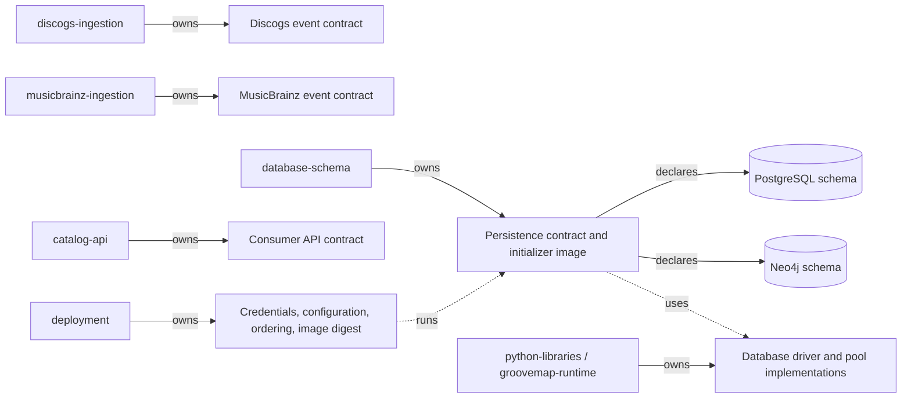
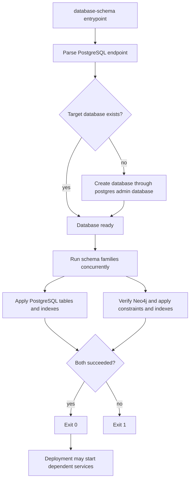

# Initializer architecture

`database-schema` owns the executable Neo4j and PostgreSQL definitions, their compatibility
contract, and the one-shot initializer image. Deployment owns credentials, service ordering,
resource policy, and the released image digest. Schema implementation files do not move into
deployment.

The source-specific ingestion repositories own their event shapes. This repository owns only
the persistence definitions and compatibility metadata; it does not own producer payloads,
consumer API shape, credentials, or rollout orchestration. The former combined
`catalog-ingestion` repository is retired and is not an active owner.

## Execution flow

The PostgreSQL administrative connection has a bounded connection timeout. Each schema
statement is idempotent, and a partial statement failure is still fatal to the initializer.
The Neo4j path verifies connectivity before applying definitions. Both clients are closed on
success or failure.

## Health and failure contract

The image intentionally has no listening port or Docker health check. Its process exit status
is the health contract: zero means the target database exists and both schema families were
applied; any administrative connection, connectivity, or schema failure returns nonzero.
Deployment may retry or stop the rollout, but it must not reinterpret a failed initializer as
healthy.

The image runs as numeric user and group `1000:1000`, writes optional logs under `/logs`, and
is named `ghcr.io/groovemap-music/database-schema` when released.

## Integration tiers

The real-engine proof runs twice over one script, `scripts/test-integration.sh`. The script
takes its engine images from `POSTGRES_INTEGRATION_IMAGE` and `NEO4J_INTEGRATION_IMAGE`, so a
tier is an image choice rather than a second copy of the test. Both tiers apply the production
initializers twice, compare the PostgreSQL and Neo4j catalogs across the two passes, assert
that the six native identity tables carry an engine `uuidv7()` default, and prove sentinel
rows survive the second pass.

| Tier | Recipe | PostgreSQL engine | CI status |
| --- | --- | --- | --- |
| Required | `just test-integration` | `postgres:18-alpine`, digest-pinned | Blocks merge |
| Advisory | `just test-integration-pg19` | `postgres:19beta3-alpine`, digest-pinned | Reports only |

The required tier is the gate. It pins the PostgreSQL major version deployment runs, and the
shared reusable workflow executes it as `integration-command`. The advisory tier exists so the
schema has a real PostgreSQL 19 engine to test on before general availability, and so a
regression in a beta is visible here rather than on the day deployment upgrades. Because the
reusable workflow accepts a single integration command, the advisory tier is a
repository-local job in [`.github/workflows/ci.yml`](../.github/workflows/ci.yml) that calls
the recipe directly and carries `continue-on-error: true`. A beta failure is therefore a
signal, not a merge block. Both tiers share the same Neo4j image; only the PostgreSQL engine
differs, so a divergence between them is attributable to the engine.

### Promoting the beta tier at general availability

When PostgreSQL 19 reaches general availability, promote the advisory tier in this order:

1. Repoint `test-integration-pg19` in the [`Justfile`](../Justfile) at the digest of the
   released `postgres:19-alpine` image and confirm the tier passes locally.
2. Move the released digest onto `test-integration` so the required tier gates on
   PostgreSQL 19, and coordinate that change with the deployment repository, which owns the
   running engine version.
3. Delete the `postgres-19-beta` job from `ci.yml`, drop the `test-integration-pg19` recipe,
   and remove the two-tier assertions from
   [`scripts/check-repository.py`](../scripts/check-repository.py), which enforces that the
   required job stays free of `continue-on-error` and that the advisory job keeps it.
4. Update this section and the README so the repository again documents a single required
   integration tier.

Until step 2 lands, the PostgreSQL 18 digest and recipe are the gate and must not be changed
to accommodate a beta result.

## Neo4j media schema

[ADR 0007](https://github.com/groovemap-music/design/blob/main/docs/adr/0007-canonical-media-taxonomy.md)
introduces a canonical media taxonomy, with the canonical block shape defined by
[`taxonomy/media/v1/media-block.schema.json`](https://github.com/groovemap-music/design/blob/main/taxonomy/media/v1/media-block.schema.json)
in the design repository. Neo4j gains two supporting node types alongside the existing
Artist, Label, Master, Release, Genre, Style, User, and Person nodes:

- `Medium` — one canonical medium (for example `vinyl_lp`), unique on `id`, with `family` and
  `label` properties.
- `MediaFamily` — one of the closed set of media families (for example `vinyl`), unique on
  `name`.

Two relationships connect them into the existing graph:

- `(:Medium)-[:IN_FAMILY]->(:MediaFamily)` — the medium's family.
- `(:Release)-[:ISSUED_ON {qty, source}]->(:Medium)` — the media a release was issued on.
  `qty` is the unit count for that medium on that release (Discogs `qty`, or `1` per
  MusicBrainz medium); `source` names the producer that asserted the edge (`discogs` or
  `musicbrainz`), so a release known to both catalogs can carry both catalogs' media and the
  API can reconcile disagreements between them.

`Release` also carries a `media_families` list property — the sorted, unique family names
present on that release — so consumers can filter by family without traversing `ISSUED_ON`
edges. See `SCHEMA_STATEMENTS` in `src/groovemap_schema/neo4j.py` for the backing
constraints and index.

The complete executable inventory is `SCHEMA_STATEMENTS` in
[`src/groovemap_schema/neo4j.py`](../src/groovemap_schema/neo4j.py). It currently declares
unique constraints for `Artist.id`, `Label.id`, `Master.id`, `Release.id`, `Genre.name`,
`Style.name`, `Medium.id`, `MediaFamily.name`, `User.id`, and `Person.name`. Constraint-backed
properties deliberately have no duplicate range index. Additional range indexes cover
ingestion hashes, selected names and years, `Release.media_families`, genre/style first years,
`Person.credit_count`, and MusicBrainz identifiers; six full-text indexes cover artist,
release, label, genre, style, and person text search. These are schema declarations, not node
or relationship creation: the source-specific producers populate the graph.

## Neo4j identity projection

[ADR 0009](https://github.com/groovemap-music/design/blob/main/docs/adr/0009-native-identity-and-provider-aliases.md)
introduces GrooveMap-minted native identity in PostgreSQL (see Identity below). Neo4j's
share of that is four range indexes — `artist_gm_id`, `label_gm_id`, `master_gm_id`, and
`release_gm_id` — on a `gm_id` property on `Artist`, `Label`, `Master`, and `Release`. Nodes
keep their existing provider `id` and its unique constraint; `gm_id` carries no constraint of
its own because the property is additive and null until a projection job backfills it from
`provider_aliases`, and a uniqueness constraint cannot be declared over a property most nodes
don't yet have. See `SCHEMA_STATEMENTS` in `src/groovemap_schema/neo4j.py` for the four
statements.

## Identity

[ADR 0009](https://github.com/groovemap-music/design/blob/main/docs/adr/0009-native-identity-and-provider-aliases.md)
adds GrooveMap-minted UUIDv7 identity for five entities in PostgreSQL, so every catalog row
and physical copy has an id that does not depend on any one provider staying alive or
consistent. Six new tables carry this, declared in `_USER_TABLES` in
[`src/groovemap_schema/postgres.py`](../src/groovemap_schema/postgres.py) after `users`,
`user_collections`, and `user_wantlists` because they reference those tables:

- `catalog_items` — one row per native entity (`release`, `master`, `artist`, or `label`);
  the id every other identity table and the additive `gm_item_id` columns point at.
- `artifacts` — an edition of a catalog item, optionally attributed to the user who first
  captured it.
- `owned_copies` — the physical copy a user holds. It exists because a user says it does, not
  because a provider listed it, and its optional `collection_row_id` back-link to
  `user_collections` is set to `NULL` on delete rather than cascading, so the copy survives a
  collection resync.
- `collection_snapshots` — a point-in-time content hash and copy-id list for a user's
  collection, for detecting drift between syncs.
- `observations` — user-captured evidence about a copy or an edition (a matrix inscription, a
  grading, a purchase price); a check constraint requires at least one of `owned_copy_id` or
  `artifact_id` to be set.
- `provider_aliases` — maps every external namespace (Discogs, MusicBrainz, Wikidata,
  barcodes, catalogue numbers, ISRCs, matrix inscriptions, …) onto a native id, with a
  validity interval so a provider merge or split is a new row rather than an in-place
  rewrite.

`provider_aliases` carries the lookup-or-create key: a unique index on
`(provider, entity_kind, external_id)` scoped to `WHERE valid_to IS NULL`. Because the
uniqueness holds only over the currently valid row rather than the whole table, any number of
concurrent writers can run the same `SELECT` / `INSERT ... ON CONFLICT DO NOTHING` / re-`SELECT`
sequence against the same external id and converge on one native id, instead of racing to
insert two aliases for the same provider entity.

Every provider-keyed table also gains an additive, nullable `gm_item_id UUID` column pointing
at `catalog_items`, each with a plain index: the four Discogs entity tables (`artists`,
`labels`, `masters`, `releases`, added in `_entity_schema_statements()`), the four
`musicbrainz.*` entity tables (`artists`, `labels`, `releases`, `release_groups`, indexed by
`idx_mb_artists_gm_item_id`, `idx_mb_labels_gm_item_id`, `idx_mb_releases_gm_item_id`, and
`idx_mb_release_groups_gm_item_id`), and `user_collections` and `user_wantlists`. Discogs
`data_id`/`release_id` and the `musicbrainz.*` `mbid` columns remain each table's primary key;
`gm_item_id` is a pointer into the native identity graph, not a replacement key.
`user_collections` also gains an additive, nullable `owned_copy_id UUID` column (indexed by
`idx_user_collections_owned_copy_id`), the native counterpart to the provider `instance_id`
that will eventually identify the physical copy. Both `release_id`/`instance_id` and the
Discogs/MusicBrainz primary keys stay authoritative until a future contraction decision
retires them.

Every table and column above is additive within persistence contract v1 — see
[the persistence compatibility contract](../contracts/persistence/).

## Activity

[ADR 0010](https://github.com/groovemap-music/design/blob/main/docs/adr/0010-first-party-events-consent-and-deletion.md)
adds a first-party, append-only behavioural record in a new `activity` PostgreSQL schema,
declared in `_ACTIVITY_STATEMENTS` in
[`src/groovemap_schema/postgres.py`](../src/groovemap_schema/postgres.py) after the
user-owned tables because `activity.user_subjects` and `activity.consent_grants` reference
`users(id)`:

- `activity.user_subjects` — the pseudonym link from a user id to a `subject_id`. Events and
  impressions reference only `subject_id`, never the user id, so the behavioural tables can be
  read and joined without carrying account identity, and removing this one row is what makes
  an erased subject unre-associable with the account it belonged to.
- `activity.consent_grants` — per-purpose consent (`product_analytics` or `model_training`); a
  revocation sets `revoked_at` rather than deleting the grant, so history stays
  reconstructible.
- `activity.events` — the typed event envelope: event type, schema/feature/model versions, the
  `subject_id`, and a `consent_purposes` snapshot taken at write time.
- `activity.impressions` — what a shown recommendation needs for later offline evaluation
  (`policy_id`, `candidate_set_id`, `position`, `propensity`); outcomes are recorded as
  `activity.events` rows carrying the impression id, never as columns here, which is what
  keeps an impression row immutable while one impression accrues several outcomes.

`activity.events` and `activity.impressions` are both declared `PARTITION BY RANGE
(occurred_at)` — month-range partitions — and each has a `_default` partition
(`activity.events_default`, `activity.impressions_default`) so an insert into a month with no
partition yet does not fail. The `activity.ensure_month_partition(table_name, month)` function
is what a writer calls before insert to land the row in its own partition: it creates
`<table>_yYYYYmMM` for that month if it doesn't already exist and returns the partition name.

Both tables are immutable by construction, not by convention. The `activity.reject_mutation()`
trigger function raises unless the session-local `groovemap.erasure` setting is `on`, and a
`BEFORE UPDATE OR DELETE` trigger on each of `activity.events` and `activity.impressions`
(`activity_events_reject_mutation`, `activity_impressions_reject_mutation`) invokes it —
declared on the partitioned table, so the trigger applies to every existing partition and is
cloned onto partitions `ensure_month_partition()` creates later. Only the erasure procedure
sets `groovemap.erasure`, and because the setting is session-local the bypass never outlives
the transaction that opened it.

`activity.erasures` records each erasure run: `subject_id`, timing, the count of
events/impressions deleted, and `model_versions_before` — the model versions that had already
trained on the data before it was deleted, so the residual question ("which models saw this
subject's data") stays answerable rather than invisible.

Every table, function, and trigger above is additive within persistence contract v1 — see
[the persistence compatibility contract](../contracts/persistence/).

## PostgreSQL media schema

The PostgreSQL family gains an indexed `media JSONB` column, holding the canonical media
block, on every release-shaped table: `releases`, `musicbrainz.releases`, `user_collections`,
and `user_wantlists`. `releases`, `musicbrainz.releases`, and `user_collections` each carry a
GIN index on `media->'families'` for medium-family filtering; the raw provider fields
(`data`, `formats`, `format`) are unchanged and remain the provenance record.
`insights.release_rarity` gains `media_families`, `family_signals`, and `medium_rarity` as
additive, media-neutral rarity signals alongside the retained `format_rarity`. Every change
is additive within persistence contract v1 — see
[the persistence compatibility contract](../contracts/persistence/).

The executable PostgreSQL inventory is in
[`src/groovemap_schema/postgres.py`](../src/groovemap_schema/postgres.py):

- public Discogs document tables: `artists`, `labels`, `masters`, and `releases`;
- account and operational tables: `users`, `oauth_tokens`, `app_tokens`, `app_config`,
  `user_collections`, `user_wantlists`, `sync_history`, `extraction_history`, `queue_metrics`,
  `service_health_metrics`, and `admin_audit_log`;
- native identity tables (see Identity above): `catalog_items`, `artifacts`, `owned_copies`,
  `collection_snapshots`, `observations`, and `provider_aliases`;
- insight tables in the `insights` schema: `artist_centrality`, `genre_trends`,
  `label_longevity`, `monthly_anniversaries`, `data_completeness`, `release_rarity`,
  `community_counts`, `computation_log`, and `activity_summary` (analytics-engine's
  daily per-dimension rollup of `activity` events and impressions, keyed by
  `summary_date`, `dimension`, and `dimension_key`);
- activity tables in the `activity` schema (see Activity above): `user_subjects`,
  `consent_grants`, `events`, `impressions`, and `erasures`; and
- MusicBrainz tables in the `musicbrainz` schema: `artists`, `labels`, `releases`,
  `release_groups`, `relationships`, and `external_links`.

The statement lists also carry the migrations required for an existing database: additive
authentication and media columns, rarity-signal columns, Discogs cross-reference widening to
`BIGINT`, and the widened `musicbrainz.relationships` natural key. The latter uses `UNIQUE NULLS
NOT DISTINCT` across both entity identifiers and types, relationship type, dates, and
attributes. These statements intentionally run with the table/index declarations because
`CREATE TABLE IF NOT EXISTS` cannot update an existing table. Do not translate them into an
out-of-band migration or remove retained provenance fields.

## Catalog identifiers, manufacturing credits, and release country

[ADR 0011](https://github.com/groovemap-music/design/blob/main/docs/adr/0011-catalog-identifiers-and-manufacturing-credits.md)
adds two PostgreSQL GIN indexes over the additive `identifiers` and `companies` blocks that
`discogs-ingestion` attaches to every Discogs `releases` event, a Neo4j `Company` node, the
`CREDITED_TO` manufacturing-credit edge, and a `Release.country` range index.

PostgreSQL gains `idx_releases_identifiers` on `data->'identifiers'` and
`idx_releases_companies` on `data->'companies'`, GIN indexes declared beside
`idx_releases_genres`, `idx_releases_labels`, and `idx_releases_media_families` in
`_SPECIFIC_INDEXES` in [`src/groovemap_schema/postgres.py`](../src/groovemap_schema/postgres.py).
They serve analytical containment queries over the two blocks; exact barcode and
catalogue-number lookup resolves through `provider_aliases` (see Identity above) instead.

Neo4j gains `Company` — one manufacturing, mastering, or distribution credit party, unique on
`id` (the `company_id` constraint) — alongside the existing Artist, Label, Master, Release,
Genre, Style, Medium, MediaFamily, User, and Person nodes. The credit itself is a
relationship:

- `(:Release)-[:CREDITED_TO {role, role_category, source}]->(:Company)` — a manufacturing,
  mastering, or rights credit a catalog asserts about a release. `role` is the raw credit
  string and `role_category` its closed-vocabulary category, the same pattern
  `(:Person)-[:CREDITED_ON {role}]->(:Release)` already uses for a person credit; `source`
  names the asserting catalog, the same pattern `(:Release)-[:ISSUED_ON {qty, source}]->(:Medium)`
  above already uses. Like those two edges, `CREDITED_TO` is documented here rather than
  declared in `SCHEMA_STATEMENTS` — the source-specific graph enrichers write it, and this
  repository declares only the `Company.id` constraint it depends on.

`Release` also gains a `country` range index (`release_country`), backing an additive
`Release.country` property that the Discogs graph enricher writes from the release's country,
and an additive `Release.mb_country` property the MusicBrainz graph enricher writes on
releases it matches. `releases.data->>'country'` is already indexed in PostgreSQL
(`idx_releases_country`); this closes the same gap in the graph. See `SCHEMA_STATEMENTS` in
[`src/groovemap_schema/neo4j.py`](../src/groovemap_schema/neo4j.py) for the `company_id`
constraint and the `release_country` index.

Every index and constraint above is additive within persistence contract v1 — see
[the persistence compatibility contract](../contracts/persistence/).

## Media schema consumer promotion

Downstream services do not track `database-schema` continuously; each pins
`contracts/persistence/v1` to a specific, reviewed `database-schema` commit and promotes to a
later commit deliberately, the same way
[`compatibility.json`](../contracts/persistence/v1/compatibility.json) pins the tested
`groovemap-runtime` commit for that contract version. The Neo4j and PostgreSQL media changes
described above are additive within persistence contract version 1: no rename, removal, type
change, or relationship-semantics change, so a consumer promotes to a commit that includes
them without a migration or a lockstep upgrade across services. See
[the persistence compatibility contract](../contracts/README.md) for the full
additive-versus-destructive policy and the expand/migrate/contract ordering a breaking change
would require.
