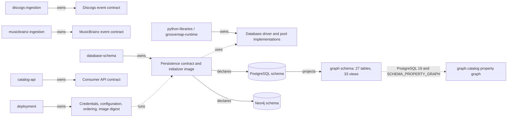
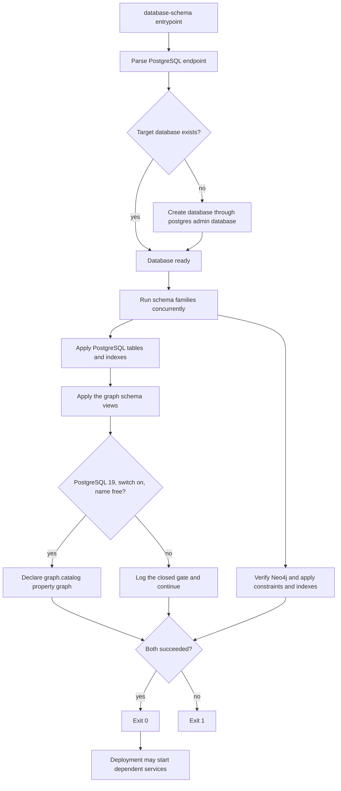

# Initializer architecture

`database-schema` owns the executable Neo4j and PostgreSQL definitions, their compatibility
contract, and the one-shot initializer image. Deployment owns credentials, service ordering,
resource policy, and the released image digest. Schema implementation files do not move into
deployment.



The source-specific ingestion repositories own their event shapes. This repository owns only
the persistence definitions and compatibility metadata; it does not own producer payloads,
consumer API shape, credentials, or rollout orchestration. The former combined
`catalog-ingestion` repository is retired and is not an active owner.

## Execution flow



The PostgreSQL administrative connection has a bounded connection timeout. Each schema
statement is idempotent, and a partial statement failure is still fatal to the initializer.
The property graph branch is the one place a statement is skipped rather than executed; a
closed gate is logged and the run continues, and only a failure once every gate is open counts
against the exit status. See [the property graph](#property-graph).
The Neo4j path verifies connectivity before applying definitions. Both clients are closed on
success or failure.

## Health and failure contract

The image intentionally has no listening port or Docker health check. Its process exit status
is the health contract: zero means the target database exists and both schema families were
applied; any administrative connection, connectivity, or schema failure returns nonzero.
Deployment may retry or stop the rollout, but it must not reinterpret a failed initializer as
healthy.

The image runs as numeric user and group `1000:1000`, writes optional logs under `/logs`, and
is named `ghcr.io/groovemap-music/database-schema` when released.

## Integration tiers

The real-engine proof runs twice over one script, `scripts/test-integration.sh`. The script
takes its engine images from `POSTGRES_INTEGRATION_IMAGE` and `NEO4J_INTEGRATION_IMAGE`, so a
tier is an image choice rather than a second copy of the test. Both tiers apply the production
initializers twice, compare the PostgreSQL and Neo4j catalogs across the two passes, assert
that the six native identity tables carry an engine `uuidv7()` default, and prove sentinel
rows survive the second pass.

| Tier | Recipe | PostgreSQL engine | CI status |
| --- | --- | --- | --- |
| Required | `just test-integration` | `postgres:18-alpine`, digest-pinned | Blocks merge |
| Advisory | `just test-integration-pg19` | `postgres:19beta3-alpine`, digest-pinned | Reports only |

The required tier is the gate. It pins the PostgreSQL major version deployment runs, and the
shared reusable workflow executes it as `integration-command`. The advisory tier exists so the
schema has a real PostgreSQL 19 engine to test on before general availability, and so a
regression in a beta is visible here rather than on the day deployment upgrades. Because the
reusable workflow accepts a single integration command, the advisory tier is a
repository-local job in [`.github/workflows/ci.yml`](../.github/workflows/ci.yml) that calls
the recipe directly and carries `continue-on-error: true`. A beta failure is therefore a
signal, not a merge block. Both tiers share the same Neo4j image; only the PostgreSQL engine
differs, so a divergence between them is attributable to the engine.

### Promoting the beta tier at general availability

When PostgreSQL 19 reaches general availability, promote the advisory tier in this order:

1. Repoint `test-integration-pg19` in the [`Justfile`](../Justfile) at the digest of the
   released `postgres:19-alpine` image and confirm the tier passes locally.
2. Move the released digest onto `test-integration` so the required tier gates on
   PostgreSQL 19, and coordinate that change with the deployment repository, which owns the
   running engine version.
3. Delete the `postgres-19-beta` job from `ci.yml`, drop the `test-integration-pg19` recipe,
   and remove the two-tier assertions from
   [`scripts/check-repository.py`](../scripts/check-repository.py), which enforces that the
   required job stays free of `continue-on-error` and that the advisory job keeps it.
4. Update this section and the README so the repository again documents a single required
   integration tier.

Until step 2 lands, the PostgreSQL 18 digest and recipe are the gate and must not be changed
to accommodate a beta result.

## Neo4j media schema

[ADR 0007](https://github.com/groovemap-music/design/blob/main/docs/adr/0007-canonical-media-taxonomy.md)
introduces a canonical media taxonomy, with the canonical block shape defined by
[`taxonomy/media/v1/media-block.schema.json`](https://github.com/groovemap-music/design/blob/main/taxonomy/media/v1/media-block.schema.json)
in the design repository. Neo4j gains two supporting node types alongside the existing
Artist, Label, Master, Release, Genre, Style, User, and Person nodes:

- `Medium` — one canonical medium (for example `vinyl_lp`), unique on `id`, with `family` and
  `label` properties.
- `MediaFamily` — one of the closed set of media families (for example `vinyl`), unique on
  `name`.

Two relationships connect them into the existing graph:

- `(:Medium)-[:IN_FAMILY]->(:MediaFamily)` — the medium's family.
- `(:Release)-[:ISSUED_ON {qty, source}]->(:Medium)` — the media a release was issued on.
  `qty` is the unit count for that medium on that release (Discogs `qty`, or `1` per
  MusicBrainz medium); `source` names the producer that asserted the edge (`discogs` or
  `musicbrainz`), so a release known to both catalogs can carry both catalogs' media and the
  API can reconcile disagreements between them.

`Release` also carries a `media_families` list property — the sorted, unique family names
present on that release — so consumers can filter by family without traversing `ISSUED_ON`
edges. See `SCHEMA_STATEMENTS` in `src/groovemap_schema/neo4j.py` for the backing
constraints and index.

The complete executable inventory is `SCHEMA_STATEMENTS` in
[`src/groovemap_schema/neo4j.py`](../src/groovemap_schema/neo4j.py). It currently declares
unique constraints for `Artist.id`, `Label.id`, `Master.id`, `Release.id`, `Genre.name`,
`Style.name`, `Medium.id`, `MediaFamily.name`, `User.id`, and `Person.name`. Constraint-backed
properties deliberately have no duplicate range index. Additional range indexes cover
ingestion hashes, selected names and years, `Release.media_families`, genre/style first years,
`Person.credit_count`, and MusicBrainz identifiers; six full-text indexes cover artist,
release, label, genre, style, and person text search. These are schema declarations, not node
or relationship creation: the source-specific producers populate the graph.

## Neo4j identity projection

[ADR 0009](https://github.com/groovemap-music/design/blob/main/docs/adr/0009-native-identity-and-provider-aliases.md)
introduces GrooveMap-minted native identity in PostgreSQL (see Identity below). Neo4j's
share of that is four range indexes — `artist_gm_id`, `label_gm_id`, `master_gm_id`, and
`release_gm_id` — on a `gm_id` property on `Artist`, `Label`, `Master`, and `Release`. Nodes
keep their existing provider `id` and its unique constraint; `gm_id` carries no constraint of
its own because the property is additive and null until a projection job backfills it from
`provider_aliases`, and a uniqueness constraint cannot be declared over a property most nodes
don't yet have. See `SCHEMA_STATEMENTS` in `src/groovemap_schema/neo4j.py` for the four
statements.

## Identity

[ADR 0009](https://github.com/groovemap-music/design/blob/main/docs/adr/0009-native-identity-and-provider-aliases.md)
adds GrooveMap-minted UUIDv7 identity for five entities in PostgreSQL, so every catalog row
and physical copy has an id that does not depend on any one provider staying alive or
consistent. Six new tables carry this, declared in `_USER_TABLES` in
[`src/groovemap_schema/postgres.py`](../src/groovemap_schema/postgres.py) after `users`,
`user_collections`, and `user_wantlists` because they reference those tables:

- `catalog_items` — one row per native entity (`release`, `master`, `artist`, or `label`);
  the id every other identity table and the additive `gm_item_id` columns point at.
- `artifacts` — an edition of a catalog item, optionally attributed to the user who first
  captured it.
- `owned_copies` — the physical copy a user holds. It exists because a user says it does, not
  because a provider listed it, and its optional `collection_row_id` back-link to
  `user_collections` is set to `NULL` on delete rather than cascading, so the copy survives a
  collection resync.
- `collection_snapshots` — a point-in-time content hash and copy-id list for a user's
  collection, for detecting drift between syncs.
- `observations` — user-captured evidence about a copy or an edition (a matrix inscription, a
  grading, a purchase price); a check constraint requires at least one of `owned_copy_id` or
  `artifact_id` to be set.
- `provider_aliases` — maps every external namespace (Discogs, MusicBrainz, Wikidata,
  barcodes, catalogue numbers, ISRCs, matrix inscriptions, …) onto a native id, with a
  validity interval so a provider merge or split is a new row rather than an in-place
  rewrite.

`provider_aliases` carries the lookup-or-create key: a unique index on
`(provider, entity_kind, external_id)` scoped to `WHERE valid_to IS NULL`. Because the
uniqueness holds only over the currently valid row rather than the whole table, any number of
concurrent writers can run the same `SELECT` / `INSERT ... ON CONFLICT DO NOTHING` / re-`SELECT`
sequence against the same external id and converge on one native id, instead of racing to
insert two aliases for the same provider entity.

Every provider-keyed table also gains an additive, nullable `gm_item_id UUID` column pointing
at `catalog_items`, each with a plain index: the four Discogs entity tables (`artists`,
`labels`, `masters`, `releases`, added in `_entity_schema_statements()`), the four
`musicbrainz.*` entity tables (`artists`, `labels`, `releases`, `release_groups`, indexed by
`idx_mb_artists_gm_item_id`, `idx_mb_labels_gm_item_id`, `idx_mb_releases_gm_item_id`, and
`idx_mb_release_groups_gm_item_id`), and `user_collections` and `user_wantlists`. Discogs
`data_id`/`release_id` and the `musicbrainz.*` `mbid` columns remain each table's primary key;
`gm_item_id` is a pointer into the native identity graph, not a replacement key.
`user_collections` also gains an additive, nullable `owned_copy_id UUID` column (indexed by
`idx_user_collections_owned_copy_id`), the native counterpart to the provider `instance_id`
that will eventually identify the physical copy. Both `release_id`/`instance_id` and the
Discogs/MusicBrainz primary keys stay authoritative until a future contraction decision
retires them.

Every table and column above is additive within persistence contract v1 — see
[the persistence compatibility contract](../contracts/persistence/).

## Activity

[ADR 0010](https://github.com/groovemap-music/design/blob/main/docs/adr/0010-first-party-events-consent-and-deletion.md)
adds a first-party, append-only behavioural record in a new `activity` PostgreSQL schema,
declared in `_ACTIVITY_STATEMENTS` in
[`src/groovemap_schema/postgres.py`](../src/groovemap_schema/postgres.py) after the
user-owned tables because `activity.user_subjects` and `activity.consent_grants` reference
`users(id)`:

- `activity.user_subjects` — the pseudonym link from a user id to a `subject_id`. Events and
  impressions reference only `subject_id`, never the user id, so the behavioural tables can be
  read and joined without carrying account identity, and removing this one row is what makes
  an erased subject unre-associable with the account it belonged to.
- `activity.consent_grants` — per-purpose consent (`product_analytics` or `model_training`); a
  revocation sets `revoked_at` rather than deleting the grant, so history stays
  reconstructible.
- `activity.events` — the typed event envelope: event type, schema/feature/model versions, the
  `subject_id`, and a `consent_purposes` snapshot taken at write time.
- `activity.impressions` — what a shown recommendation needs for later offline evaluation
  (`policy_id`, `candidate_set_id`, `position`, `propensity`); outcomes are recorded as
  `activity.events` rows carrying the impression id, never as columns here, which is what
  keeps an impression row immutable while one impression accrues several outcomes.

`activity.events` and `activity.impressions` are both declared `PARTITION BY RANGE
(occurred_at)` — month-range partitions — and each has a `_default` partition
(`activity.events_default`, `activity.impressions_default`) so an insert into a month with no
partition yet does not fail. The `activity.ensure_month_partition(table_name, month)` function
is what a writer calls before insert to land the row in its own partition: it creates
`<table>_yYYYYmMM` for that month if it doesn't already exist and returns the partition name.

Both tables are immutable by construction, not by convention. The `activity.reject_mutation()`
trigger function raises unless the session-local `groovemap.erasure` setting is `on`, and a
`BEFORE UPDATE OR DELETE` trigger on each of `activity.events` and `activity.impressions`
(`activity_events_reject_mutation`, `activity_impressions_reject_mutation`) invokes it —
declared on the partitioned table, so the trigger applies to every existing partition and is
cloned onto partitions `ensure_month_partition()` creates later. Only the erasure procedure
sets `groovemap.erasure`, and because the setting is session-local the bypass never outlives
the transaction that opened it.

`activity.erasures` records each erasure run: `subject_id`, timing, the count of
events/impressions deleted, and `model_versions_before` — the model versions that had already
trained on the data before it was deleted, so the residual question ("which models saw this
subject's data") stays answerable rather than invisible.

Every table, function, and trigger above is additive within persistence contract v1 — see
[the persistence compatibility contract](../contracts/persistence/).

## PostgreSQL media schema

The PostgreSQL family gains an indexed `media JSONB` column, holding the canonical media
block, on every release-shaped table: `releases`, `musicbrainz.releases`, `user_collections`,
and `user_wantlists`. `releases`, `musicbrainz.releases`, and `user_collections` each carry a
GIN index on `media->'families'` for medium-family filtering; the raw provider fields
(`data`, `formats`, `format`) are unchanged and remain the provenance record.
`insights.release_rarity` gains `media_families`, `family_signals`, and `medium_rarity` as
additive, media-neutral rarity signals alongside the retained `format_rarity`. Every change
is additive within persistence contract v1 — see
[the persistence compatibility contract](../contracts/persistence/).

The executable PostgreSQL inventory is in
[`src/groovemap_schema/postgres.py`](../src/groovemap_schema/postgres.py):

- public Discogs document tables: `artists`, `labels`, `masters`, and `releases`;
- account and operational tables: `users`, `oauth_tokens`, `app_tokens`, `app_config`,
  `user_collections`, `user_wantlists`, `sync_history`, `extraction_history`, `queue_metrics`,
  `service_health_metrics`, and `admin_audit_log`;
- native identity tables (see Identity above): `catalog_items`, `artifacts`, `owned_copies`,
  `collection_snapshots`, `observations`, and `provider_aliases`;
- insight tables in the `insights` schema: `artist_centrality`, `genre_trends`,
  `label_longevity`, `monthly_anniversaries`, `data_completeness`, `release_rarity`,
  `community_counts`, `computation_log`, and `activity_summary` (analytics-engine's
  daily per-dimension rollup of `activity` events and impressions, keyed by
  `summary_date`, `dimension`, and `dimension_key`);
- activity tables in the `activity` schema (see Activity above): `user_subjects`,
  `consent_grants`, `events`, `impressions`, and `erasures`; and
- MusicBrainz tables in the `musicbrainz` schema: `artists`, `labels`, `releases`,
  `release_groups`, `relationships`, and `external_links`.

The statement lists also carry the migrations required for an existing database: additive
authentication and media columns, rarity-signal columns, Discogs cross-reference widening to
`BIGINT`, and the widened `musicbrainz.relationships` natural key. The latter uses `UNIQUE NULLS
NOT DISTINCT` across both entity identifiers and types, relationship type, dates, and
attributes. These statements intentionally run with the table/index declarations because
`CREATE TABLE IF NOT EXISTS` cannot update an existing table. Do not translate them into an
out-of-band migration or remove retained provenance fields.

`musicbrainz.relationships` and `musicbrainz.external_links` were declared with `created_at`
only, unlike every other MusicBrainz entity table, so an additive `updated_at TIMESTAMPTZ NOT
NULL DEFAULT NOW()` column (with a plain index, `idx_mb_rels_updated_at` and
`idx_mb_links_updated_at`) closes the gap. `musicbrainz-sql-loader` is the consumer:
delete-reconciliation, modelled on `discogs-sql-loader`'s `purge_stale_rows` over the Discogs
entity tables' own `updated_at`, refreshes the column on every upsert and deletes rows where
`updated_at < run start` at the end of a full re-extraction. DDL ownership is this repository
alone, so the column is declared here rather than carried as a startup `ALTER` in the loader.

## Catalog identifiers, manufacturing credits, and release country

[ADR 0011](https://github.com/groovemap-music/design/blob/main/docs/adr/0011-catalog-identifiers-and-manufacturing-credits.md)
adds two PostgreSQL GIN indexes over the additive `identifiers` and `companies` blocks that
`discogs-ingestion` attaches to every Discogs `releases` event, a Neo4j `Company` node, the
`CREDITED_TO` manufacturing-credit edge, and a `Release.country` range index.

PostgreSQL gains `idx_releases_identifiers` on `data->'identifiers'` and
`idx_releases_companies` on `data->'companies'`, GIN indexes declared beside
`idx_releases_genres`, `idx_releases_labels`, and `idx_releases_media_families` in
`_SPECIFIC_INDEXES` in [`src/groovemap_schema/postgres.py`](../src/groovemap_schema/postgres.py).
They serve analytical containment queries over the two blocks; exact barcode and
catalogue-number lookup resolves through `provider_aliases` (see Identity above) instead.

Neo4j gains `Company` — one manufacturing, mastering, or distribution credit party, unique on
`id` (the `company_id` constraint) — alongside the existing Artist, Label, Master, Release,
Genre, Style, Medium, MediaFamily, User, and Person nodes. The credit itself is a
relationship:

- `(:Release)-[:CREDITED_TO {role, role_category, source}]->(:Company)` — a manufacturing,
  mastering, or rights credit a catalog asserts about a release. `role` is the raw credit
  string and `role_category` its closed-vocabulary category, the same pattern
  `(:Person)-[:CREDITED_ON {role}]->(:Release)` already uses for a person credit; `source`
  names the asserting catalog, the same pattern `(:Release)-[:ISSUED_ON {qty, source}]->(:Medium)`
  above already uses. Like those two edges, `CREDITED_TO` is documented here rather than
  declared in `SCHEMA_STATEMENTS` — the source-specific graph enrichers write it, and this
  repository declares only the `Company.id` constraint it depends on.

`Release` also gains a `country` range index (`release_country`), backing an additive
`Release.country` property that the Discogs graph enricher writes from the release's country,
and an additive `Release.mb_country` property the MusicBrainz graph enricher writes on
releases it matches. `releases.data->>'country'` is already indexed in PostgreSQL
(`idx_releases_country`); this closes the same gap in the graph. See `SCHEMA_STATEMENTS` in
[`src/groovemap_schema/neo4j.py`](../src/groovemap_schema/neo4j.py) for the `company_id`
constraint and the `release_country` index.

Every index and constraint above is additive within persistence contract v1 — see
[the persistence compatibility contract](../contracts/persistence/).

## Graph schema

The `graph` schema re-presents the catalog as the vertex and edge relations of the property
graph the Neo4j enrichers already build. Sixty-six relations, declared in
[`src/groovemap_schema/postgres.py`](../src/groovemap_schema/postgres.py): twenty-nine
loader-written tables and thirty-seven read-only views over tables declared elsewhere in the
same module. The schema is additive within persistence contract v1:
[the persistence compatibility contract](../contracts/persistence/) records every relation
with its shape and its owner, the text key rule, and the property graph as additive objects of
version 1.

**This repository declares every relation and writes rows into none of them.** An empty table
on a fresh database is the expected state, not a fault. `discogs-sql-loader` owns most of
them, `musicbrainz-sql-loader` owns the MusicBrainz half and co-owns the shared medium
vocabulary, `catalog-api` owns the personal-collection views, and
[`graph.release_degree`](#the-counter-degree-and-aggregate-relations) is the one relation
split across two owners. The contract names the owner of each. The schema also declares
[`graph.bootstrap_fill()`](#the-bootstrap-fill), which can write those rows on request, but
nothing calls it and applying the schema still writes nothing — and what it writes is not
authoritative.

Twenty of the tables replaced a view that computed the same rows on every read. Spike
gm-database-schema-9c8.1 measured those views and found every hot edge re-unnesting a JSONB
document per query, unable to carry an index, and — because a view cannot be probed from its
target end — reproducing a sequential scan on the traversal direction the ported Cypher uses
most. Spike gm-database-schema-9c8.2 Table 2 and Table 3 fix the shapes, keys, indexes, and
owners; this schema follows them and does not invent one. Seven further tables hold the
counters the graph enrichers compute in a post-import pass, which a graph declared over views
had nowhere to put. The twenty-eighth is `graph.artist_member_of`, the
[cross-provenance MEMBER_OF union](#the-member_of-union), and the twenty-ninth is
`graph.vertex_degree`, [the per-vertex degree](#the-per-vertex-degree) that orders frontier
expansion. Both are derived from the relations above them rather than from a document.

Read the section in two halves. The sixty-six relations are unconditional — every supported
engine gets all of them, on PostgreSQL 18 and 19 alike. The `CREATE PROPERTY GRAPH`
declaration layered over them is not: it needs PostgreSQL 19 and an explicit switch, and
[when it is applied](#when-it-is-applied) is the one place those gates are stated. A consumer
reads the relations and probes for the graph.

Names are the contract. A vertex view is named for the Neo4j label it mirrors and an edge
view for the relationship type, lowercased and de-reserved, so a later `CREATE PROPERTY
GRAPH` can use the view name as the label verbatim: `:User` becomes `app_user`, the vertex
label ADR 0012 records for it, because `user` is reserved; and the overloaded `[:BY]`,
`[:ON]`, and `[:IS]` types become `by_artist`, `on_label`, `in_genre`, and `in_style`. Where
ADR 0012 names a label, its mapping table is the contract and this schema follows it.

That contract is enforced by the engine, not only by convention. `CREATE OR REPLACE VIEW`
may only append columns to the end of an existing view: PostgreSQL refuses to drop, rename,
reorder, or retype a column the view already exposes, and fails the statement outright rather
than replacing it. So adding a column to a view is the only change that is safe to ship on its
own. Renaming a view or a view column, removing one, changing its position, or widening its
type is a breaking change to the published contract and needs a coordinated migration under
the persistence contract's expand/migrate/contract rule — expand with the new shape alongside
the old, migrate readers, then contract — not an edit to the statement list here.

Changing a relation's *shape* is the one case the schema handles itself, and it is the only
place anything here drops anything. A relation that becomes a loader-written table is preceded
by a guarded migration: a `DO` block that reads `pg_class`, drops the view only if a view of
that name is still there, and does nothing otherwise. A fresh database drops nothing. A second
apply finds a table rather than a view and drops nothing either. `CASCADE` is required because
on PostgreSQL 19 `graph.catalog` depends on the view, and the property graph is re-declared on
the same run. The four Discogs vertex relations that stay views carry the same guard for the
same reason, conditioned on their key column still reading as `character varying`, which makes
it self-healing from any half-applied state.

The same rule binds the base tables underneath. PostgreSQL will not retype a column a view
reads, so once a graph view exposes a column, an `ALTER COLUMN ... TYPE` against it fails
while the view exists. The MusicBrainz provider-id widenings in `_MUSICBRAINZ_TABLES` are
gated on both the column still being narrow and no view depending on it, and emit a `NOTICE`
naming the dependent view instead of failing when it is; reaching that state needs the same
coordinated migration rather than a startup `ALTER`.

Discogs ids live inside JSONB documents as numbers while the catalog tables key on `data_id
VARCHAR`, so every id is read with `->>` and compared as text. Every unnest is guarded by a
`jsonb_typeof(...) = 'array'` check, because a malformed document would otherwise fail the
whole view rather than skip one row, and every element whose `id` is missing or `0` is
dropped — exactly what `graphinator` does before it writes an edge.

Two asymmetries in that projection are worth naming. The Discogs edge views unnest a JSONB
array and do not inner-join the vertex view for their target, so an edge may reference an id
no vertex row carries; the MusicBrainz relationship views do inner-join both entity tables,
so an edge appears only once both endpoints are loaded. Both are faithful to the enrichers
they mirror — `graphinator` merges a Discogs target node as it writes the edge, while the
MusicBrainz enricher only relates entities it has already ingested. And `graph.company`
resolves a company id that several credits spell differently by taking the lexicographically
smallest name (`DISTINCT ON` with a matching `ORDER BY`), where Neo4j's last-write-wins merge
would keep whichever credit was written last; the view's answer is stable and reproducible,
which the graph's is not.

One deliberate narrowness: these views trim with `btrim`, which removes spaces only, while
the Python enrichers use `str.strip()`, which removes every kind of whitespace. A value padded
with a tab or a newline — in `country`, in a normalized credit role, or in the fallback
`name:` company key — is therefore trimmed by the enricher but not by the view. Discogs and
MusicBrainz payloads pad with spaces in practice, so the two agree on real data; a document
that pads otherwise is the known gap.

### Neo4j type to relation mapping

This is the whole mapping, and it carries three names per row rather than two. The Neo4j label
or relationship type an enricher writes is the first; the relation that re-presents it is the
second; and on PostgreSQL 19 the SQL/PGQ label is the third — always the relation name, verbatim,
which is what the de-reserving rule in ADR 0012 buys. So `:Release` is `graph.release` is
`MATCH (r IS release)`, and `[:BY]` out of a release is `graph.by_artist` is
`-[IS by_artist]->`, with no second table to consult. See [labels](#labels) for the two
keywords that were checked and for the shared label sixteen relations carry on top of their own.

Vertex relations. The key column is what edge relations join to, and every one of them is
`text`, `uuid`, or `bigint` — never `character varying`; see
[the text key rule](#the-text-key-rule). "Shape" is `table` where a loader writes the rows and
`view` where the relation is a projection of a table written elsewhere.

Four of these relations hold the rows of a label without being the element table the property
graph binds. `:Genre`, `:Style`, `:Label`, and `:Artist` bind a `<label>_vertex` view that
joins the relation below to its counter relation, so that the counters `graphinator` writes
onto those four nodes read as properties of the same label here. The rows, the key, and every
column in this table are unchanged by that; the projection only adds columns. See
[the counter relations](#the-counter-degree-and-aggregate-relations).

| Neo4j label | Relation | Shape | Key column | Other columns |
| --- | --- | --- | --- | --- |
| `:Artist` | `graph.artist` | view | `artist_id` | `name`, `gm_item_id`, `hash`, `updated_at`, `gm_id` |
| `:Label` | `graph.label` | view | `label_id` | `name`, `gm_item_id`, `hash`, `updated_at`, `gm_id` |
| `:Master` | `graph.master` | view | `master_id` | `title`, `year`, `genres`, `styles`, `gm_item_id`, `hash`, `updated_at`, `gm_id` |
| `:Release` | `graph.release` | view | `release_id` | `title`, `year`, `country`, `genres`, `styles`, `media_families`, `gm_item_id`, `hash`, `updated_at`, `formats`, `catalog_number`, `gm_id` |
| `:Genre` | `graph.genre` | **table** | `name` | — |
| `:Style` | `graph.style` | **table** | `name` | — |
| `:Person` | `graph.person` | **table** | `name` | — |
| `:Company` | `graph.company` | **table** | `company_id` | `name`, `discogs_label_id` |
| `:Medium` | `graph.medium` | **table** | `medium_id` | `family`, `label` |
| `:MediaFamily` | `graph.media_family` | **table** | `name` | — |
| `:User` | `graph.app_user` | view | `user_id` | `is_active`, `is_admin`, `created_at`, `updated_at` |
| (native identity) | `graph.catalog_item` | view | `item_id` | `kind`, `created_at` |
| (MusicBrainz artist) | `graph.mb_artist` | view | `mbid` | `name`, `sort_name`, `type`, `gender`, `begin_date`, `end_date`, `ended`, `area`, `begin_area`, `end_area`, `disambiguation`, `discogs_artist_id`, `updated_at` |
| (MusicBrainz label) | `graph.mb_label` | view | `mbid` | `name`, `type`, `label_code`, `begin_date`, `end_date`, `ended`, `area`, `disambiguation`, `discogs_label_id`, `updated_at` |
| (MusicBrainz release) | `graph.mb_release` | view | `mbid` | `name`, `barcode`, `status`, `release_group_mbid`, `discogs_release_id`, `media_families`, `updated_at` |
| (MusicBrainz release group) | `graph.mb_release_group` | view | `mbid` | `name`, `type`, `secondary_types`, `first_release_date`, `disambiguation`, `discogs_master_id`, `updated_at` |

The six name-keyed vertex relations are tables because their views were the most expensive
relations in the schema and could not carry an index. Each was a `SELECT DISTINCT` over a full
unnest of every release and every master to yield a few hundred rows, which is why a scan of
`masters` appeared in the label DNA plan even though that query has nothing to do with
masters. `graph.genre`, `graph.style`, and `graph.person` also carry a `GIN` trigram index on
`name`, which the six full-text query functions the coverage spike found need and which a view
cannot carry at all. The extension is created by the initializer and each index is guarded on
it actually being present, so a deployment whose role cannot create an extension loses trigram
search rather than the schema.

`graph.company`'s identity rule is the producer's and the table deliberately does not
recompute it: a whole Discogs id of at least one when the source supplies one, otherwise
`name:` followed by the name case-folded with inner whitespace collapsed and punctuation left
alone. PostgreSQL's `lower` only approximates Python's `casefold` — they disagree on the
German eszett and a handful of other characters — so the loader writes the rule's own answer
and the approximation retired with the view.

The four Discogs entity relations stay views: they are straight projections of an indexed
table and do not need materializing on read grounds. Each now publishes its key as
`data_id::text`, which retires the appended `<entity>_key` restatement the phase 0 views
carried. Each also appends `gm_id`, the native catalog identity ADR 0009 mints, read from
`provider_aliases` — the one table `catalog-api`'s `gm_id` projection job reads — through its
partial unique index on `(provider, entity_kind, external_id) WHERE valid_to IS NULL`. The
join is a single index probe, cannot multiply a row, and is a `LEFT JOIN` so an entity the
resolver has not reached yet is still a vertex. Exposing it here is what makes a cross-store
copy unnecessary.

`graph.release` also publishes `formats` and `catalog_number`, the two `:Release` properties
the graph writes from `data->'formats'[].name` and `labels[0].catno`. `catalog_number` was
written twice in the graph — by `graphinator` and again by `catalog-api`'s syncer — and
neither `user_collections` nor `user_wantlists` has a column for it, so the Discogs copy is
the one with a relational home.

`graph.app_user` deliberately omits `email` and every credential column: the Neo4j
`:User` node carries only an id, and a graph relation is the wrong surface on which to widen
personal data.

Edge relations. Every one exposes a stable key column set plus the source and target key
columns that join the vertex relations above. **Every edge table is indexed in both
directions**: the primary key serves the forward walk and a second index serves the reverse,
because the ported Cypher enters these edges from the target end as often as from the source.
A table indexed one way only reproduces the exact failure the views had. "Reverse index" is
that second index; the primary key is the key column set in the column before it.

| Neo4j relationship | Relation | Shape | Key columns | Reverse index | Source → target | Source |
| --- | --- | --- | --- | --- | --- | --- |
| `(:Release)-[:BY]->(:Artist)` | `graph.by_artist` | **table** | `release_id`, `artist_id` | `(artist_id, release_id)` | `release_id` → `artist_id` | `releases.data->'artists'` |
| `(:Release)-[:ON]->(:Label)` | `graph.on_label` | **table** | `release_id`, `label_id` | `(label_id, release_id)` | `release_id` → `label_id` | `releases.data->'labels'` |
| `(:Release)-[:DERIVED_FROM]->(:Master)` | `graph.derived_from` | **table** | `release_id`, `master_id` | `(master_id, release_id)` | `release_id` → `master_id` | `releases.data->>'master_id'` |
| `(:Release)-[:IS]->(:Genre)` | `graph.in_genre` | **table** | `release_id`, `genre_name` | `(genre_name, release_id)` | `release_id` → `genre_name` | `releases.data->'genres'` |
| `(:Release)-[:IS]->(:Style)` | `graph.in_style` | **table** | `release_id`, `style_name` | `(style_name, release_id)` | `release_id` → `style_name` | `releases.data->'styles'` |
| `(:Master)-[:BY]->(:Artist)` | `graph.master_by_artist` | **table** | `master_id`, `artist_id` | `(artist_id, master_id)` | `master_id` → `artist_id` | `masters.data->'artists'` |
| `(:Master)-[:IS]->(:Genre)` | `graph.master_in_genre` | **table** | `master_id`, `genre_name` | `(genre_name, master_id)` | `master_id` → `genre_name` | `masters.data->'genres'` |
| `(:Master)-[:IS]->(:Style)` | `graph.master_in_style` | **table** | `master_id`, `style_name` | `(style_name, master_id)` | `master_id` → `style_name` | `masters.data->'styles'` |
| `(:Style)-[:PART_OF]->(:Genre)` | `graph.part_of` | view | `style_name`, `genre_name` | — | `style_name` → `genre_name` | releases and masters carrying exactly one genre |
| `(:Artist)-[:MEMBER_OF]->(:Artist)` | `graph.member_of` | **table** | `member_artist_id`, `group_artist_id` | `(group_artist_id, member_artist_id)` | `member_artist_id` → `group_artist_id` | `artists.data->'members'` and `->'groups'` |
| (`MEMBER_OF`, both provenances) | `graph.artist_member_of` | **table** | `member_artist_id`, `group_artist_id`, `source` | `(group_artist_id, member_artist_id)` | `member_artist_id` → `group_artist_id` | `graph.member_of` and `graph.mb_rel_artist_artist` |
| `(:Artist)-[:ALIAS_OF]->(:Artist)` | `graph.alias_of` | **table** | `alias_artist_id`, `artist_id` | `(artist_id, alias_artist_id)` | `alias_artist_id` → `artist_id` | `artists.data->'aliases'` |
| `(:Label)-[:SUBLABEL_OF]->(:Label)` | `graph.sublabel_of` | view | `sublabel_id`, `parent_label_id` | — | `sublabel_id` → `parent_label_id` | `labels.data->'parentLabel'` and `->'sublabels'` |
| `(:Person)-[:CREDITED_ON]->(:Release)` | `graph.credited_on` | **table** | `person_name`, `release_id`, `role` | `(release_id, person_name)` | `person_name` → `release_id` | `releases.data->'extraartists'` |
| `(:Person)-[:SAME_AS]->(:Artist)` | `graph.same_as` | **table** | `person_name`, `artist_id` | `(artist_id)` | `person_name` → `artist_id` | `releases.data->'extraartists'` |
| `(:Release)-[:CREDITED_TO]->(:Company)` | `graph.credited_to` | **table** | `release_id`, `company_id`, `role`, `source` | `(company_id, release_id)` | `release_id` → `company_id` | `releases.data->'companies'` |
| `(:Release)-[:ISSUED_ON]->(:Medium)` | `graph.issued_on` | **table** | `release_id`, `medium_id`, `source` | `(medium_id, release_id)` | `release_id` → `medium_id` | `releases.media` and `musicbrainz.releases.media` |
| `(:Medium)-[:IN_FAMILY]->(:MediaFamily)` | `graph.in_family` | view | `medium_id`, `family_name` | — | `medium_id` → `family_name` | `graph.medium` |
| (artist genre aggregate) | `graph.artist_genre` | **table** | `artist_id`, `genre_name` | `(genre_name, artist_id)` | `artist_id` → `genre_name` | `graph.by_artist` × `graph.in_genre` |
| (label genre aggregate) | `graph.label_genre` | **table** | `label_id`, `genre_name` | `(genre_name, label_id)` | `label_id` → `genre_name` | `graph.on_label` × `graph.in_genre` |
| `(:User)-[:COLLECTED]->(:Release)` | `graph.collected` | view | `collection_id` | — | `user_id` → `release_id` | `user_collections` |
| `(:User)-[:WANTS]->(:Release)` | `graph.wants` | view | `wantlist_id` | — | `user_id` → `release_id` | `user_wantlists` |
| (native ownership) | `graph.owns` | view | `owned_copy_id` | — | `user_id` → `item_id` | `owned_copies` |
| (MusicBrainz relationship) | `graph.mb_rel_<source>_<target>` | view | `relationship_id` | — | `source_mbid` → `target_mbid` | `musicbrainz.relationships` |

Three edges stay views, and Table 2 of the coverage spike says why in each case. `part_of` is
bounded by 757 styles times 16 genres, `in_family` by the media taxonomy, and `sublabel_of`
is read by nothing in `catalog-api`'s `api/queries/` at all — Table 2 says to materialize it
only when a caller appears, and none has. The personal-collection edges stay views because
`user_collections` and `user_wantlists` are real tables with real indexes; ADR 0012 phase 4
makes them views on purpose. `part_of` keeps its single-genre guard verbatim and now
inner-joins the style and genre vertex tables so an edge never points at a vertex row that is
not there; `in_family` projects `graph.medium` rather than re-unnesting both providers' media
blocks.

Two more properties of the edge tables are worth stating because they are deliberate.
**No edge table declares a foreign key.** A loader writes an edge in the same transaction as
the document it came from and may legitimately name an entity it has not ingested yet, exactly
as `graphinator` merges a target node as it writes the edge; resolution is the property
graph's job. And **`source` stays in the key of `credited_to` and `issued_on`**, with its own
index, precisely so `discogs-sql-loader` writing `source='discogs'` and
`musicbrainz-sql-loader` writing `source='musicbrainz'` do not collide and so each one's
source-scoped prune reaches only its own rows.

`graph.credited_on.role_category` is a generated column over
`graph.credit_role_category(role)` rather than a column a loader writes. Nine credits
functions read it and a loader that forgot to set it would produce a silent null rather than a
failure. The expression binds to the function at creation time, so re-rendering that function
from a newer runtime pin does not recompute stored rows; a taxonomy move is a backfill, which
is what it is in Neo4j too.

`graph.collected` also exposes `instance_id`, `folder_id`, `condition`, `rating`, and
`date_added`; its natural key is `(user_id, release_id, instance_id)`, and `collection_id` is
the single-column key a property graph declaration should use. `graph.wants` exposes `rating`
and `date_added` over a natural key of `(user_id, release_id)`. `graph.owns` also exposes
`artifact_id`, `collection_row_id`, and `acquired_at`.

`user_collections` and `user_wantlists` hold the raw Discogs release id as a `BIGINT` and
carry no foreign key to `releases`, so both edge views cast it to text and inner-join the
catalog. That cast is the join the whole graph turns on: `releases.data_id` is the Discogs id
as a string.

### MusicBrainz relationship edges

`musicbrainz.relationships` is polymorphic — one table holding every (source type, target
type) combination — and carries no foreign keys, so a row can name an mbid the loader has not
stored yet. A property graph needs the opposite: one typed edge relation per endpoint pair,
every row of which resolves to a vertex. The schema therefore declares all sixteen ordered
pairs over the four modelled entity types, named `graph.mb_rel_<source>_<target>` with
`release-group` spelled `release_group`:

`mb_rel_artist_artist`, `mb_rel_artist_label`, `mb_rel_artist_release`,
`mb_rel_artist_release_group`, `mb_rel_label_artist`, `mb_rel_label_label`,
`mb_rel_label_release`, `mb_rel_label_release_group`, `mb_rel_release_artist`,
`mb_rel_release_label`, `mb_rel_release_release`, `mb_rel_release_release_group`,
`mb_rel_release_group_artist`, `mb_rel_release_group_label`, `mb_rel_release_group_release`,
and `mb_rel_release_group_release_group`.

Each one filters on its own `(source_entity_type, target_entity_type)` pair and inner-joins
both endpoint tables, which is what drops the dangling rows. All sixteen are declared rather
than only the pairs some catalog happens to hold today, so the set of relations is a property
of the schema and not of the data loaded into it. Every one exposes `relationship_id`,
`source_mbid`, `target_mbid`, `relationship_type`, `begin_date`, `end_date`, `ended`,
`attributes`, and `raw_relationship_type`.

Until now nothing indexed that pair filter. `musicbrainz.relationships` carries a natural-key
constraint that guarantees uniqueness but leads with the source identifier, which is not a
useful access path for a filter on the endpoint types. Two indexes close it —
`(source_entity_type, target_entity_type, source_mbid)` and the mirrored
`(…, target_mbid)` — because a relationship is reached from its target as often as from its
source. `musicbrainz.artists (discogs_artist_id)` is the column the MusicBrainz read crosses
key spaces on and is already indexed.

**The two stores disagree about the relationship vocabulary, and the disagreement is closed
here.** `musicbrainz-sql-loader` stores the raw MusicBrainz string; the graph enricher maps it
to a Neo4j relationship type before it writes an edge. A query ported from Cypher asks for
`MEMBER_OF` and would find `member of band`. `graph.mb_relationship_type(text)` renders
`brainzgraphinator`'s `MB_RELATIONSHIP_MAP` verbatim — eight entries, pinned entry by entry in
the test suite — so `relationship_type` publishes the Neo4j name and `raw_relationship_type`
publishes the string the loader stored.

The enricher resolves an unmapped string to `None` and writes no edge at all. The relational
side cannot drop the row, because `musicbrainz.relationships` holds every relationship the
loader ingested rather than only the eight the enricher projects, so the mapped column is
`NULL` there and the raw string stays readable beside it. A consumer filtering on the mapped
name therefore sees exactly the edges Neo4j carries; one filtering on the raw string sees
everything.

| MusicBrainz relationship | Neo4j type |
| --- | --- |
| `artist rename` | `RENAMED_TO` |
| `collaboration` | `COLLABORATED_WITH` |
| `founder` | `FOUNDED` |
| `member of band` | `MEMBER_OF` |
| `subgroup` | `SUBGROUP_OF` |
| `supporting musician` | `SUPPORTED` |
| `teacher` | `TAUGHT` |
| `tribute` | `TRIBUTE_TO` |

### Credits, companies, and media

`graph.credited_on` carries `role` verbatim and `role_category` from the shared
credit-role taxonomy in `groovemap-runtime` (`common.credit_roles`). A view cannot call
Python, so the taxonomy is rendered into an `IMMUTABLE` SQL function,
`graph.credit_role_category(text)`, at statement-build time, from the runtime's own
`ROLE_CATEGORIES` data rather than a second copy of it. The rendered `CASE` reproduces
`categorize_role` exactly: an exact match on the lowered, trimmed role first, then a
fragment scan ordered longest-first globally across categories, so a generic fragment
declared in an earlier category cannot pre-empt a longer, more specific one declared later.
`graph.medium_label(text)` is rendered the same way from the vendored media taxonomy, and
falls back to the id itself for a medium a newer producer taxonomy names. When the
`groovemap-runtime` pin moves, both functions move with it; nothing in this repository
restates a role or a label.

`graph.credited_to` takes `role_category` from the canonical companies block instead: ADR
0011 makes that the producer's mapping, fixed by conformance fixtures, and re-deriving it
here would make this schema a second, unverified implementation of those rules. A
pre-cutover record whose `companies` key still holds the raw Discogs list contributes
nothing, which is the intended reading — such a record is silent about company credits
rather than asserting it has none.

A company's identity follows the producer's rule: a whole Discogs id of at least one when
the source supplies one, otherwise `name:` followed by the name case-folded with inner
whitespace collapsed. PostgreSQL's `lower` approximates Python's `casefold` — they differ
for a handful of characters such as the German eszett — and punctuation is deliberately
left alone, so two spellings differing by a comma stay two companies a later reconciliation
can merge rather than one that cannot be taken apart again.

`:Medium` and `:MediaFamily` are shared across catalogs and each provider writes its own
`[:ISSUED_ON]` edge to them, so `source` is part of the `graph.issued_on` key rather than a
property, and the MusicBrainz side joins down to the Discogs release id the enricher keys
`:Release` on. Two format entries resolving to the same canonical medium — a 2xLP split
across two Discogs entries — are one edge whose `qty` is their sum, and an absent,
non-integer, or non-positive `qty` defaults to one.

`:Person` is keyed on the credit name, verbatim: `Person.name` is the Neo4j key, so folding
it here would key the vertex differently from the node it mirrors.

### Fidelity notes

- `PART_OF` is projected only from a record carrying exactly one genre, because with two,
  nothing in the document says which genre a style sits under. This matches the enricher rule
  and applies to release and master documents alike.
- `member_of` and `sublabel_of` are `UNION`, not `UNION ALL`: Discogs states both relations
  from each end, and a reciprocal pair would otherwise assert the same edge twice.
- `DISTINCT` is used where a source array can repeat a reference — a release lists the same
  label once per catalogue number — and omitted where the source is a scalar.
- `year` is exposed as text because the indexes on `masters` and `releases` are on
  `(data->>'year')`; casting it in the view would defeat them.
- Base tables are schema-qualified so a view's meaning does not depend on the `search_path`
  in force when it was created.
- `ALTER COLUMN ... TYPE BIGINT` on the four `discogs_*_id` columns is now gated on the
  column still being narrow. PostgreSQL refuses to retype a column a view reads even when the
  requested type is the one it already has, and the graph schema exposes exactly those
  columns as the bridge between the MusicBrainz and Discogs halves of the graph.

### The MEMBER_OF union

`graph.artist_member_of` is the one relation here derived from two others rather than projected
from a document, and it exists because the two stores disagree about how many relations
`MEMBER_OF` is.

In Neo4j it is one. A Discogs band membership, written by `graphinator` from an artist
document's `members` and `groups` blocks, and a MusicBrainz "member of band" assertion, written
by the graph enricher from `musicbrainz.relationships`, are the same relationship type to the
expander, so `shortestPath((a)-[:BY|ON|IS|ALIAS_OF|MEMBER_OF|DERIVED_FROM*..d]-(b))` traverses
both without knowing which is which.

On the relational side it is two relations in two key spaces. `graph.member_of` is Discogs-only
and keyed on Discogs artist ids. The MusicBrainz half lives in `musicbrainz.relationships`,
keyed on MBIDs, and reaches a Discogs id only through `musicbrainz.artists.discogs_artist_id`.

**The half that is missing is the larger half.** Spike gm-database-schema-gkt.1 measured the
split on the production-scale catalog: 22,577 directed rows from Discogs against 36,189 from
MusicBrainz, so 61.6% of the `MEMBER_OF` edge class has MusicBrainz provenance. A path or alias
traversal that reads `graph.member_of` alone does not return the paths the Cypher it replaces
returns — it returns a different, smaller answer, silently. Both spikes reached the same
conclusion independently: gm-database-schema-9c8.3's `augment.sql` prototyped exactly this
union so the two engines would hold the same graph, and gkt.1 records it as "not optional".

So the key-space crossing is resolved once, at build time, into a materialized artist-to-artist
relation, rather than being paid per traversal step. The Discogs half is `graph.member_of`
entire — the relation is the provenance, and filtering it here would make the union disagree
with the relation it unions. The MusicBrainz half reads `graph.mb_rel_artist_artist`, so
"artist-to-artist", "both endpoints are stored", and "the relationship type the enricher would
have written" stay stated once, in that view, rather than restated here. Two filters are the
crossing's own: `DISTINCT`, because several MusicBrainz relationships — two membership spans of
the same band, or two MBIDs mapped to one Discogs artist — collapse to one Discogs pair and the
primary key would reject the second; and a self-membership guard, because two MBIDs resolving
to one Discogs id would otherwise manufacture an edge from an artist to itself that nobody
asserted.

`source` is in the primary key, alongside the pair. The same membership asserted by both
providers is therefore two rows rather than a collision, a consumer can ask what a path is
evidenced by, and a traversal that does not care simply does not read the column. The reverse
index is `(group_artist_id, member_artist_id)`, for the same reason every other edge table
carries one: a walk enters this relation from the group end as often as from the member end.

**It binds no property-graph label.** `graph.catalog` goes on binding `member_of` alone. A
second artist-to-artist edge label overlapping it would double-count every Discogs membership
in a pattern that matched both, and there is no Neo4j relationship type this union corresponds
to — it is a relation the path functions read directly.

`graph.refresh_artist_member_of()` rebuilds it, and the contract records its owner:
**`discogs-sql-loader` calls it on the `extraction_complete` latch it already handles**, the
same latch the counter relations are recomputed on and the same one `graphinator` uses to start
its post-import pass. So the union costs no new scheduler, and it is rebuilt on the pass that
has just finished moving the rows it reads. Nothing in this repository calls it either; this is
a declaration.

```sql
SELECT * FROM graph.refresh_artist_member_of();
```

```
   source    | row_count
-------------+-----------
 discogs     |     22577
 musicbrainz |     36189
```

It is `TRUNCATE` then `INSERT`, for the reason [the bootstrap fill](#the-bootstrap-fill) has it:
the relation is a derivation, so a membership the sources no longer state has to leave, and an
upsert converges upward only. It reports one row per provenance and always both, so a rebuild
that finds no MusicBrainz half — an environment where `musicbrainz-sql-loader` has not run, or
one whose artists carry no `discogs_artist_id` — says so with a zero rather than looking like a
relation that is simply smaller than expected. The body it runs is the same text
`graph.bootstrap_fill()` inlines, so the one-off fill and the refresh cannot disagree about what
a membership is.

### The per-vertex degree

`graph.vertex_degree` is one `bigint` per vertex of the path traversal surface, holding its
undirected degree. It buys exactly two things, and both are ordering decisions rather than
access paths: which side of a bidirectional search to expand next, and which vertex of that
side's frontier to expand first. **Neither changes an answer.**

Spike gm-database-schema-gkt.1 measured it. Expanding the smaller-degree frontier first
removed the distance-5 variance outright — 1,774 ms down to 334 ms — with every path it
returned unchanged. It does not help distance 6 and made it slightly worse, so this is a
variance reducer and must not be sold as a fix. What makes it worth building anyway is the
price. One bigint per vertex is **97 MB** at catalog scale. The dense adjacency copy the
earlier spike gm-database-schema-9c8.3 priced is **1,649 MB**, kept current against a growing
catalog, for 1.3× to 1.4×, and that spike's own verdict did not turn on it. Build the cheap
one.

| Relation | Key | Holds | Indexes |
| --- | --- | --- | --- |
| `graph.vertex_degree` | `(kind, key)` | `degree` | the primary key, and nothing else |

**`kind` is a one-byte discriminator, not a prefix on the key.** The pathfinder's node
identity is the pair `(kind, key)`, and it has to stay a pair: an equality on a concatenated
token — `'a:' || artist_id` — cannot use the text indexes the edge tables carry, so every
frontier step would degrade to a scan. `"char"` is PostgreSQL's one-byte internal type, which
is the whole point of a 97 MB relation: a vertex costs a byte and a bigint rather than a row
of text. The alphabet is the spike's own.

| `kind` | Vertex |
| --- | --- |
| `a` | artist |
| `g` | genre |
| `l` | label |
| `m` | master |
| `r` | release |
| `s` | style |

**It sums both directions of ten relations**, which are the traversal surface and nothing
else: the eight Discogs relations spike gm-database-schema-9c8.1's `materialize.sql` indexes
both ways — `by_artist`, `master_by_artist`, `on_label`, `in_genre`, `in_style`,
`master_in_genre`, `master_in_style`, `derived_from` — plus the two artist-to-artist ones,
`alias_of` and [the MEMBER_OF union](#the-member_of-union). Those are the six relationship
types `_PATH_REL_TYPES` names in `catalog-api`: `BY`, `ON`, `IS`, `ALIAS_OF`, `MEMBER_OF`,
`DERIVED_FROM`. `part_of`, `sublabel_of`, `same_as`, `credited_on`, `credited_to`, and
`issued_on` are deliberately absent — a path query does not traverse them, so an endpoint of
one is not a neighbour an expansion would ever visit and counting it would misorder the
frontier rather than describe it.

Only a vertex that carries an edge gets a row. A genre nothing is filed under is absent
rather than zero, which is what keeps the relation the size of the traversal surface rather
than the size of the catalog; a lookup that misses reads as degree zero, which is what it is.

**A membership both provenances assert counts twice.** `graph.artist_member_of` carries
`source` in its key, so a band membership the Discogs documents and MusicBrainz both state is
two rows, and an expansion of that artist really does scan two rows. The number this relation
holds is therefore the rows an expansion will read, which is the quantity the ordering
decision is comparing; counting the distinct neighbour instead would understate the work by
exactly the rows the scan still has to do. The spike's prototype counts it the same way — its
`pf.edge` unions the Discogs and MusicBrainz halves with `UNION ALL` — so this relation
reproduces the measurement rather than a variant of it. The cost is that a dual-provenance
artist looks marginally busier than it is, which can only make the search expand the other
side first. No answer moves.

That is also the first of the two reasons its artist rows are **not** identical to
`graph.artist_degree`, which counts an artist the way Neo4j's `COUNT { (a)--() }` does. The
second is `same_as`: that counter includes the person-to-artist edge, because a `:Artist` node
carries it, and no path query traverses it. So the two are the same sum with two deliberate
substitutions, and the integration suite states them as arithmetic rather than as prose —
`vertex_degree = artist_degree − same_as + (artist_member_of − member_of)` holds for every
artist on the fixture, and where both substitutions are inert the two relations agree
outright.

**It binds no property-graph label**, for the same kind of reason
[`graph.artist_member_of`](#the-member_of-union) binds none: there is no Neo4j node property it
corresponds to, nothing in `graph.catalog` would read it, and a label over it would publish a
second identity for every vertex the graph already binds under its own label.

`graph.refresh_vertex_degree()` rebuilds it, and the contract records its owner under
`graph_schema.vertex_degree`: **`discogs-sql-loader` calls it on the `extraction_complete`
latch it already handles**, with the counter relations and after
`graph.refresh_artist_member_of()`, which writes one of the ten relations it sums. It is a sum
over relations a loader writes a row at a time, so no loader can maintain it incrementally,
and running it on that latch costs no new scheduler. Nothing in this repository calls it.

```sql
SELECT * FROM graph.refresh_vertex_degree();
```

```
 kind | row_count
------+-----------
 a    |       …
 g    |      16
 l    |       …
 m    |       …
 r    |       …
 s    |     757
```

It is `TRUNCATE` then `INSERT` in one transaction, for the reason
[the bootstrap fill](#the-bootstrap-fill) has it: a vertex whose last edge was removed has to
lose its row, and an upsert converges upward only — that vertex would go on looking like a hub
and the search would keep expanding the wrong frontier. It reports one row per vertex kind and
always every kind, so a rebuild that finds no masters says so with a zero rather than looking
like a relation that is simply smaller than expected. The body it runs is the same text
`graph.bootstrap_fill()` inlines, so the one-off fill and the refresh cannot disagree about
what a degree counts.

### The bootstrap fill

`graph.bootstrap_fill()` derives every one of the twenty-nine loader-written tables from the
`artists`, `labels`, `masters`, `releases`, and `musicbrainz` documents in one pass — and
[the MEMBER_OF union](#the-member_of-union) from the relations it has just filled. It exists
for one situation: an environment that has the documents but has not run a loader, where a
read rewrite in `catalog-api` would otherwise be blocked waiting for the dual-write. Run it
once and the graph relations are populated.

**It is not authoritative, and the loaders own every relation it touches.**
`discogs-sql-loader` writes an edge in the same transaction as the document it came from and
recomputes the counters on the `extraction_complete` latch it already handles;
`musicbrainz-sql-loader` upserts its half of the shared medium vocabulary. Whatever this fill
wrote is superseded the first time either of them runs, and where the two disagree the loader
is right. Nothing in this repository calls it — applying the schema declares the function and
writes no row — so a fresh database is still empty until somebody asks.

```sql
SELECT * FROM graph.bootstrap_fill();
```

```
      relation       | row_count
---------------------+-----------
 graph.genre         |        16
 graph.style         |       757
 …
```

It returns a row per relation in fill order and raises the same line as a `NOTICE`, so a psql
session watching a long fill sees progress rather than silence.

Three things about how it works are worth stating, because each is a decision rather than a
detail.

**It is the phase 0 projection, by construction.** Twenty of these tables replaced a view that
computed the same rows on every read. Those view bodies are still in `postgres.py`, retained
for the table-versus-view parity comparison, and the fill inlines the same text rather than a
copy of it. So "the fill agrees with the definition the relation published" is not a property
anyone has to check — there is one definition and both read it. The seven counter relations
never had a view; their bodies are the sums over the edge tables that the loaders implement,
and they are shared the same way. So is `graph.artist_member_of`'s, with
`graph.refresh_artist_member_of()` rather than with a retained view.

**Each relation is emptied and refilled, in one transaction.** `TRUNCATE` then `INSERT`, not an
upsert. `ON CONFLICT DO NOTHING` converges upward only: a row the documents no longer justify —
a release whose genre was corrected, a credit that was removed — would survive every re-run, so
the relation would drift away from its own definition rather than toward it. Emptying it first
makes the relation exactly the projection of the documents present, which is what idempotent
has to mean here. The whole fill is one statement, so it either replaces all twenty-nine
relations or replaces none; a failure half way through cannot leave edges pointing at vertices
that were truncated and never refilled. The cost is that a row a loader wrote which the
documents do not justify is discarded too, which is a reason to run the bootstrap before the
loaders rather than after them.

**The order is load-bearing.** Vertex tables fill before edge tables, because `part_of` and
`in_family` inner-join the vertex tables and an edge written before its endpoints exist is
silently absent rather than visibly wrong. Edge tables fill before the counters, because every
counter's count is a sum over the edge tables — `genre_stats` and `style_stats` also join
`graph.release` for `first_year`, a document-backed view, but every count column reads no
document — filled first the counts would sum an empty relation and report a converged zero.
`artist_genre` and `label_genre` sit with the counters for the same reason: both join
`by_artist` or `on_label` to `in_genre`.

One known divergence from what the loaders write, recorded in the contract under
`graph_schema.bootstrap`:

- **Company ids for a company with no Discogs id.** The producer's rule keys such a company on
  `name:` followed by the name case-folded with inner whitespace collapsed. This fill folds with
  SQL `lower`, which is only an approximation of Python's `str.casefold` — they disagree on the
  German eszett and a handful of other characters. For those few names the loader's id is the
  right one and the fill's is not; the loader's row wins.

`credited_on.role_category` is never written by the fill either — it is a generated column, so
naming it in an `INSERT` is an error rather than an overwrite — but that is not a second
divergence: the engine computes it from `role`, which is in the key, so the fill produces the
same value the loader would.

The integration suite runs the fill against the real-engine fixture, compares every relation's
row count to the retained phase 0 view — or, for the counters and the union, to an independent
restatement of what the count has to be — runs it a second time and asserts the rows are
identical, then writes a row no document justifies and asserts the next run removes it. The
union gets the same treatment from its own refresh function, against a fixture carrying a
membership only MusicBrainz asserts.

### Property graph

PostgreSQL 19 adds SQL/PGQ, and with it `CREATE PROPERTY GRAPH`: a named, read-only graph over
relations that a `GRAPH_TABLE` query pattern-matches. `graph.catalog` declares one over every
relation above — 17 vertex element tables and 38 edge element tables — so the same
relation serves both a `SELECT` and a graph pattern. The declaration itself materializes
nothing and copies nothing: each element is read from the table or view underneath it at query
time, and the twenty-nine tables are written by their loaders whether the graph is declared
or not.

Eleven relations bind no element. Four hold the rows and four the counters of a label that
binds a view joining them — see
[the counter relations](#the-counter-degree-and-aggregate-relations) — the ninth is
`graph.release_degree_base`, the loader-written half of release degree, which the graph
reaches through `graph.release_degree`, and the last two are read directly by the path
functions: [`graph.artist_member_of`](#the-member_of-union), because Neo4j has no
relationship type it corresponds to, and [`graph.vertex_degree`](#the-per-vertex-degree),
because it is an expansion-ordering heuristic rather than a property of any node.

It is the one conditional object in this schema. On PostgreSQL 18, and on 19 with the switch
off, `graph.catalog` does not exist while all sixty-six relations do, so no consumer may assume it
— [the persistence compatibility contract](../contracts/persistence/) records it as additive
but conditional for exactly that reason. The gates are stated once, in
[when it is applied](#when-it-is-applied) below.

The statement is built by `_property_graph_statement()` in
[`src/groovemap_schema/postgres.py`](../src/groovemap_schema/postgres.py) and exported as
`PROPERTY_GRAPH_STATEMENT`, the same `(name, statement)` pair every other schema statement is.
It is deliberately not part of `_schema_statements()`: that list is the unconditional schema
every supported engine gets, and this one is conditional. It is rendered here in full so a
`catalog-api` rewrite can cite an exact label, key, or property without running a 19 server.

```sql
CREATE PROPERTY GRAPH graph.catalog
    VERTEX TABLES (
        graph.artist_vertex AS artist KEY (artist_id)
            LABEL artist PROPERTIES ALL COLUMNS,
        graph.label_vertex AS label KEY (label_id)
            LABEL label PROPERTIES ALL COLUMNS,
        graph.master AS master KEY (master_id)
            LABEL master PROPERTIES ALL COLUMNS,
        graph.release AS release KEY (release_id)
            LABEL release PROPERTIES ALL COLUMNS,
        graph.genre_vertex AS genre KEY (name)
            LABEL genre PROPERTIES ALL COLUMNS,
        graph.style_vertex AS style KEY (name)
            LABEL style PROPERTIES ALL COLUMNS,
        graph.person AS person KEY (name)
            LABEL person PROPERTIES ALL COLUMNS,
        graph.company AS company KEY (company_id)
            LABEL company PROPERTIES ALL COLUMNS,
        graph.medium AS medium KEY (medium_id)
            LABEL medium PROPERTIES ALL COLUMNS,
        graph.media_family AS media_family KEY (name)
            LABEL media_family PROPERTIES ALL COLUMNS,
        graph.app_user AS app_user KEY (user_id)
            LABEL app_user PROPERTIES ALL COLUMNS,
        graph.catalog_item AS catalog_item KEY (item_id)
            LABEL catalog_item PROPERTIES ALL COLUMNS,
        graph.mb_artist AS mb_artist KEY (mbid)
            LABEL mb_artist PROPERTIES ALL COLUMNS,
        graph.mb_label AS mb_label KEY (mbid)
            LABEL mb_label PROPERTIES (mbid, name, type, label_code, begin_date, end_date, ended, area, disambiguation, discogs_label_id::text AS discogs_label_id, updated_at),
        graph.mb_release AS mb_release KEY (mbid)
            LABEL mb_release PROPERTIES ALL COLUMNS,
        graph.mb_release_group AS mb_release_group KEY (mbid)
            LABEL mb_release_group PROPERTIES ALL COLUMNS,
        graph.release_degree AS release_degree KEY (release_id)
            LABEL release_degree PROPERTIES ALL COLUMNS
    )
    EDGE TABLES (
        graph.by_artist AS by_artist KEY (release_id, artist_id)
            SOURCE KEY (release_id) REFERENCES release (release_id)
            DESTINATION KEY (artist_id) REFERENCES artist (artist_id)
            LABEL by_artist PROPERTIES ALL COLUMNS,
        graph.on_label AS on_label KEY (release_id, label_id)
            SOURCE KEY (release_id) REFERENCES release (release_id)
            DESTINATION KEY (label_id) REFERENCES label (label_id)
            LABEL on_label PROPERTIES ALL COLUMNS,
        graph.derived_from AS derived_from KEY (release_id, master_id)
            SOURCE KEY (release_id) REFERENCES release (release_id)
            DESTINATION KEY (master_id) REFERENCES master (master_id)
            LABEL derived_from PROPERTIES ALL COLUMNS,
        graph.in_genre AS in_genre KEY (release_id, genre_name)
            SOURCE KEY (release_id) REFERENCES release (release_id)
            DESTINATION KEY (genre_name) REFERENCES genre (name)
            LABEL in_genre PROPERTIES ALL COLUMNS,
        graph.in_style AS in_style KEY (release_id, style_name)
            SOURCE KEY (release_id) REFERENCES release (release_id)
            DESTINATION KEY (style_name) REFERENCES style (name)
            LABEL in_style PROPERTIES ALL COLUMNS,
        graph.master_by_artist AS master_by_artist KEY (master_id, artist_id)
            SOURCE KEY (master_id) REFERENCES master (master_id)
            DESTINATION KEY (artist_id) REFERENCES artist (artist_id)
            LABEL master_by_artist PROPERTIES ALL COLUMNS,
        graph.master_in_genre AS master_in_genre KEY (master_id, genre_name)
            SOURCE KEY (master_id) REFERENCES master (master_id)
            DESTINATION KEY (genre_name) REFERENCES genre (name)
            LABEL master_in_genre PROPERTIES ALL COLUMNS,
        graph.master_in_style AS master_in_style KEY (master_id, style_name)
            SOURCE KEY (master_id) REFERENCES master (master_id)
            DESTINATION KEY (style_name) REFERENCES style (name)
            LABEL master_in_style PROPERTIES ALL COLUMNS,
        graph.part_of AS part_of KEY (style_name, genre_name)
            SOURCE KEY (style_name) REFERENCES style (name)
            DESTINATION KEY (genre_name) REFERENCES genre (name)
            LABEL part_of PROPERTIES ALL COLUMNS,
        graph.member_of AS member_of KEY (member_artist_id, group_artist_id)
            SOURCE KEY (member_artist_id) REFERENCES artist (artist_id)
            DESTINATION KEY (group_artist_id) REFERENCES artist (artist_id)
            LABEL member_of PROPERTIES ALL COLUMNS,
        graph.alias_of AS alias_of KEY (alias_artist_id, artist_id)
            SOURCE KEY (alias_artist_id) REFERENCES artist (artist_id)
            DESTINATION KEY (artist_id) REFERENCES artist (artist_id)
            LABEL alias_of PROPERTIES ALL COLUMNS,
        graph.sublabel_of AS sublabel_of KEY (sublabel_id, parent_label_id)
            SOURCE KEY (sublabel_id) REFERENCES label (label_id)
            DESTINATION KEY (parent_label_id) REFERENCES label (label_id)
            LABEL sublabel_of PROPERTIES ALL COLUMNS,
        graph.credited_on AS credited_on KEY (person_name, release_id, role)
            SOURCE KEY (person_name) REFERENCES person (name)
            DESTINATION KEY (release_id) REFERENCES release (release_id)
            LABEL credited_on PROPERTIES ALL COLUMNS,
        graph.same_as AS same_as KEY (person_name, artist_id)
            SOURCE KEY (person_name) REFERENCES person (name)
            DESTINATION KEY (artist_id) REFERENCES artist (artist_id)
            LABEL same_as PROPERTIES ALL COLUMNS,
        graph.credited_to AS credited_to KEY (release_id, company_id, role, source)
            SOURCE KEY (release_id) REFERENCES release (release_id)
            DESTINATION KEY (company_id) REFERENCES company (company_id)
            LABEL credited_to PROPERTIES ALL COLUMNS,
        graph.issued_on AS issued_on KEY (release_id, medium_id, source)
            SOURCE KEY (release_id) REFERENCES release (release_id)
            DESTINATION KEY (medium_id) REFERENCES medium (medium_id)
            LABEL issued_on PROPERTIES ALL COLUMNS,
        graph.in_family AS in_family KEY (medium_id, family_name)
            SOURCE KEY (medium_id) REFERENCES medium (medium_id)
            DESTINATION KEY (family_name) REFERENCES media_family (name)
            LABEL in_family PROPERTIES ALL COLUMNS,
        graph.artist_genre AS artist_genre KEY (artist_id, genre_name)
            SOURCE KEY (artist_id) REFERENCES artist (artist_id)
            DESTINATION KEY (genre_name) REFERENCES genre (name)
            LABEL artist_genre PROPERTIES ALL COLUMNS,
        graph.label_genre AS label_genre KEY (label_id, genre_name)
            SOURCE KEY (label_id) REFERENCES label (label_id)
            DESTINATION KEY (genre_name) REFERENCES genre (name)
            LABEL label_genre PROPERTIES ALL COLUMNS,
        graph.collected AS collected KEY (collection_id)
            SOURCE KEY (user_id) REFERENCES app_user (user_id)
            DESTINATION KEY (release_id) REFERENCES release (release_id)
            LABEL collected PROPERTIES (collection_id, user_id, release_id::text AS release_id, instance_id, folder_id, condition, rating, date_added),
        graph.wants AS wants KEY (wantlist_id)
            SOURCE KEY (user_id) REFERENCES app_user (user_id)
            DESTINATION KEY (release_id) REFERENCES release (release_id)
            LABEL wants PROPERTIES (wantlist_id, user_id, release_id::text AS release_id, rating, date_added),
        graph.owns AS owns KEY (owned_copy_id)
            SOURCE KEY (user_id) REFERENCES app_user (user_id)
            DESTINATION KEY (item_id) REFERENCES catalog_item (item_id)
            LABEL owns PROPERTIES ALL COLUMNS,
        graph.mb_rel_artist_artist AS mb_rel_artist_artist KEY (relationship_id)
            SOURCE KEY (source_mbid) REFERENCES mb_artist (mbid)
            DESTINATION KEY (target_mbid) REFERENCES mb_artist (mbid)
            LABEL mb_rel_artist_artist PROPERTIES ALL COLUMNS LABEL mb_related PROPERTIES ALL COLUMNS,
        graph.mb_rel_artist_label AS mb_rel_artist_label KEY (relationship_id)
            SOURCE KEY (source_mbid) REFERENCES mb_artist (mbid)
            DESTINATION KEY (target_mbid) REFERENCES mb_label (mbid)
            LABEL mb_rel_artist_label PROPERTIES ALL COLUMNS LABEL mb_related PROPERTIES ALL COLUMNS,
        graph.mb_rel_artist_release AS mb_rel_artist_release KEY (relationship_id)
            SOURCE KEY (source_mbid) REFERENCES mb_artist (mbid)
            DESTINATION KEY (target_mbid) REFERENCES mb_release (mbid)
            LABEL mb_rel_artist_release PROPERTIES ALL COLUMNS LABEL mb_related PROPERTIES ALL COLUMNS,
        graph.mb_rel_artist_release_group AS mb_rel_artist_release_group KEY (relationship_id)
            SOURCE KEY (source_mbid) REFERENCES mb_artist (mbid)
            DESTINATION KEY (target_mbid) REFERENCES mb_release_group (mbid)
            LABEL mb_rel_artist_release_group PROPERTIES ALL COLUMNS LABEL mb_related PROPERTIES ALL COLUMNS,
        graph.mb_rel_label_artist AS mb_rel_label_artist KEY (relationship_id)
            SOURCE KEY (source_mbid) REFERENCES mb_label (mbid)
            DESTINATION KEY (target_mbid) REFERENCES mb_artist (mbid)
            LABEL mb_rel_label_artist PROPERTIES ALL COLUMNS LABEL mb_related PROPERTIES ALL COLUMNS,
        graph.mb_rel_label_label AS mb_rel_label_label KEY (relationship_id)
            SOURCE KEY (source_mbid) REFERENCES mb_label (mbid)
            DESTINATION KEY (target_mbid) REFERENCES mb_label (mbid)
            LABEL mb_rel_label_label PROPERTIES ALL COLUMNS LABEL mb_related PROPERTIES ALL COLUMNS,
        graph.mb_rel_label_release AS mb_rel_label_release KEY (relationship_id)
            SOURCE KEY (source_mbid) REFERENCES mb_label (mbid)
            DESTINATION KEY (target_mbid) REFERENCES mb_release (mbid)
            LABEL mb_rel_label_release PROPERTIES ALL COLUMNS LABEL mb_related PROPERTIES ALL COLUMNS,
        graph.mb_rel_label_release_group AS mb_rel_label_release_group KEY (relationship_id)
            SOURCE KEY (source_mbid) REFERENCES mb_label (mbid)
            DESTINATION KEY (target_mbid) REFERENCES mb_release_group (mbid)
            LABEL mb_rel_label_release_group PROPERTIES ALL COLUMNS LABEL mb_related PROPERTIES ALL COLUMNS,
        graph.mb_rel_release_artist AS mb_rel_release_artist KEY (relationship_id)
            SOURCE KEY (source_mbid) REFERENCES mb_release (mbid)
            DESTINATION KEY (target_mbid) REFERENCES mb_artist (mbid)
            LABEL mb_rel_release_artist PROPERTIES ALL COLUMNS LABEL mb_related PROPERTIES ALL COLUMNS,
        graph.mb_rel_release_label AS mb_rel_release_label KEY (relationship_id)
            SOURCE KEY (source_mbid) REFERENCES mb_release (mbid)
            DESTINATION KEY (target_mbid) REFERENCES mb_label (mbid)
            LABEL mb_rel_release_label PROPERTIES ALL COLUMNS LABEL mb_related PROPERTIES ALL COLUMNS,
        graph.mb_rel_release_release AS mb_rel_release_release KEY (relationship_id)
            SOURCE KEY (source_mbid) REFERENCES mb_release (mbid)
            DESTINATION KEY (target_mbid) REFERENCES mb_release (mbid)
            LABEL mb_rel_release_release PROPERTIES ALL COLUMNS LABEL mb_related PROPERTIES ALL COLUMNS,
        graph.mb_rel_release_release_group AS mb_rel_release_release_group KEY (relationship_id)
            SOURCE KEY (source_mbid) REFERENCES mb_release (mbid)
            DESTINATION KEY (target_mbid) REFERENCES mb_release_group (mbid)
            LABEL mb_rel_release_release_group PROPERTIES ALL COLUMNS LABEL mb_related PROPERTIES ALL COLUMNS,
        graph.mb_rel_release_group_artist AS mb_rel_release_group_artist KEY (relationship_id)
            SOURCE KEY (source_mbid) REFERENCES mb_release_group (mbid)
            DESTINATION KEY (target_mbid) REFERENCES mb_artist (mbid)
            LABEL mb_rel_release_group_artist PROPERTIES ALL COLUMNS LABEL mb_related PROPERTIES ALL COLUMNS,
        graph.mb_rel_release_group_label AS mb_rel_release_group_label KEY (relationship_id)
            SOURCE KEY (source_mbid) REFERENCES mb_release_group (mbid)
            DESTINATION KEY (target_mbid) REFERENCES mb_label (mbid)
            LABEL mb_rel_release_group_label PROPERTIES ALL COLUMNS LABEL mb_related PROPERTIES ALL COLUMNS,
        graph.mb_rel_release_group_release AS mb_rel_release_group_release KEY (relationship_id)
            SOURCE KEY (source_mbid) REFERENCES mb_release_group (mbid)
            DESTINATION KEY (target_mbid) REFERENCES mb_release (mbid)
            LABEL mb_rel_release_group_release PROPERTIES ALL COLUMNS LABEL mb_related PROPERTIES ALL COLUMNS,
        graph.mb_rel_release_group_release_group AS mb_rel_release_group_release_group KEY (relationship_id)
            SOURCE KEY (source_mbid) REFERENCES mb_release_group (mbid)
            DESTINATION KEY (target_mbid) REFERENCES mb_release_group (mbid)
            LABEL mb_rel_release_group_release_group PROPERTIES ALL COLUMNS LABEL mb_related PROPERTIES ALL COLUMNS
    );
```

#### When it is applied

Three gates, evaluated in that order, and every one of them must open:

1. `SCHEMA_PROPERTY_GRAPH` is enabled. It defaults to off and is read from the environment, so
   the common case settles without a round trip. See
   [the runtime configuration](runtime-configuration.md).
2. `current_setting('server_version_num')::int` is at least `190000`. On PostgreSQL 18 the
   statement is a syntax error, so the version is asked before it is sent.
3. No relation named `catalog` already exists in schema `graph`.

A closed gate logs one line naming which gate closed and is not a failure: running on 18, or
with the switch off, is the supported default. A statement that fails once all three are open
is counted like any other failed schema statement and makes the initializer exit nonzero.

The third gate is what makes a second apply a no-op. `CREATE PROPERTY GRAPH` has no
`IF NOT EXISTS` spelling, and this schema never drops a relation a consumer may be reading, so
an existing `graph.catalog` is left exactly as it is — including one an operator edited by
hand. The check is against `pg_class` rather than a property-graph-specific catalog, so a table
or a view squatting the name also closes the gate, which is the conservative answer.

Changing the declaration therefore does not roll out on its own. A property graph is replaced
with `CREATE OR REPLACE PROPERTY GRAPH` or dropped and recreated, both of which this
initializer refuses to do; moving an already-created `graph.catalog` to a new shape is a
deliberate operator action, the same coordinated migration a view rename would need.

#### How it appears in the catalog

A property graph is a relation with its own `relkind`:

| Catalog | Value |
| --- | --- |
| `pg_class.relkind` for `graph.catalog` | `g` |
| Elements, labels, and properties | `pg_propgraph_element`, `pg_propgraph_label`, `pg_propgraph_element_label`, `pg_propgraph_property`, `pg_propgraph_label_property` |
| Elements declared | 55 — 17 vertex, 38 edge |
| Labels declared | 56 — one per element, plus the shared `mb_related` |
| Distinct property names | one row per name, each with exactly one data type |

`pg_propgraph_property` is the engine's own register of the SQL/PGQ rule that one property name
carries one data type across a whole graph, so a single row per name is that rule holding
rather than a restatement of it. The integration suite asserts it directly.

`pg_dump --schema-only` on 19beta3 does emit the property graph: a `CREATE PROPERTY GRAPH`
block followed by `ALTER PROPERTY GRAPH graph.catalog OWNER TO ...`, placed after the views it
reads. The round trip is faithful but not textual — `PROPERTIES ALL COLUMNS` comes back expanded
into an explicit alphabetized column list, and a label matching its element alias is dropped
rather than written out, because it is what the grammar already defaults to. All but sixteen
of the 59 elements therefore dump with no label clause at all. The sixteen carrying a second
label keep both, as `DEFAULT LABEL` for their own and `LABEL mb_related` for the shared one,
since dropping the first would silently change which labels the element has. A dump taken from
a 19 server therefore restores onto another 19 server and fails on an 18 one, which is the same
boundary the switch draws.

On PostgreSQL 18 the property graph object does not exist: no `graph.catalog`, no relation of
relkind `g` in schema `graph`, and the `pg_propgraph_*` catalogs are absent. Every relation it
would have been declared over is still there, tables and views alike, with the same columns,
keys, and indexes — see [the text key rule](#the-text-key-rule) below for why the keys read as
`text` on an engine that cannot carry a property graph. The tables are not a property-graph
feature: they are the read shape spike gm-database-schema-9c8.1 recommends, and PostgreSQL 18
gets the whole benefit of them with the switch off.

#### Labels

Every element carries its relation name as its label, verbatim. That is what the naming rule in
ADR 0012 buys: `:User` is projected as `graph.app_user` because `user` is reserved, and the
overloaded `[:BY]`, `[:ON]`, and `[:IS]` types as `by_artist`, `on_label`, `in_genre`, and
`in_style`. Checked against `pg_get_keywords()` on 19beta3, only `label` and `release` are
keywords at all and both are unreserved, so no label here needs quoting.

Four labels are the exception, and they are named for the Neo4j label rather than for the
relation underneath: `genre`, `style`, `label`, and `artist` bind `graph.genre_vertex`,
`graph.style_vertex`, `graph.label_vertex`, and `graph.artist_vertex`. Those four views exist
only so the label can publish the counters Neo4j carries on the node of the same name; the
label is what a query names, so the label keeps the Neo4j spelling. See
[the counter relations](#the-counter-degree-and-aggregate-relations).

The sixteen `mb_rel_<source>_<target>` views carry a second, shared label, `mb_related`. SQL/PGQ
allows one label across several element tables only when every one of them exposes the same
property names and types, and these sixteen do: each projects the same nine columns of
`musicbrainz.relationships`. That same rule is why a counter relation cannot simply be
attached to the label it describes as a second element table. Keeping the per-pair label as well costs nothing and loses nothing,
so a query picks its own altitude — `[IS mb_rel_artist_label]` for one endpoint pair, or
`[IS mb_related]` for any MusicBrainz relationship without spelling out all sixteen.

#### Properties, and the two names that still have to be cast

`PROPERTIES ALL COLUMNS` is the default here; three elements carry an explicit list instead.

SQL/PGQ requires every property of a given name to have one data type across the whole graph.
With every key column now `text`, only two names are still spelled two ways.
`discogs_label_id` is `bigint` on the MusicBrainz side and `text` on the Discogs side, and
`release_id` is `text` on every graph relation except `graph.collected` and `graph.wants`,
which read `releases.data_id` through a join and publish it as `character varying`. Both are
unified on `text`: the cast is total, and it never overflows the way `text` to `bigint` can on
an unbounded digit string.

| Property | Cast in | Left alone in |
| --- | --- | --- |
| `discogs_label_id` | `mb_label` | `company` |
| `release_id` | `collected`, `wants` | every other relation that exposes it |

Nothing else is cast. `artist_id`, `label_id`, and `master_id` used to need one on the vertex
side and no longer do: the four Discogs vertex views publish `data_id::text` directly. The
three other provider bridges — `discogs_artist_id`, `discogs_master_id`, and
`discogs_release_id` — stay `bigint`, because joining one to the Discogs half of the graph is
a deliberate cast in the query rather than a property-type problem.

The counter beads add properties without moving any existing name: `formats` and
`catalog_number` on `release`, `gm_id` on the four Discogs vertices, `raw_relationship_type` on
the sixteen MusicBrainz pair relations, and the counters on `genre`, `style`, `label`, and
`artist`. Every one is appended after the published columns, and every counter name carries one
type across the graph — the five `*_count` names and `degree` are `bigint`, `first_year` is
`integer`.

#### The text key rule

Every vertex key in `graph.catalog` is `text`, `uuid`, or `bigint`. None is
`character varying`, and none is an appended restatement of another column.

PostgreSQL 19beta3 resolves the equality operator for an edge endpoint against the referenced
vertex column's own type, and `character varying` registers none of its own: every
`varchar = varchar` comparison in PostgreSQL runs through a binary coercion to `text`. An edge
whose `SOURCE` or `DESTINATION` resolves to a `varchar` vertex key is therefore rejected with
`no equality operator exists for SOURCE key comparison of edge "..."`. `text`, `uuid`,
`bigint`, and even `bpchar` are all accepted; `varchar` and `varchar(n)` are not. Only the
vertex side is checked, which is why `graph.collected` and `graph.wants` may go on publishing
a `character varying` `release_id` as an endpoint.

The four Discogs entity tables key on `data_id VARCHAR`, so the phase 0 vertex views inherited
it and worked around it by appending a `text` restatement — `artist_key`, `label_key`,
`master_key`, `release_key` — because `CREATE OR REPLACE VIEW` refuses to retype a published
column and appending was the one change it accepts. **Those four columns are retired.** The
loader-written tables are declared `text` from the start and never needed the workaround, and
once the edge side was `text` throughout there was no reason for the vertex side to be
anything else, so the four views now publish `data_id::text` as `<entity>_id` itself. A
guarded migration drops and recreates each view when its key column still reads as
`character varying`; on a database that has already been migrated it does nothing.

The change is invisible to a consumer. psycopg returns `str` for both types, the column name
and its position are unchanged, and nothing but `CREATE PROPERTY GRAPH` ever read the appended
restatements — they were never declared as properties. The persistence contract records the
retirement under `graph_schema.key_columns`.

#### The counter, degree, and aggregate relations

Eight `catalog-api` functions read node properties that `graphinator`'s post-import pass
writes and that no phase 0 view carried: the `Genre`, `Style`, and `Label` counters and the
two `first_year` values, plus the artist and release degrees. `explore_genre`'s own docstring
records that reading `g.release_count` replaces four traversal queries — roughly 200 million
database hits for Rock — with a single property read. A rewrite that dropped the counter and
re-aggregated on request would not merely get slower; it would reproduce the failure that took
the rarity pipeline down for thirty-three consecutive days.

The loaders write them into relations of their own:

| Relation | Replaces | Key | Other indexes |
| --- | --- | --- | --- |
| `graph.genre_stats` | `Genre.release_count`, `.artist_count`, `.label_count`, `.style_count`, `.first_year` | `name` | `(first_year)` |
| `graph.style_stats` | `Style.release_count`, `.artist_count`, `.label_count`, `.genre_count`, `.first_year` | `name` | `(first_year)` |
| `graph.label_stats` | `Label.release_count`, `.artist_count`, `.genre_count` | `label_id` | `(release_count)` |
| `graph.artist_degree` | `size([(a)-[]-() \| 1])`, `COUNT { (a)--() }` | `artist_id` | `(degree DESC)` |
| `graph.release_degree_base` | the catalog half of `COUNT { (r)--() }` | `release_id` | — |
| [`graph.vertex_degree`](#the-per-vertex-degree) | nothing — an expansion-ordering heuristic with no Neo4j counterpart | `(kind, key)` | — |
| `graph.artist_genre` | a two-hop expansion `catalog-api` walks today | `(artist_id, genre_name)` | `(genre_name, artist_id)` |
| `graph.label_genre` | the same for labels | `(label_id, genre_name)` | `(genre_name, label_id)` |

`discogs-sql-loader` refreshes all of them on the `extraction_complete` message it already
handles, which is the same latch `graphinator` uses to start its own post-import pass — so
they cost no new scheduler. [`graph.vertex_degree`](#the-per-vertex-degree) is refreshed on
that same latch and is listed above for that reason, but it is the one entry here that is not
a counter: nothing reads it as a property, it exists to order frontier expansion in the path
functions, and it has its own rebuild in `graph.refresh_vertex_degree()` because it is derived
rather than written a row at a time. Every count is a sum over the edge tables and none re-reads a
JSONB document directly — `genre_stats` and `style_stats` do join `graph.release` for
`first_year`, a document-backed view, but that lookup is a `min` over an indexed column, not a
count — which is what keeps the pass affordable.

**Four of them read back as properties of the label Neo4j carries them on.** That is the
parity claim and it is the point of the whole arrangement: `MATCH (g IS genre) COLUMNS
(g.release_count)` reads exactly as the Cypher it replaces, and no query has to learn a second
label to find a counter.

| Label | Element table | Storage | Counters | Properties gained |
| --- | --- | --- | --- | --- |
| `genre` | `graph.genre_vertex` | `graph.genre` | `graph.genre_stats` | `release_count`, `artist_count`, `label_count`, `style_count`, `first_year` |
| `style` | `graph.style_vertex` | `graph.style` | `graph.style_stats` | `release_count`, `artist_count`, `label_count`, `genre_count`, `first_year` |
| `label` | `graph.label_vertex` | `graph.label` | `graph.label_stats` | `release_count`, `artist_count`, `genre_count` |
| `artist` | `graph.artist_vertex` | `graph.artist` | `graph.artist_degree` | `degree` |

Each `<label>_vertex` is a view that `LEFT JOIN`s the storage relation to the counter
relation. A view rather than a second element table, because SQL/PGQ admits one element table
per label unless every table exposes an identical property set: declaring `graph.genre` and
`graph.genre_stats` both as `LABEL genre` is refused on 19beta3 with `mismatching number of
properties in definition of label "genre"`. A view joining the two is one element table, and
the engine accepts it.

The join is free when it is not read. Each counter relation is unique on the join column, so
the planner removes the `LEFT JOIN` outright for a query that names no counter: the pilot
collaborator two-hop plans identically over `graph.artist_vertex` and over `graph.artist`
alone, with `graph.artist_degree` absent from the plan entirely. The integration suite asserts
both halves of that — the relation's absence when no counter is named and its presence when
one is.

A count reads zero where the loader has not computed one yet, because every caller does
arithmetic on it and a null would propagate through a ratio or a sum. `first_year` is
deliberately not defaulted: an unknown first year must not read as year zero, and every caller
of it already tests for null.

The counter relations themselves are **not** declared as labels. Every property they carry is
reachable on the Neo4j label, so a second label would be published surface with no query
behind it. They stay loader-owned storage, and the contract records them as relations with an
owner and no element.

**`graph.release_degree` is the one counter that stays a label of its own**, and the reason is
a measurement rather than a rule. Release degree as Neo4j computes it counts `COLLECTED` and
`WANTS` edges, which `catalog-api` writes and the loader never sees. So it is a view summing
`graph.release_degree_base` against a live count over `user_collections` and `user_wantlists`,
and that live half is a pair of lateral counts no unique key makes removable. Folding it onto
the `release` vertex would make every release binding in every traversal count collection and
wantlist rows even where degree is never read: the same
`(r IS release)-[IS in_genre]->(g IS genre)` traversal plans in nine lines against a plain
`release` and nineteen against a joined one, the extra containing a scan of
`release_degree_base` and both aggregates. `MATCH (r IS release_degree WHERE r.release_id =
…)` is therefore the one carry-forward spelling a rewrite has to learn, and the reason is the
live half of the count rather than any SQL/PGQ limit.

The view resolves the release id across two type spaces through a `CASE` that yields `NULL`
for a non-numeric id, which is total — `release_id = NULL` matches no row and the count is
zero rather than a cast error — and keeps both lookups on their index. It is the one relation
in the whole edge model split across two owners, and the contract records it as such rather
than leaving it to whoever writes it first.

#### Two costs worth budgeting for

Neither blocks anything here; both are stated so the query-rewrite beads can plan around them.

**An upgrade that runs with the switch off loses the property graph until the next run with it
on.** The view-to-table migration drops the phase 0 view with `CASCADE`, and on PostgreSQL 19
`graph.catalog` depends on that view, so the migration takes the graph with it and relies on
the same run re-declaring it. `_apply_property_graph` only re-declares when
`SCHEMA_PROPERTY_GRAPH` is enabled, so an operator who upgrades with the switch off on a
server that already carried the graph ends that run with the tables in place and no
`graph.catalog`. The next run with the switch on restores it, because the catalog existence
check finds nothing and creates it. Turn the switch on for the upgrade run, or expect one
window without the graph.

**`gm_id` costs one index probe per vertex binding.** The four Discogs vertex views `LEFT
JOIN` `provider_aliases`, whose uniqueness comes from a *partial* unique index — `WHERE
valid_to IS NULL` — and the planner cannot prove a partial index unique for join removal the
way it can a primary key. So unlike the counter join, this one stays in the plan whether or
not `gm_id` is selected, and a traversal binding artists pays for it at every hop. It is the
correct source: `provider_aliases` is the table `catalog-api`'s own `gm_id` projection job
reads, and the `gm_item_id` column on the entity tables is not the same guarantee. The cost is
recorded here so a query-rewrite bead can budget for it rather than discover it.

#### Querying it

```sql
-- Two hops from a release to the artists credited on it.
SELECT * FROM GRAPH_TABLE (graph.catalog
    MATCH (a IS artist)<-[IS by_artist]-(r IS release)-[IS by_artist]->(b IS artist)
    COLUMNS (r.release_id AS release_id, a.name AS left_name, b.name AS right_name)
);

-- Any MusicBrainz relationship between two artists, through the shared label.
SELECT * FROM GRAPH_TABLE (graph.catalog
    MATCH (s IS mb_artist)-[e IS mb_related]->(t IS mb_artist)
    COLUMNS (s.name AS source_name, e.relationship_type AS relationship_type, t.name AS target_name)
);
```

Access is checked against the querying user's permissions on the base relations, not the
property graph's owner, so the graph grants nothing the views do not already grant.

## Media schema consumer promotion

Downstream services do not track `database-schema` continuously; each pins
`contracts/persistence/v1` to a specific, reviewed `database-schema` commit and promotes to a
later commit deliberately, the same way
[`compatibility.json`](../contracts/persistence/v1/compatibility.json) pins the tested
`groovemap-runtime` commit for that contract version. The Neo4j and PostgreSQL media changes
described above are additive within persistence contract version 1: no rename, removal, type
change, or relationship-semantics change, so a consumer promotes to a commit that includes
them without a migration or a lockstep upgrade across services. See
[the persistence compatibility contract](../contracts/README.md) for the full
additive-versus-destructive policy and the expand/migrate/contract ordering a breaking change
would require.
