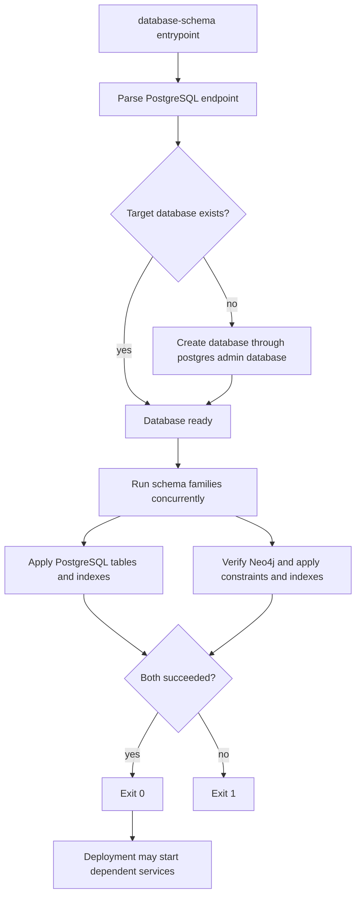

# Initializer architecture

`database-schema` owns the executable Neo4j and PostgreSQL definitions, their compatibility
contract, and the one-shot initializer image. Deployment owns credentials, service ordering,
resource policy, and the released image digest. Schema implementation files do not move into
deployment.

## Execution flow

The PostgreSQL administrative connection has a bounded connection timeout. Each schema
statement is idempotent, and a partial statement failure is still fatal to the initializer.
The Neo4j path verifies connectivity before applying definitions. Both clients are closed on
success or failure.

## Health and failure contract

The image intentionally has no listening port or Docker health check. Its process exit status
is the health contract: zero means the target database exists and both schema families were
applied; any administrative connection, connectivity, or schema failure returns nonzero.
Deployment may retry or stop the rollout, but it must not reinterpret a failed initializer as
healthy.

The image runs as numeric user and group `1000:1000`, writes optional logs under `/logs`, and
is named `ghcr.io/groovemap-music/database-schema` when released.
