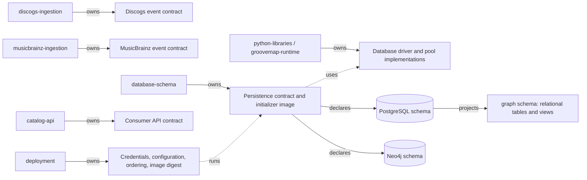
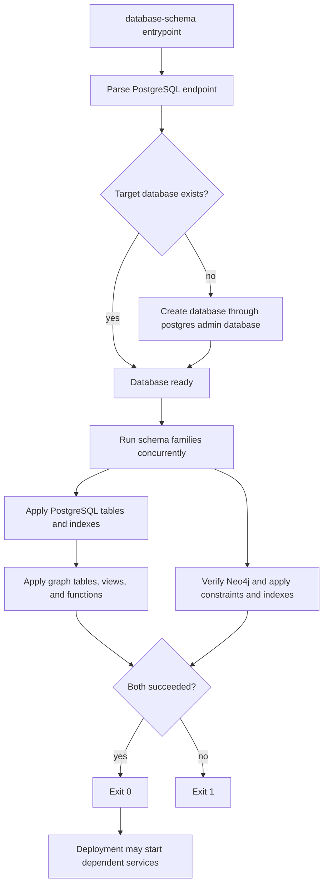

# Initializer architecture

`database-schema` owns the executable Neo4j and PostgreSQL definitions, their compatibility
contract, and the one-shot initializer image. Deployment owns credentials, service ordering,
resource policy, and the released image digest. Schema implementation files do not move into
deployment.


```mermaid
flowchart LR
    DI[discogs-ingestion] -->|owns| DE[Discogs event contract]
    MI[musicbrainz-ingestion] -->|owns| ME[MusicBrainz event contract]
    DS[database-schema] -->|owns| PC[Persistence contract and initializer image]
    RT[python-libraries / groovemap-runtime] -->|owns| CL[Database driver and pool implementations]
    API[catalog-api] -->|owns| AC[Consumer API contract]
    DEP[deployment] -->|owns| OP[Credentials, configuration, ordering, image digest]
    PC -->|declares| PG[(PostgreSQL schema)]
    PC -->|declares| N[(Neo4j schema)]
    PG -->|projects| GV[graph schema: relational tables and views]
    PC -. uses .-> CL
    OP -. runs .-> PC
```

The source-specific ingestion repositories own their event shapes. This repository owns only
the persistence definitions and compatibility metadata; it does not own producer payloads,
consumer API shape, credentials, or rollout orchestration. The former combined
`catalog-ingestion` repository is retired and is not an active owner.

## Execution flow


```mermaid
flowchart TD
    E[database-schema entrypoint] --> P[Parse PostgreSQL endpoint]
    P --> D{Target database exists?}
    D -->|no| C[Create database through postgres admin database]
    D -->|yes| R[Database ready]
    C --> R
    R --> F[Run schema families concurrently]
    F --> PG[Apply PostgreSQL tables and indexes]
    F --> N[Verify Neo4j and apply constraints and indexes]
    PG --> GV[Apply graph tables, views, and functions]
    GV --> G{Both succeeded?}
    N --> G
    G -->|yes| Z[Exit 0]
    G -->|no| X[Exit 1]
    Z --> S[Deployment may start dependent services]
```

The PostgreSQL administrative connection has a bounded connection timeout. Each schema
statement is idempotent, and a partial statement failure is still fatal to the initializer.
The Neo4j path verifies connectivity before applying definitions. Both clients are closed on
success or failure.

## Health and failure contract

The image intentionally has no listening port or Docker health check. Its process exit status
is the health contract: zero means the target database exists and both schema families were
applied; any administrative connection, connectivity, or schema failure returns nonzero.
Deployment may retry or stop the rollout, but it must not reinterpret a failed initializer as
healthy.

The image runs as numeric user and group `1000:1000`, writes optional logs under `/logs`, and
is named `ghcr.io/groovemap-music/database-schema` when released.

## Integration tiers

The real-engine proof runs twice over one script, `scripts/test-integration.sh`. The script
takes its engine images from `POSTGRES_INTEGRATION_IMAGE` and `NEO4J_INTEGRATION_IMAGE`, so a
tier is an image choice rather than a second copy of the test. Both tiers apply the production
initializers twice, compare the PostgreSQL and Neo4j catalogs across the two passes, assert
that the six native identity tables carry an engine `uuidv7()` default, and prove sentinel
rows survive the second pass.

| Tier | Recipe | PostgreSQL engine | CI status |
| --- | --- | --- | --- |
| Required | `just test-integration` | `postgres:18-alpine`, digest-pinned | Blocks merge |
| Advisory | `just test-integration-pg19` | `postgres:19beta3-alpine`, digest-pinned | Reports only |

The required tier is the gate. It pins the PostgreSQL major version deployment runs, and the
shared reusable workflow executes it as `integration-command`. The advisory tier exists so the
schema has a real PostgreSQL 19 engine to test on before general availability, and so a
regression in a beta is visible here rather than on the day deployment upgrades. Because the
reusable workflow accepts a single integration command, the advisory tier is a
repository-local job in [`.github/workflows/ci.yml`](../.github/workflows/ci.yml) that calls
the recipe directly and carries `continue-on-error: true`. A beta failure is therefore a
signal, not a merge block. Both tiers share the same Neo4j image; only the PostgreSQL engine
differs, so a divergence between them is attributable to the engine.

The script also takes the PostgreSQL container's shared memory size from
`POSTGRES_INTEGRATION_SHM_SIZE`, defaulting to Docker's own 64 MB. The PG18 tier never builds an
HNSW index and leaves this at the default. The PG19 tier's own integration test builds the
artist embeddings HNSW index (`build_artist_embeddings_index` in
[`postgres.py`](../src/groovemap_schema/postgres.py)) over a small synthetic fixture, and a
parallel HNSW build needs `/dev/shm` at least as large as the `maintenance_work_mem` it runs
with; `just test-integration-pg19` sets `POSTGRES_INTEGRATION_SHM_SIZE=256m` to cover the
modest, test-only `maintenance_work_mem` that build passes (never the ~2 GB the "Building the
artist HNSW index" procedure below documents for production).

### Promoting the beta tier at general availability

When PostgreSQL 19 reaches general availability, promote the advisory tier in this order:

1. Repoint `test-integration-pg19` in the [`Justfile`](../Justfile) at the digest of the
   released `postgres:19-alpine` image and confirm the tier passes locally.
2. Move the released digest onto `test-integration` so the required tier gates on
   PostgreSQL 19, and coordinate that change with the deployment repository, which owns the
   running engine version.
3. Delete the `postgres-19-beta` job from `ci.yml`, drop the `test-integration-pg19` recipe,
   and remove the two-tier assertions from
   [`scripts/check-repository.py`](../scripts/check-repository.py), which enforces that the
   required job stays free of `continue-on-error` and that the advisory job keeps it.
4. Update this section and the README so the repository again documents a single required
   integration tier.

Until step 2 lands, the PostgreSQL 18 digest and recipe are the gate and must not be changed
to accommodate a beta result.

## Neo4j media schema

[ADR 0007](https://github.com/groovemap-music/design/blob/main/docs/adr/0007-canonical-media-taxonomy.md)
introduces a canonical media taxonomy, with the canonical block shape defined by
[`taxonomy/media/v1/media-block.schema.json`](https://github.com/groovemap-music/design/blob/main/taxonomy/media/v1/media-block.schema.json)
in the design repository. Neo4j gains two supporting node types alongside the existing
Artist, Label, Master, Release, Genre, Style, User, and Person nodes:

- `Medium` — one canonical medium (for example `vinyl_lp`), unique on `id`, with `family` and
  `label` properties.
- `MediaFamily` — one of the closed set of media families (for example `vinyl`), unique on
  `name`.

Two relationships connect them into the existing graph:

- `(:Medium)-[:IN_FAMILY]->(:MediaFamily)` — the medium's family.
- `(:Release)-[:ISSUED_ON {qty, source}]->(:Medium)` — the media a release was issued on.
  `qty` is the unit count for that medium on that release (Discogs `qty`, or `1` per
  MusicBrainz medium); `source` names the producer that asserted the edge (`discogs` or
  `musicbrainz`), so a release known to both catalogs can carry both catalogs' media and the
  API can reconcile disagreements between them.

`Release` also carries a `media_families` list property — the sorted, unique family names
present on that release — so consumers can filter by family without traversing `ISSUED_ON`
edges. See `SCHEMA_STATEMENTS` in `src/groovemap_schema/neo4j.py` for the backing
constraints and index.

The complete executable inventory is `SCHEMA_STATEMENTS` in
[`src/groovemap_schema/neo4j.py`](../src/groovemap_schema/neo4j.py). It currently declares
unique constraints for `Artist.id`, `Label.id`, `Master.id`, `Release.id`, `Genre.name`,
`Style.name`, `Medium.id`, `MediaFamily.name`, `User.id`, and `Person.name`. Constraint-backed
properties deliberately have no duplicate range index. Additional range indexes cover
ingestion hashes, selected names and years, `Release.media_families`, genre/style first years,
`Person.credit_count`, and MusicBrainz identifiers; six full-text indexes cover artist,
release, label, genre, style, and person text search. These are schema declarations, not node
or relationship creation: the source-specific producers populate the graph.

## Neo4j identity projection

[ADR 0009](https://github.com/groovemap-music/design/blob/main/docs/adr/0009-native-identity-and-provider-aliases.md)
introduces GrooveMap-minted native identity in PostgreSQL (see Identity below). Neo4j's
share of that is four range indexes — `artist_gm_id`, `label_gm_id`, `master_gm_id`, and
`release_gm_id` — on a `gm_id` property on `Artist`, `Label`, `Master`, and `Release`. Nodes
keep their existing provider `id` and its unique constraint; `gm_id` carries no constraint of
its own because the property is additive and null until a projection job backfills it from
`provider_aliases`, and a uniqueness constraint cannot be declared over a property most nodes
don't yet have. See `SCHEMA_STATEMENTS` in `src/groovemap_schema/neo4j.py` for the four
statements.

## Identity

[ADR 0009](https://github.com/groovemap-music/design/blob/main/docs/adr/0009-native-identity-and-provider-aliases.md)
adds GrooveMap-minted UUIDv7 identity for five entities in PostgreSQL, so every catalog row
and physical copy has an id that does not depend on any one provider staying alive or
consistent. Six new tables carry this, declared in `_USER_TABLES` in
[`src/groovemap_schema/postgres.py`](../src/groovemap_schema/postgres.py) after `users`,
`user_collections`, and `user_wantlists` because they reference those tables:

- `catalog_items` — one row per native entity (`release`, `master`, `artist`, or `label`);
  the id every other identity table and the additive `gm_item_id` columns point at.
- `artifacts` — an edition of a catalog item, optionally attributed to the user who first
  captured it.
- `owned_copies` — the physical copy a user holds. It exists because a user says it does, not
  because a provider listed it, and its optional `collection_row_id` back-link to
  `user_collections` is set to `NULL` on delete rather than cascading, so the copy survives a
  collection resync.
- `collection_snapshots` — a point-in-time content hash and copy-id list for a user's
  collection, for detecting drift between syncs.
- `observations` — user-captured evidence about a copy or an edition (a matrix inscription, a
  grading, a purchase price); a check constraint requires at least one of `owned_copy_id` or
  `artifact_id` to be set.
- `provider_aliases` — maps every external namespace (Discogs, MusicBrainz, Wikidata,
  barcodes, catalogue numbers, ISRCs, matrix inscriptions, …) onto a native id, with a
  validity interval so a provider merge or split is a new row rather than an in-place
  rewrite.

`provider_aliases` carries the lookup-or-create key: a unique index on
`(provider, entity_kind, external_id)` scoped to `WHERE valid_to IS NULL`. Because the
uniqueness holds only over the currently valid row rather than the whole table, any number of
concurrent writers can run the same `SELECT` / `INSERT ... ON CONFLICT DO NOTHING` / re-`SELECT`
sequence against the same external id and converge on one native id, instead of racing to
insert two aliases for the same provider entity.

Every provider-keyed table also gains an additive, nullable `gm_item_id UUID` column pointing
at `catalog_items`, each with a plain index: the four Discogs entity tables (`artists`,
`labels`, `masters`, `releases`, added in `_entity_schema_statements()`), the four
`musicbrainz.*` entity tables (`artists`, `labels`, `releases`, `release_groups`, indexed by
`idx_mb_artists_gm_item_id`, `idx_mb_labels_gm_item_id`, `idx_mb_releases_gm_item_id`, and
`idx_mb_release_groups_gm_item_id`), and `user_collections` and `user_wantlists`. Discogs
`data_id`/`release_id` and the `musicbrainz.*` `mbid` columns remain each table's primary key;
`gm_item_id` is a pointer into the native identity graph, not a replacement key.
`user_collections` also gains an additive, nullable `owned_copy_id UUID` column (indexed by
`idx_user_collections_owned_copy_id`), the native counterpart to the provider `instance_id`
that will eventually identify the physical copy. Both `release_id`/`instance_id` and the
Discogs/MusicBrainz primary keys stay authoritative until a future contraction decision
retires them.

### Superseded catalog items

ADR 0009's
[2026-09-25 amendment](https://github.com/groovemap-music/design/blob/main/docs/adr/0009-native-identity-and-provider-aliases.md#2026-09-25-superseded-catalog-items-and-native-id-merge)
decides what happens when two native catalog items turn out to be one, through an ADR 0014
edition promotion or catalog re-attachment. The superseded item keeps its `catalog_items`
row; this repository declares the shape and `catalog-api` writes every row, inside the ADR
0014 transaction that moves the aliases:

- `catalog_item_supersessions` — `superseded_id` → `survivor_id` (both foreign keys to
  `catalog_items`), a `cause` checked against the closed set `edition_promotion` and
  `catalog_reattachment`, a `decision_ref` naming the matching decision or `admin_audit_log`
  entry that authorized it (a bare UUID, not a foreign key), a `valid_from`/`valid_to`
  interval, and `via_id`. A partial unique index on `superseded_id WHERE valid_to IS NULL`
  admits at most one current survivor per item. Resolution is always one hop: when B, which
  survives A, is superseded into C, the writer closes A → B and opens A → C with `via_id`
  naming the B → C row, so reverting B → C can close exactly the rows it compressed and
  re-open their predecessors.
- `catalog_item_moves` — the ledger of asserted references a merge re-pointed:
  `supersession_id`, `table_name` (`artifacts` or `owned_copies`), `row_id`, `from_item_id`,
  `to_item_id`, the owning `user_id`, and `moved_at`, unique per `(supersession_id,
  table_name, row_id)`. A revert moves back only the ledgered rows that still point at
  `to_item_id`. The ledger is personal data: erasure deletes a user's rows by `user_id` (and
  deleting the `users` row cascades), and export includes them.
- `public.resolve_catalog_item(native_id uuid)` — the published resolution: the current
  survivor, or the id itself when it is not superseded. It is a function rather than a view
  because it must answer for any native id, including ids with no `catalog_items` row, such as
  an `activity.impressions.item_id` or an outcome recorded verbatim.
- `graph.catalog_item` excludes currently superseded items, so the vertex never exposes a
  tombstone.

`artifacts.item_id` and `owned_copies.item_id` are indexed (`idx_artifacts_item_id`,
`idx_owned_copies_item_id`), because the merge re-point and `catalog-api`'s dependents guard
both walk from an item to its dependents.

Every table and column above is additive within persistence contract v1 — see
[the persistence compatibility contract](../contracts/persistence/).

## Activity

[ADR 0010](https://github.com/groovemap-music/design/blob/main/docs/adr/0010-first-party-events-consent-and-deletion.md)
adds a first-party, append-only behavioural record in a new `activity` PostgreSQL schema,
declared in `_ACTIVITY_STATEMENTS` in
[`src/groovemap_schema/postgres.py`](../src/groovemap_schema/postgres.py) after the
user-owned tables because `activity.user_subjects` and `activity.consent_grants` reference
`users(id)`:

- `activity.user_subjects` — the pseudonym link from a user id to a `subject_id`. Events and
  impressions reference only `subject_id`, never the user id, so the behavioural tables can be
  read and joined without carrying account identity, and removing this one row is what makes
  an erased subject unre-associable with the account it belonged to.
- `activity.consent_grants` — per-purpose consent (`product_analytics` or `model_training`); a
  revocation sets `revoked_at` rather than deleting the grant, so history stays
  reconstructible.
- `activity.events` — the typed event envelope: event type, schema/feature/model versions, the
  `subject_id`, and a `consent_purposes` snapshot taken at write time.
- `activity.impressions` — what a shown recommendation needs for later offline evaluation
  (`policy_id`, `candidate_set_id`, `position`, `propensity`); outcomes are recorded as
  `activity.events` rows carrying the impression id, never as columns here, which is what
  keeps an impression row immutable while one impression accrues several outcomes.

`activity.events` and `activity.impressions` are both declared `PARTITION BY RANGE
(occurred_at)` — month-range partitions — and each has a `_default` partition
(`activity.events_default`, `activity.impressions_default`) so an insert into a month with no
partition yet does not fail. The `activity.ensure_month_partition(table_name, month)` function
is what a writer calls before insert to land the row in its own partition: it creates
`<table>_yYYYYmMM` for that month if it doesn't already exist and returns the partition name.

Both tables are immutable by construction, not by convention. The `activity.reject_mutation()`
trigger function raises unless the session-local `groovemap.erasure` setting is `on`, and a
`BEFORE UPDATE OR DELETE` trigger on each of `activity.events` and `activity.impressions`
(`activity_events_reject_mutation`, `activity_impressions_reject_mutation`) invokes it —
declared on the partitioned table, so the trigger applies to every existing partition and is
cloned onto partitions `ensure_month_partition()` creates later. Only the erasure procedure
sets `groovemap.erasure`, and because the setting is session-local the bypass never outlives
the transaction that opened it.

`activity.erasures` records each erasure run: `subject_id`, timing, the count of
events/impressions deleted, and `model_versions_before` — the model versions that had already
trained on the data before it was deleted, so the residual question ("which models saw this
subject's data") stays answerable rather than invisible.

Every table, function, and trigger above is additive within persistence contract v1 — see
[the persistence compatibility contract](../contracts/persistence/).

## PostgreSQL media schema

The PostgreSQL family gains an indexed `media JSONB` column, holding the canonical media
block, on every release-shaped table: `releases`, `musicbrainz.releases`, `user_collections`,
and `user_wantlists`. `releases`, `musicbrainz.releases`, and `user_collections` each carry a
GIN index on `media->'families'` for medium-family filtering; the raw provider fields
(`data`, `formats`, `format`) are unchanged and remain the provenance record.
`insights.release_rarity` gains `media_families`, `family_signals`, and `medium_rarity` as
additive, media-neutral rarity signals alongside the retained `format_rarity`. Every change
is additive within persistence contract v1 — see
[the persistence compatibility contract](../contracts/persistence/).

The executable PostgreSQL inventory is in
[`src/groovemap_schema/postgres.py`](../src/groovemap_schema/postgres.py):

- public Discogs document tables: `artists`, `labels`, `masters`, and `releases`;
- account and operational tables: `users`, `oauth_tokens`, `app_tokens`, `app_config`,
  `user_collections`, `user_wantlists`, `sync_history`, `extraction_history`, `queue_metrics`,
  `service_health_metrics`, `admin_audit_log`, and `loader_extraction_latch`;
- native identity tables (see Identity above): `catalog_items`, `artifacts`, `owned_copies`,
  `collection_snapshots`, `observations`, `provider_aliases`, `catalog_item_supersessions`,
  and `catalog_item_moves`;
- insight tables in the `insights` schema: `artist_centrality`, `genre_trends`,
  `label_longevity`, `monthly_anniversaries`, `data_completeness`, `release_rarity`,
  `community_counts`, `computation_log`, and `activity_summary` (analytics-engine's
  daily per-dimension rollup of `activity` events and impressions, keyed by
  `summary_date`, `dimension`, and `dimension_key`);
- activity tables in the `activity` schema (see Activity above): `user_subjects`,
  `consent_grants`, `events`, `impressions`, and `erasures`;
- MusicBrainz tables in the `musicbrainz` schema: `artists`, `labels`, `releases`,
  `release_groups`, `relationships`, and `external_links`; and
- `public.artist_embeddings` (see Vector embeddings and the embedding pipeline role below),
  guarded on the `vector` extension being present, alongside the `embedding_pipeline` role.

The statement lists also carry the migrations required for an existing database: additive
authentication and media columns, rarity-signal columns, Discogs cross-reference widening to
`BIGINT`, and the widened `musicbrainz.relationships` natural key. The latter uses `UNIQUE NULLS
NOT DISTINCT` across both entity identifiers and types, relationship type, dates, and
attributes. These statements intentionally run with the table/index declarations because
`CREATE TABLE IF NOT EXISTS` cannot update an existing table. Do not translate them into an
out-of-band migration or remove retained provenance fields.

`musicbrainz.relationships` and `musicbrainz.external_links` were declared with `created_at`
only, unlike every other MusicBrainz entity table, so an additive `updated_at TIMESTAMPTZ NOT
NULL DEFAULT NOW()` column (with a plain index, `idx_mb_rels_updated_at` and
`idx_mb_links_updated_at`) closes the gap. `musicbrainz-sql-loader` is the consumer:
delete-reconciliation, modelled on `discogs-sql-loader`'s `purge_stale_rows` over the Discogs
entity tables' own `updated_at`, refreshes the column on every upsert and deletes rows where
`updated_at < run start` at the end of a full re-extraction. DDL ownership is this repository
alone, so the column is declared here rather than carried as a startup `ALTER` in the loader.

### Loader extraction-latch coordination

`loader_extraction_latch` is the loader family's durable, per-`(loader, extraction)` latch for
a post-import pass — for `discogs-sql-loader`, the pass that refreshes counters and reconciles
`member_of`/`same_as` after a full Discogs extraction. A loader handles `extraction_complete`
once per entity type across independently draining fanout queues, and its derived-relation
refresh must not run until all of one extraction's signals have arrived — a per-type refresh
would publish counts over a half-loaded catalog. One row per `(loader, version)` — `version`
falling back to `started_at` when the message carries no version — records which types have
signalled (`signals TEXT[]`), whether the refresh pass has completed (`refreshed_at`), and
superseded-by ordering against a later extraction of the same loader, so a stale signal from a
dump a newer one has replaced is never mistaken for the current one's final signal. It mirrors
`graphinator`'s equivalent Neo4j-side latch, and for the same reason: written before the
triggering delivery is acked, so a restart between signals resumes collection instead of
losing the coordination state the ack would otherwise destroy.

The table is declared here, in `_USER_TABLES` in
[`src/groovemap_schema/postgres.py`](../src/groovemap_schema/postgres.py), rather than by a
runtime `CREATE TABLE` in a loader, because this repository is the sole DDL issuer (the
discogs-sql-loader review bounced its own runtime `CREATE TABLE IF NOT EXISTS` for exactly
that reason). `discogs-sql-loader`'s `tableinator/extraction_latch.py` probes
`information_schema` at startup for `public.loader_extraction_latch` and requires the
`loader` column (its `REQUIRED_COLUMNS`) along with the other columns at exact
`information_schema` types (`text`; `ARRAY`/`_text`; `timestamp with time zone` × 3), or it
declines the relation and runs degraded. This repository declares exactly that relation:

```sql
CREATE TABLE IF NOT EXISTS loader_extraction_latch (
    loader       TEXT NOT NULL,
    version      TEXT NOT NULL,
    signals      TEXT[] NOT NULL DEFAULT '{}',
    created_at   TIMESTAMPTZ NOT NULL DEFAULT NOW(),
    updated_at   TIMESTAMPTZ NOT NULL DEFAULT NOW(),
    refreshed_at TIMESTAMPTZ,
    CONSTRAINT loader_extraction_latch_pkey PRIMARY KEY (loader, version)
)
```

It is named for the loader family, not for one loader, and carries the mandatory `loader`
discriminator column the probe requires: the loader keys and scopes every statement on it to
`loader = 'discogs'` (its `_key_columns()` returns `(loader, version)` rather than
`(version,)`), which is why the primary key is declared on `(loader, version)` up front. The
probe verifies via `pg_constraint` that a PRIMARY KEY or UNIQUE constraint spans exactly those
two columns — a bare unique index is declined by design — before its `ON CONFLICT` upsert
runs, so that constraint must exist from the start, not be added later.
`discogs-sql-loader` writes `loader = 'discogs'`;
`musicbrainz-sql-loader` may adopt the same pattern and write `loader = 'musicbrainz'` rows
into this same relation, without this repository declaring a second table. See
`extraction_latch` in [the persistence compatibility contract](../contracts/persistence/) for
the full column and primary-key record.

`loader_extraction_latch` is storage-only: a plain `public` schema table, not part of the
`graph` schema and not a property-graph element.

### Durable derived-refresh job state

The measured million-release refresh did not certify the full Discogs dump against
RabbitMQ's 1,800-second acknowledgement timeout. The schema therefore also declares
`public.loader_derived_refresh_cursor` and `public.loader_derived_refresh_job`, plus a
nullable `generation BIGINT` on the existing latch. This is an **additive schema-only
prerequisite**: the current loader still refreshes inline and acknowledges only after
the transaction commits. No database trigger or schema initializer starts a job.

The cursor has one row per loader and records its latest accepted `(generation,
version)`. The future loader must compare source extraction order before advancing
that cursor: an old signal arriving first *at this consumer* is not thereby a new
extraction. Discogs' producer sends its ordered dump version and `started_at`;
another loader must establish an equally reliable ordering rule. It must serialize
first-signal generation assignment with `SELECT ... FOR UPDATE` on the cursor row,
write the assigned generation on the latch, and never reassign it for a replay of
the same version. Legacy latch rows remain `NULL` until the loader cutover
reconciles unfinished versions; this additive migration does not manufacture a
job from an old row or silently acknowledge its terminal delivery.

On the fourth signal the loader commits the latch update and one `pending` job,
keyed by `(loader, version)`, **before** it acknowledges the delivery. A job's
generation must equal its latch's generation (a composite foreign key enforces
that), and only one version per loader may use any non-null generation. The job
can be `pending`, `leased`, `retry`, `completed`, or `superseded`; it records
attempt count, due time, lease owner/token/epoch/expiry, bounded sanitized error,
and lifecycle timestamps. Partial indexes support due-job and expired-lease
scans. The loader, not this repository, owns scheduling, retry policy, and the
health surface. `discogs-sql-loader` writes only `loader = 'discogs'` rows and
`musicbrainz-sql-loader` only its own discriminator.

A worker may claim a due row transactionally with `FOR UPDATE SKIP LOCKED`, increment
its lease epoch, and set a fresh token. It must also scan expired leases on startup
and periodically, rather than rely on a live notification. Before the refresh
transaction commits it must lock the loader cursor and require its generation and
version to match the job, and require the job's lease token and epoch still to
match. The graph refresh, latch `refreshed_at`, and `completed` transition then
commit together; a stale generation rolls back and becomes `superseded`, never
stamps the old latch. A failure leaves a durable retry obligation, and a later
extraction cannot be undone by a slow old worker. The worker must make pending
age, lease expiry, retry due, last sanitized failure, and newest completed
version visible in health; an acknowledged but stuck job is degraded health, not
success. The full transition and crash-injection requirements are in the
[`discogs-sql-loader` measurement](https://github.com/groovemap-music/discogs-sql-loader/blob/bd0a32b/docs/derived-refresh-ack-budget.md).

The old inline loader can run against this expanded schema unchanged. Rollback of
the future worker is to restore inline behavior while retaining these unused
additive relations; dropping them would be a separate contract migration.

## Catalog identifiers, manufacturing credits, and release country

[ADR 0011](https://github.com/groovemap-music/design/blob/main/docs/adr/0011-catalog-identifiers-and-manufacturing-credits.md)
adds two PostgreSQL GIN indexes over the additive `identifiers` and `companies` blocks that
`discogs-ingestion` attaches to every Discogs `releases` event, a Neo4j `Company` node, the
`CREDITED_TO` manufacturing-credit edge, and a `Release.country` range index.

PostgreSQL gains `idx_releases_identifiers` on `data->'identifiers'` and
`idx_releases_companies` on `data->'companies'`, GIN indexes declared beside
`idx_releases_genres`, `idx_releases_labels`, and `idx_releases_media_families` in
`_SPECIFIC_INDEXES` in [`src/groovemap_schema/postgres.py`](../src/groovemap_schema/postgres.py).
They serve analytical containment queries over the two blocks; exact barcode and
catalogue-number lookup resolves through `provider_aliases` (see Identity above) instead.

Neo4j gains `Company` — one manufacturing, mastering, or distribution credit party, unique on
`id` (the `company_id` constraint) — alongside the existing Artist, Label, Master, Release,
Genre, Style, Medium, MediaFamily, User, and Person nodes. The credit itself is a
relationship:

- `(:Release)-[:CREDITED_TO {role, role_category, source}]->(:Company)` — a manufacturing,
  mastering, or rights credit a catalog asserts about a release. `role` is the raw credit
  string and `role_category` its closed-vocabulary category, the same pattern
  `(:Person)-[:CREDITED_ON {role}]->(:Release)` already uses for a person credit; `source`
  names the asserting catalog, the same pattern `(:Release)-[:ISSUED_ON {qty, source}]->(:Medium)`
  above already uses. Like those two edges, `CREDITED_TO` is documented here rather than
  declared in `SCHEMA_STATEMENTS` — the source-specific graph enrichers write it, and this
  repository declares only the `Company.id` constraint it depends on.

`Release` also gains a `country` range index (`release_country`), backing an additive
`Release.country` property that the Discogs graph enricher writes from the release's country,
and an additive `Release.mb_country` property the MusicBrainz graph enricher writes on
releases it matches. `releases.data->>'country'` is already indexed in PostgreSQL
(`idx_releases_country`); this closes the same gap in the graph. See `SCHEMA_STATEMENTS` in
[`src/groovemap_schema/neo4j.py`](../src/groovemap_schema/neo4j.py) for the `company_id`
constraint and the `release_country` index.

Every index and constraint above is additive within persistence contract v1 — see
[the persistence compatibility contract](../contracts/persistence/).

## Graph schema

The `graph` schema re-presents the catalog as relational vertex and edge projections matching
the graph the Neo4j enrichers build. Sixty-eight relations, declared in
[`src/groovemap_schema/postgres.py`](../src/groovemap_schema/postgres.py): thirty-one
loader-written tables and thirty-seven read-only views over tables declared elsewhere in the
same module. The schema is additive within persistence contract v1:
[the persistence compatibility contract](../contracts/persistence/) records every relation
with its shape and its owner, and the text key rule as additive objects of
version 1.

**This repository declares every relation and writes rows into none of them.** An empty table
on a fresh database is the expected state, not a fault. `discogs-sql-loader` owns most of
them, `musicbrainz-sql-loader` owns the MusicBrainz half and co-owns the shared medium
vocabulary, `catalog-api` owns the personal-collection views, and
[`graph.release_degree`](#the-counter-degree-and-aggregate-relations) is the one relation
split across two owners. The contract names the owner of each. The schema also declares
[`graph.bootstrap_fill()`](#the-bootstrap-fill), which can write those rows on request, but
nothing calls it and applying the schema still writes nothing — and what it writes is not
authoritative.

Twenty of the tables replaced a view that computed the same rows on every read. Spike
gm-database-schema-9c8.1 measured those views and found every hot edge re-unnesting a JSONB
document per query, unable to carry an index, and — because a view cannot be probed from its
target end — reproducing a sequential scan on the traversal direction the ported Cypher uses
most. Spike gm-database-schema-9c8.2 Table 2 and Table 3 fix the shapes, keys, indexes, and
owners; this schema follows them and does not invent one. Seven further tables hold the
counters the graph enrichers compute in a post-import pass, which a graph declared over views
had nowhere to put. The twenty-eighth is `graph.artist_member_of`, the
[cross-provenance MEMBER_OF union](#the-member_of-union), and the twenty-ninth is
`graph.vertex_degree`, [the per-vertex degree](#the-per-vertex-degree) that orders frontier
expansion. Both are derived from the relations above them rather than from a document, and
both exist for [the shortest-path function](#the-shortest-path) that reads them. The thirtieth
and thirty-first are `graph.track_credited_on` and `graph.track_by_artist`,
[the track-level credits and performers](#track-credits-and-track-performers) the FastRP
embedding pipeline reads — never a phase 0 view, and additive rather than a replacement of
anything above.

The sixty-eight relations are unconditional on every supported PostgreSQL engine. Consumers
read them with ordinary SQL; graph pattern queries continue to use Neo4j.

Names are the contract. A vertex view is named for the Neo4j label it mirrors and an edge
view for the relationship type, lowercased and de-reserved: `:User` becomes `app_user`, the vertex
label ADR 0012 records for it, because `user` is reserved; and the overloaded `[:BY]`,
`[:ON]`, and `[:IS]` types become `by_artist`, `on_label`, `in_genre`, and `in_style`. Where
ADR 0012 names a label, its mapping table is the contract and this schema follows it.

That contract is enforced by the engine, not only by convention. `CREATE OR REPLACE VIEW`
may only append columns to the end of an existing view: PostgreSQL refuses to drop, rename,
reorder, or retype a column the view already exposes, and fails the statement outright rather
than replacing it. So adding a column to a view is the only change that is safe to ship on its
own. Renaming a view or a view column, removing one, changing its position, or widening its
type is a breaking change to the published contract and needs a coordinated migration under
the persistence contract's expand/migrate/contract rule — expand with the new shape alongside
the old, migrate readers, then contract — not an edit to the statement list here.

Changing a relation's *shape* is the one case the schema handles itself, and it is the only
place anything here drops anything. A relation that becomes a loader-written table is preceded
by a guarded migration: a `DO` block that reads `pg_class`, drops the view only if a view of
that name is still there, and does nothing otherwise. A fresh database drops nothing. A second
apply finds a table rather than a view and drops nothing either. `CASCADE` also cleans up dependencies left by the retired experimental SQL/PGQ declaration. The four Discogs vertex relations that stay views carry the same guard for the
same reason, conditioned on their key column still reading as `character varying`, which makes
it self-healing from any half-applied state.

The same rule binds the base tables underneath. PostgreSQL will not retype a column a view
reads, so once a graph view exposes a column, an `ALTER COLUMN ... TYPE` against it fails
while the view exists. The MusicBrainz provider-id widenings in `_MUSICBRAINZ_TABLES` are
gated on both the column still being narrow and no view depending on it, and emit a `NOTICE`
naming the dependent view instead of failing when it is; reaching that state needs the same
coordinated migration rather than a startup `ALTER`.

Discogs ids live inside JSONB documents as numbers while the catalog tables key on `data_id
VARCHAR`, so every id is read with `->>` and compared as text. Every unnest is guarded by a
`jsonb_typeof(...) = 'array'` check, because a malformed document would otherwise fail the
whole view rather than skip one row, and every element whose `id` is missing or `0` is
dropped — exactly what `graphinator` does before it writes an edge.

Two asymmetries in that projection are worth naming. The Discogs edge views unnest a JSONB
array and do not inner-join the vertex view for their target, so an edge may reference an id
no vertex row carries; the MusicBrainz relationship views do inner-join both entity tables,
so an edge appears only once both endpoints are loaded. Both are faithful to the enrichers
they mirror — `graphinator` merges a Discogs target node as it writes the edge, while the
MusicBrainz enricher only relates entities it has already ingested. And `graph.company`
resolves a company id that several credits spell differently by taking the lexicographically
smallest name (`DISTINCT ON` with a matching `ORDER BY`), where Neo4j's last-write-wins merge
would keep whichever credit was written last; the view's answer is stable and reproducible,
which the graph's is not.

One deliberate narrowness: these views trim with `btrim`, which removes spaces only, while
the Python enrichers use `str.strip()`, which removes every kind of whitespace. A value padded
with a tab or a newline — in `country`, in a normalized credit role, or in the fallback
`name:` company key — is therefore trimmed by the enricher but not by the view. Discogs and
MusicBrainz payloads pad with spaces in practice, so the two agree on real data; a document
that pads otherwise is the known gap.

### Neo4j type to relation mapping

This is the whole mapping between each Neo4j label or relationship type and the ordinary SQL
relation that re-presents it. See [labels](#labels) for the reserved words handled by the
relational names.

Vertex relations. The key column is what edge relations join to, and every one of them is
`text`, `uuid`, or `bigint` — never `character varying`; see
[the text key rule](#the-text-key-rule). "Shape" is `table` where a loader writes the rows and
`view` where the relation is a projection of a table written elsewhere.

Four of these relations hold the rows of a label without being the element table the property
graph binds. `:Genre`, `:Style`, `:Label`, and `:Artist` bind a `<label>_vertex` view that
joins the relation below to its counter relation, so that the counters `graphinator` writes
onto those four nodes read as properties of the same label here. The rows, the key, and every
column in this table are unchanged by that; the projection only adds columns. See
[the counter relations](#the-counter-degree-and-aggregate-relations).

| Neo4j label | Relation | Shape | Key column | Other columns |
| --- | --- | --- | --- | --- |
| `:Artist` | `graph.artist` | view | `artist_id` | `name`, `gm_item_id`, `hash`, `updated_at`, `gm_id` |
| `:Label` | `graph.label` | view | `label_id` | `name`, `gm_item_id`, `hash`, `updated_at`, `gm_id` |
| `:Master` | `graph.master` | view | `master_id` | `title`, `year`, `genres`, `styles`, `gm_item_id`, `hash`, `updated_at`, `gm_id` |
| `:Release` | `graph.release` | view | `release_id` | `title`, `year`, `country`, `genres`, `styles`, `media_families`, `gm_item_id`, `hash`, `updated_at`, `formats`, `catalog_number`, `gm_id` |
| `:Genre` | `graph.genre` | **table** | `name` | — |
| `:Style` | `graph.style` | **table** | `name` | — |
| `:Person` | `graph.person` | **table** | `name` | — |
| `:Company` | `graph.company` | **table** | `company_id` | `name`, `discogs_label_id` |
| `:Medium` | `graph.medium` | **table** | `medium_id` | `family`, `label` |
| `:MediaFamily` | `graph.media_family` | **table** | `name` | — |
| `:User` | `graph.app_user` | view | `user_id` | `is_active`, `is_admin`, `created_at`, `updated_at` |
| (native identity) | `graph.catalog_item` | view | `item_id` | `kind`, `created_at` |
| (MusicBrainz artist) | `graph.mb_artist` | view | `mbid` | `name`, `sort_name`, `type`, `gender`, `begin_date`, `end_date`, `ended`, `area`, `begin_area`, `end_area`, `disambiguation`, `discogs_artist_id`, `updated_at`, `gm_item_id` |
| (MusicBrainz label) | `graph.mb_label` | view | `mbid` | `name`, `type`, `label_code`, `begin_date`, `end_date`, `ended`, `area`, `disambiguation`, `discogs_label_id`, `updated_at`, `gm_item_id` |
| (MusicBrainz release) | `graph.mb_release` | view | `mbid` | `name`, `barcode`, `status`, `release_group_mbid`, `discogs_release_id`, `media_families`, `updated_at`, `gm_item_id` |
| (MusicBrainz release group) | `graph.mb_release_group` | view | `mbid` | `name`, `type`, `secondary_types`, `first_release_date`, `disambiguation`, `discogs_master_id`, `updated_at`, `gm_item_id` |

The six name-keyed vertex relations are tables because their views were the most expensive
relations in the schema and could not carry an index. Each was a `SELECT DISTINCT` over a full
unnest of every release and every master to yield a few hundred rows, which is why a scan of
`masters` appeared in the label DNA plan even though that query has nothing to do with
masters. `graph.genre`, `graph.style`, and `graph.person` also carry a `GIN` trigram index on
`name`, which the six full-text query functions the coverage spike found need and which a view
cannot carry at all. The extension is created by the initializer and each index is guarded on
it actually being present, so a deployment whose role cannot create an extension loses trigram
search rather than the schema.

`graph.company`'s identity rule is the producer's and the table deliberately does not
recompute it: a whole Discogs id of at least one when the source supplies one, otherwise
`name:` followed by the name case-folded with inner whitespace collapsed and punctuation left
alone. PostgreSQL's `lower` only approximates Python's `casefold` — they disagree on the
German eszett and a handful of other characters — so the loader writes the rule's own answer
and the approximation retired with the view.

The four Discogs entity relations stay views: they are straight projections of an indexed
table and do not need materializing on read grounds. Each now publishes its key as
`data_id::text`, which retires the appended `<entity>_key` restatement the phase 0 views
carried. Each also appends `gm_id`, the native catalog identity ADR 0009 mints, read from
`provider_aliases` — the one table `catalog-api`'s `gm_id` projection job reads — through its
partial unique index on `(provider, entity_kind, external_id) WHERE valid_to IS NULL`. The
join is a single index probe, cannot multiply a row, and is a `LEFT JOIN` so an entity the
resolver has not reached yet is still a vertex. Exposing it here is what makes a cross-store
copy unnecessary.

`graph.release` also publishes `formats` and `catalog_number`, the two `:Release` properties
the graph writes from `data->'formats'[].name` and `labels[0].catno`. `catalog_number` was
written twice in the graph — by `graphinator` and again by `catalog-api`'s syncer — and
neither `user_collections` nor `user_wantlists` has a column for it, so the Discogs copy is
the one with a relational home.

`graph.app_user` deliberately omits `email` and every credential column: the Neo4j
`:User` node carries only an id, and a graph relation is the wrong surface on which to widen
personal data.

Edge relations. Every one exposes a stable key column set plus the source and target key
columns that join the vertex relations above. **Every edge table is indexed in both
directions**: the primary key serves the forward walk and a second index serves the reverse,
because the ported Cypher enters these edges from the target end as often as from the source.
A table indexed one way only reproduces the exact failure the views had. "Reverse index" is
that second index; the primary key is the key column set in the column before it.

| Neo4j relationship | Relation | Shape | Key columns | Reverse index | Source → target | Source |
| --- | --- | --- | --- | --- | --- | --- |
| `(:Release)-[:BY]->(:Artist)` | `graph.by_artist` | **table** | `release_id`, `artist_id` | `(artist_id, release_id)` | `release_id` → `artist_id` | `releases.data->'artists'` |
| `(:Release)-[:ON]->(:Label)` | `graph.on_label` | **table** | `release_id`, `label_id` | `(label_id, release_id)` | `release_id` → `label_id` | `releases.data->'labels'` |
| `(:Release)-[:DERIVED_FROM]->(:Master)` | `graph.derived_from` | **table** | `release_id`, `master_id` | `(master_id, release_id)` | `release_id` → `master_id` | `releases.data->>'master_id'` |
| `(:Release)-[:IS]->(:Genre)` | `graph.in_genre` | **table** | `release_id`, `genre_name` | `(genre_name, release_id)` | `release_id` → `genre_name` | `releases.data->'genres'` |
| `(:Release)-[:IS]->(:Style)` | `graph.in_style` | **table** | `release_id`, `style_name` | `(style_name, release_id)` | `release_id` → `style_name` | `releases.data->'styles'` |
| `(:Master)-[:BY]->(:Artist)` | `graph.master_by_artist` | **table** | `master_id`, `artist_id` | `(artist_id, master_id)` | `master_id` → `artist_id` | `masters.data->'artists'` |
| `(:Master)-[:IS]->(:Genre)` | `graph.master_in_genre` | **table** | `master_id`, `genre_name` | `(genre_name, master_id)` | `master_id` → `genre_name` | `masters.data->'genres'` |
| `(:Master)-[:IS]->(:Style)` | `graph.master_in_style` | **table** | `master_id`, `style_name` | `(style_name, master_id)` | `master_id` → `style_name` | `masters.data->'styles'` |
| `(:Style)-[:PART_OF]->(:Genre)` | `graph.part_of` | view | `style_name`, `genre_name` | — | `style_name` → `genre_name` | releases and masters carrying exactly one genre |
| `(:Artist)-[:MEMBER_OF]->(:Artist)` | `graph.member_of` | **table** | `member_artist_id`, `group_artist_id` | `(group_artist_id, member_artist_id)` | `member_artist_id` → `group_artist_id` | `artists.data->'members'` and `->'groups'` |
| (`MEMBER_OF`, both provenances) | `graph.artist_member_of` | **table** | `member_artist_id`, `group_artist_id`, `source` | `(group_artist_id, member_artist_id)` | `member_artist_id` → `group_artist_id` | `graph.member_of` and `graph.mb_rel_artist_artist` |
| `(:Artist)-[:ALIAS_OF]->(:Artist)` | `graph.alias_of` | **table** | `alias_artist_id`, `artist_id` | `(artist_id, alias_artist_id)` | `alias_artist_id` → `artist_id` | `artists.data->'aliases'` |
| `(:Label)-[:SUBLABEL_OF]->(:Label)` | `graph.sublabel_of` | view | `sublabel_id`, `parent_label_id` | — | `sublabel_id` → `parent_label_id` | `labels.data->'parentLabel'` and `->'sublabels'` |
| `(:Person)-[:CREDITED_ON]->(:Release)` | `graph.credited_on` | **table** | `person_name`, `release_id`, `role` | `(release_id, person_name)` | `person_name` → `release_id` | `releases.data->'extraartists'` |
| `(:Person)-[:SAME_AS]->(:Artist)` | `graph.same_as` | **table** | `person_name`, `artist_id` | `(artist_id)` | `person_name` → `artist_id` | `releases.data->'extraartists'` and `->'tracklist'[].extraartists` (and their `sub_tracks`) |
| (track credit — no Neo4j equivalent) | `graph.track_credited_on` | **table** | `person_name`, `release_id`, `track_ordinal`, `sub_track_ordinal`, `role` | `(release_id, track_ordinal, sub_track_ordinal, person_name)` | `person_name` → `release_id` | `releases.data->'tracklist'` (xmltodict-wrapped; and its `sub_tracks`) |
| (track performer — no Neo4j equivalent) | `graph.track_by_artist` | **table** | `release_id`, `track_ordinal`, `sub_track_ordinal`, `artist_id` | `(artist_id, release_id, track_ordinal, sub_track_ordinal)` | `release_id` → `artist_id` | `releases.data->'tracklist'` (xmltodict-wrapped; and its `sub_tracks`) |
| `(:Release)-[:CREDITED_TO]->(:Company)` | `graph.credited_to` | **table** | `release_id`, `company_id`, `role`, `source` | `(company_id, release_id)` | `release_id` → `company_id` | `releases.data->'companies'` |
| `(:Release)-[:ISSUED_ON]->(:Medium)` | `graph.issued_on` | **table** | `release_id`, `medium_id`, `source` | `(medium_id, release_id)` | `release_id` → `medium_id` | `releases.media` and `musicbrainz.releases.media` |
| `(:Medium)-[:IN_FAMILY]->(:MediaFamily)` | `graph.in_family` | view | `medium_id`, `family_name` | — | `medium_id` → `family_name` | `graph.medium` |
| (artist genre aggregate) | `graph.artist_genre` | **table** | `artist_id`, `genre_name` | `(genre_name, artist_id)` | `artist_id` → `genre_name` | `graph.by_artist` × `graph.in_genre` |
| (label genre aggregate) | `graph.label_genre` | **table** | `label_id`, `genre_name` | `(genre_name, label_id)` | `label_id` → `genre_name` | `graph.on_label` × `graph.in_genre` |
| `(:User)-[:COLLECTED]->(:Release)` | `graph.collected` | view | `collection_id` | — | `user_id` → `release_id` | `user_collections` |
| `(:User)-[:WANTS]->(:Release)` | `graph.wants` | view | `wantlist_id` | — | `user_id` → `release_id` | `user_wantlists` |
| (native ownership) | `graph.owns` | view | `owned_copy_id` | — | `user_id` → `item_id` | `owned_copies` |
| (MusicBrainz relationship) | `graph.mb_rel_<source>_<target>` | view | `relationship_id` | — | `source_mbid` → `target_mbid` | `musicbrainz.relationships` |

Three edges stay views, and Table 2 of the coverage spike says why in each case. `part_of` is
bounded by 757 styles times 16 genres, `in_family` by the media taxonomy, and `sublabel_of`
is read by nothing in `catalog-api`'s `api/queries/` at all — Table 2 says to materialize it
only when a caller appears, and none has. The personal-collection edges stay views because
`user_collections` and `user_wantlists` are real tables with real indexes; ADR 0012 phase 4
makes them views on purpose. `part_of` keeps its single-genre guard verbatim and now
inner-joins the style and genre vertex tables so an edge never points at a vertex row that is
not there; `in_family` projects `graph.medium` rather than re-unnesting both providers' media
blocks.

Two more properties of the edge tables are worth stating because they are deliberate.
**No edge table declares a foreign key.** A loader writes an edge in the same transaction as
the document it came from and may legitimately name an entity it has not ingested yet, exactly
as `graphinator` merges a target node as it writes the edge; resolution is the property
graph's job. And **`source` stays in the key of `credited_to` and `issued_on`**, with its own
index, precisely so `discogs-sql-loader` writing `source='discogs'` and
`musicbrainz-sql-loader` writing `source='musicbrainz'` do not collide and so each one's
source-scoped prune reaches only its own rows.

`graph.credited_on.role_category` is a generated column over
`graph.credit_role_category(role)` rather than a column a loader writes. Nine credits
functions read it and a loader that forgot to set it would produce a silent null rather than a
failure. The expression binds to the function at creation time, so re-rendering that function
from a newer runtime pin does not recompute stored rows; a taxonomy move is a backfill, which
is what it is in Neo4j too.

`graph.collected` also exposes `instance_id`, `folder_id`, `condition`, `rating`, and
`date_added`; its natural key is `(user_id, release_id, instance_id)`. `graph.wants` exposes `rating`
and `date_added` over a natural key of `(user_id, release_id)`. `graph.owns` also exposes
`artifact_id`, `collection_row_id`, and `acquired_at`.

`user_collections` and `user_wantlists` hold the raw Discogs release id as a `BIGINT` and
carry no foreign key to `releases`, so both edge views cast it to text and inner-join the
catalog. That cast is the join the whole graph turns on: `releases.data_id` is the Discogs id
as a string.

### MusicBrainz relationship edges

`musicbrainz.relationships` is polymorphic — one table holding every (source type, target
type) combination — and carries no foreign keys, so a row can name an mbid the loader has not
stored yet. Ordinary SQL consumers need typed relations whose rows resolve to both endpoints. The schema therefore declares all sixteen ordered
pairs over the four modelled entity types, named `graph.mb_rel_<source>_<target>` with
`release-group` spelled `release_group`:

`mb_rel_artist_artist`, `mb_rel_artist_label`, `mb_rel_artist_release`,
`mb_rel_artist_release_group`, `mb_rel_label_artist`, `mb_rel_label_label`,
`mb_rel_label_release`, `mb_rel_label_release_group`, `mb_rel_release_artist`,
`mb_rel_release_label`, `mb_rel_release_release`, `mb_rel_release_release_group`,
`mb_rel_release_group_artist`, `mb_rel_release_group_label`, `mb_rel_release_group_release`,
and `mb_rel_release_group_release_group`.

Each one filters on its own `(source_entity_type, target_entity_type)` pair and inner-joins
both endpoint tables, which is what drops the dangling rows. All sixteen are declared rather
than only the pairs some catalog happens to hold today, so the set of relations is a property
of the schema and not of the data loaded into it. Every one exposes `relationship_id`,
`source_mbid`, `target_mbid`, `relationship_type`, `begin_date`, `end_date`, `ended`,
`attributes`, and `raw_relationship_type`.

Until now nothing indexed that pair filter. `musicbrainz.relationships` carries a natural-key
constraint that guarantees uniqueness but leads with the source identifier, which is not a
useful access path for a filter on the endpoint types. Two indexes close it —
`(source_entity_type, target_entity_type, source_mbid)` and the mirrored
`(…, target_mbid)` — because a relationship is reached from its target as often as from its
source. `musicbrainz.artists (discogs_artist_id)` is the column the MusicBrainz read crosses
key spaces on and is already indexed.

**The two stores disagree about the relationship vocabulary, and the disagreement is closed
here.** `musicbrainz-sql-loader` stores the raw MusicBrainz string; the graph enricher maps it
to a Neo4j relationship type before it writes an edge. A query ported from Cypher asks for
`MEMBER_OF` and would find `member of band`. `graph.mb_relationship_type(text)` renders
`brainzgraphinator`'s `MB_RELATIONSHIP_MAP` verbatim — eight entries, pinned entry by entry in
the test suite — so `relationship_type` publishes the Neo4j name and `raw_relationship_type`
publishes the string the loader stored.

The enricher resolves an unmapped string to `None` and writes no edge at all. The relational
side cannot drop the row, because `musicbrainz.relationships` holds every relationship the
loader ingested rather than only the eight the enricher projects, so the mapped column is
`NULL` there and the raw string stays readable beside it. A consumer filtering on the mapped
name therefore sees exactly the edges Neo4j carries; one filtering on the raw string sees
everything.

| MusicBrainz relationship | Neo4j type |
| --- | --- |
| `artist rename` | `RENAMED_TO` |
| `collaboration` | `COLLABORATED_WITH` |
| `founder` | `FOUNDED` |
| `member of band` | `MEMBER_OF` |
| `subgroup` | `SUBGROUP_OF` |
| `supporting musician` | `SUPPORTED` |
| `teacher` | `TAUGHT` |
| `tribute` | `TRIBUTE_TO` |

### Credits, companies, and media

`graph.credited_on` carries `role` verbatim and `role_category` from the shared
credit-role taxonomy in `groovemap-runtime` (`common.credit_roles`). A view cannot call
Python, so the taxonomy is rendered into an `IMMUTABLE` SQL function,
`graph.credit_role_category(text)`, at statement-build time, from the runtime's own
`ROLE_CATEGORIES` data rather than a second copy of it. The rendered `CASE` reproduces
`categorize_role` exactly: an exact match on the lowered, trimmed role first, then a
fragment scan ordered longest-first globally across categories, so a generic fragment
declared in an earlier category cannot pre-empt a longer, more specific one declared later.
`graph.medium_label(text)` is rendered the same way from the vendored media taxonomy, and
falls back to the id itself for a medium a newer producer taxonomy names. When the
`groovemap-runtime` pin moves, both functions move with it; nothing in this repository
restates a role or a label.

`graph.credited_to` takes `role_category` from the canonical companies block instead: ADR
0011 makes that the producer's mapping, fixed by conformance fixtures, and re-deriving it
here would make this schema a second, unverified implementation of those rules. A
pre-cutover record whose `companies` key still holds the raw Discogs list contributes
nothing, which is the intended reading — such a record is silent about company credits
rather than asserting it has none.

A company's identity follows the producer's rule: a whole Discogs id of at least one when
the source supplies one, otherwise `name:` followed by the name case-folded with inner
whitespace collapsed. PostgreSQL's `lower` approximates Python's `casefold` — they differ
for a handful of characters such as the German eszett — and punctuation is deliberately
left alone, so two spellings differing by a comma stay two companies a later reconciliation
can merge rather than one that cannot be taken apart again.

`:Medium` and `:MediaFamily` are shared across catalogs and each provider writes its own
`[:ISSUED_ON]` edge to them, so `source` is part of the `graph.issued_on` key rather than a
property, and the MusicBrainz side joins down to the Discogs release id the enricher keys
`:Release` on. Two format entries resolving to the same canonical medium — a 2xLP split
across two Discogs entries — are one edge whose `qty` is their sum, and an absent,
non-integer, or non-positive `qty` defaults to one.

`:Person` is keyed on the credit name, verbatim: `Person.name` is the Neo4j key, so folding
it here would key the vertex differently from the node it mirrors. `graph.person` reads both
`releases.data->'extraartists'` and `->'tracklist'[].extraartists` (and their `sub_tracks`,
gm-database-schema-ug3v) so a person credited only on a track, never on the release itself,
is still a `:Person` row rather than a `graph.track_credited_on` edge referencing a vertex this
relation never publishes.

### Track credits and track performers

Follow-up from gm-analytics-engine-ieu (maintainer decision 2026-09-25). `graphinator` has
never projected a track into Neo4j — `graph.credited_on` and `graph.by_artist` above are
release-level only — but the FastRP embedding pipeline in `analytics-engine` needs the credit
and performer edges Discogs states per track and sub-track. Spike gm-analytics-engine-ieu.2
sized the gap on the 2026-08 dump: full credit scope reaches ~96.5M edges against 51.0M
release-level, and track performers alone are 24,370,971 edges naming 1,271,244 artists beyond
the release's own credit. Companion bead gm-discogs-sql-loader-b2a writes the rows into the two
relations this bead declares; `graph.bootstrap_fill()` also fills them, from the same
`tracklist` and `sub_tracks` shape that loader reads, so an environment can be populated once
before that loader has run, exactly like every other loader-owned table (see
[the bootstrap fill](#the-bootstrap-fill)).

**Resolution mirrors what each source array already gives, exactly as the release-level pair
does.** `graph.track_credited_on` reads `tracklist[].extraartists` (and each track's
`sub_tracks[].extraartists`) — the same free-text credit shape `graph.credited_on` reads at
release level: a name, a role, and an id that is sometimes absent or wrong. It therefore never
stores that id, for the same reason `credited_on` does not: `person_name` is the key that joins
to `:Person`, and `graph.same_as` is the one relation that resolves a person to an artist id.
`graph.same_as` needs no new shape to serve the track-level case — it is keyed on
`(person_name, artist_id)`, not on where the credit was found, so a loader that also reads
track-level ids into it converges on the same row a release-level credit would produce; this is
additive to `graph.same_as`'s population, not a change to it. `graph.person` is extended the
same way, reading both credit sources, so a person credited only on a track is still a
`:Person` row rather than an edge referencing a vertex `graph.person` never publishes. `graph.track_by_artist` reads
`tracklist[].artists` (and `sub_tracks[].artists`), the same formal, id-bearing shape
`graph.by_artist` reads from `releases.data->'artists'`, most often naming a different artist
than the release's own credit on a various-artists compilation — so it stores `artist_id`
directly, exactly as `by_artist` does, with no name-based resolution step.

**`tracklist` keeps the raw xmltodict wrapper, unlike every field this schema reads at release
level.** `discogs-ingestion`'s `normalize_release` (`src/discogs/normalize.rs`) unwraps
`extraartists`, `artists`, `companies`, `genres`, `styles`, and every other release-level array
this schema reads into a plain JSON array before the document is stored — one child collapses to
a bare object under a singular key otherwise (`{"artist": {...}}`), several children are a real
array under it (`{"artist": [...]}`), which is the ordinary xmltodict shape a straight XML-to-JSON
conversion produces. `normalize_release` never recurses into `tracklist`, so it, each track's
`sub_tracks`, and a track's or sub-track's own `extraartists`/`artists` are still exactly that raw
shape in the stored document: `releases.data->'tracklist'` is `{"track": {...}}` for one track,
`{"track": [...]}` for several, never a bare JSON array. Reading that with the plain "is it an
array" guard `graph.by_artist` and `graph.credited_on`'s sources use sees an object, not an array,
and unnests nothing: a synthetic fixture built as a plain array would look correctly populated
while the same relation stayed silently empty against a real dump. `_xmltodict_array` is the guard
built for this shape: see its docstring in `src/groovemap_schema/postgres.py` for the four cases
it handles, matching
`discogs-ingestion`'s own `unwrap_container` case for case.

**Track identity is `(release_id, track_ordinal, sub_track_ordinal)`, not the dump's own
`position` string.** A heading entry's `position` is empty, and two entries can legitimately
share one, so a key built from it would silently drop the first case (filtered out as empty) and
collapse the second (two credits merged under one key). `track_ordinal` is `tracklist`'s own
1-based position after `_xmltodict_array` unwraps it, read with `WITH ORDINALITY` the same way
`graph.credited_to`'s `entry_position` already is; `sub_track_ordinal` is the sub-track's own
1-based ordinal within its parent's `sub_tracks`, or `0` for a credit on the track itself, because
a primary key column cannot be `NULL`. Both are stable for one dump's document, which is all a key
inside one row's projection needs. `track_position` is still carried, as a plain nullable column
rather than a key column, so a consumer that wants the dump's own string for display still can —
it is simply never filtered on and never assumed unique.

**Indexes are sized for the embedding pipeline's block reads.** Both tables carry the same
"indexed in both directions" shape every edge table in this schema does — the natural key as
primary key, plus a reverse index — but the reverse index leads with `release_id` (then the two
ordinals) rather than with the natural key's own leading column, because the pipeline's dominant
access pattern is a block read walking release by release, not the person- or artist-led lookup
`credited_on`/`by_artist` serve. `graph.track_credited_on` also carries the
`(role_category, release_id, track_ordinal, sub_track_ordinal)` fan-out index `credited_on`
carries on `(role_category, person_name)`, for the categorized block reads spike
gm-analytics-engine-ieu.2 calls for — `role_category` is the same generated column, over the same
`graph.credit_role_category(role)`, so a track credit's category is computed by the identical
rule a release-level one is. `graph.track_by_artist` needs no equivalent, mirroring
`graph.by_artist`.

No Neo4j relationship type binds either relation, the same standing `graph.artist_genre` and
`graph.label_genre` already have. Both endpoints resolve to an existing vertex
(`:Person`/`:Release` and `:Release`/`:Artist`), so SQL consumers can join them without
reparsing source documents.

The `embedding_pipeline` role's `GRANT SELECT ON ALL TABLES IN SCHEMA graph` (see
[`embedding_pipeline`](#embedding_pipeline)) already covers both relations on the initializer's
next run — no grant list to update, which is the whole reason that grant is schema-wide rather
than an enumerated relation list.

### Fidelity notes

- `PART_OF` is projected only from a record carrying exactly one genre, because with two,
  nothing in the document says which genre a style sits under. This matches the enricher rule
  and applies to release and master documents alike.
- `member_of` and `sublabel_of` are `UNION`, not `UNION ALL`: Discogs states both relations
  from each end, and a reciprocal pair would otherwise assert the same edge twice.
- `DISTINCT` is used where a source array can repeat a reference — a release lists the same
  label once per catalogue number — and omitted where the source is a scalar.
- `year` is exposed as text because the indexes on `masters` and `releases` are on
  `(data->>'year')`; casting it in the view would defeat them.
- Base tables are schema-qualified so a view's meaning does not depend on the `search_path`
  in force when it was created.
- `ALTER COLUMN ... TYPE BIGINT` on the four `discogs_*_id` columns is now gated on the
  column still being narrow. PostgreSQL refuses to retype a column a view reads even when the
  requested type is the one it already has, and the graph schema exposes exactly those
  columns as the bridge between the MusicBrainz and Discogs halves of the graph.

### The MEMBER_OF union

`graph.artist_member_of` is the one relation here derived from two others rather than projected
from a document, and it exists because the two stores disagree about how many relations
`MEMBER_OF` is.

In Neo4j it is one. A Discogs band membership, written by `graphinator` from an artist
document's `members` and `groups` blocks, and a MusicBrainz "member of band" assertion, written
by the graph enricher from `musicbrainz.relationships`, are the same relationship type to the
expander, so `shortestPath((a)-[:BY|ON|IS|ALIAS_OF|MEMBER_OF|DERIVED_FROM*..d]-(b))` traverses
both without knowing which is which.

On the relational side it is two relations in two key spaces. `graph.member_of` is Discogs-only
and keyed on Discogs artist ids. The MusicBrainz half lives in `musicbrainz.relationships`,
keyed on MBIDs, and reaches a Discogs id only through `musicbrainz.artists.discogs_artist_id`.

**The half that is missing is the larger half.** Spike gm-database-schema-gkt.1 measured the
split on the production-scale catalog: 22,577 directed rows from Discogs against 36,189 from
MusicBrainz, so 61.6% of the `MEMBER_OF` edge class has MusicBrainz provenance. A path or alias
traversal that reads `graph.member_of` alone does not return the paths the Cypher it replaces
returns — it returns a different, smaller answer, silently. Both spikes reached the same
conclusion independently: gm-database-schema-9c8.3's `augment.sql` prototyped exactly this
union so the two engines would hold the same graph, and gkt.1 records it as "not optional".

So the key-space crossing is resolved once, at build time, into a materialized artist-to-artist
relation, rather than being paid per traversal step. The Discogs half is `graph.member_of`
entire — the relation is the provenance, and filtering it here would make the union disagree
with the relation it unions. The MusicBrainz half reads `graph.mb_rel_artist_artist`, so
"artist-to-artist", "both endpoints are stored", and "the relationship type the enricher would
have written" stay stated once, in that view, rather than restated here. Two filters are the
crossing's own: `DISTINCT`, because several MusicBrainz relationships — two membership spans of
the same band, or two MBIDs mapped to one Discogs artist — collapse to one Discogs pair and the
primary key would reject the second; and a self-membership guard, because two MBIDs resolving
to one Discogs id would otherwise manufacture an edge from an artist to itself that nobody
asserted.

`source` is in the primary key, alongside the pair. The same membership asserted by both
providers is therefore two rows rather than a collision, a consumer can ask what a path is
evidenced by, and a traversal that does not care simply does not read the column. The reverse
index is `(group_artist_id, member_artist_id)`, for the same reason every other edge table
carries one: a walk enters this relation from the group end as often as from the member end.

**It binds no property-graph label.** `graph.catalog` goes on binding `member_of` alone. A
second artist-to-artist edge label overlapping it would double-count every Discogs membership
in a pattern that matched both, and there is no Neo4j relationship type this union corresponds
to — it is a relation the path functions read directly.

`graph.refresh_artist_member_of()` rebuilds it, and the contract records its owner:
**`discogs-sql-loader` calls it on the `extraction_complete` latch it already handles**, the
same latch the counter relations are recomputed on and the same one `graphinator` uses to start
its post-import pass. So the union costs no new scheduler, and it is rebuilt on the pass that
has just finished moving the rows it reads. Nothing in this repository calls it either; this is
a declaration.

```sql
SELECT * FROM graph.refresh_artist_member_of();
```

```
   source    | row_count
-------------+-----------
 discogs     |     22577
 musicbrainz |     36189
```

It is `TRUNCATE` then `INSERT`, for the reason [the bootstrap fill](#the-bootstrap-fill) has it:
the relation is a derivation, so a membership the sources no longer state has to leave, and an
upsert converges upward only. It reports one row per provenance and always both, so a rebuild
that finds no MusicBrainz half — an environment where `musicbrainz-sql-loader` has not run, or
one whose artists carry no `discogs_artist_id` — says so with a zero rather than looking like a
relation that is simply smaller than expected. The body it runs is the same text
`graph.bootstrap_fill()` inlines, so the one-off fill and the refresh cannot disagree about what
a membership is.

### The per-vertex degree

`graph.vertex_degree` is one `bigint` per vertex of the path traversal surface, holding its
undirected degree. It buys exactly two things, and both are ordering decisions rather than
access paths: which side of a bidirectional search to expand next, and which vertex of that
side's frontier to expand first. **Neither changes an answer.**

Spike gm-database-schema-gkt.1 measured it. Expanding the smaller-degree frontier first
removed the distance-5 variance outright — 1,774 ms down to 334 ms — with every path it
returned unchanged. It does not help distance 6 and made it slightly worse, so this is a
variance reducer and must not be sold as a fix. What makes it worth building anyway is the
price. One bigint per vertex is **97 MB** at catalog scale. The dense adjacency copy the
earlier spike gm-database-schema-9c8.3 priced is **1,649 MB**, kept current against a growing
catalog, for 1.3× to 1.4×, and that spike's own verdict did not turn on it. Build the cheap
one.

| Relation | Key | Holds | Indexes |
| --- | --- | --- | --- |
| `graph.vertex_degree` | `(kind, key)` | `degree` | the primary key, and nothing else |

**`kind` is a one-byte discriminator, not a prefix on the key.** The pathfinder's node
identity is the pair `(kind, key)`, and it has to stay a pair: an equality on a concatenated
token — `'a:' || artist_id` — cannot use the text indexes the edge tables carry, so every
frontier step would degrade to a scan. `"char"` is PostgreSQL's one-byte internal type, which
is the whole point of a 97 MB relation: a vertex costs a byte and a bigint rather than a row
of text. The alphabet is the spike's own.

| `kind` | Vertex |
| --- | --- |
| `a` | artist |
| `g` | genre |
| `l` | label |
| `m` | master |
| `r` | release |
| `s` | style |

**It sums both directions of ten relations**, which are the traversal surface and nothing
else: the eight Discogs relations spike gm-database-schema-9c8.1's `materialize.sql` indexes
both ways — `by_artist`, `master_by_artist`, `on_label`, `in_genre`, `in_style`,
`master_in_genre`, `master_in_style`, `derived_from` — plus the two artist-to-artist ones,
`alias_of` and [the MEMBER_OF union](#the-member_of-union). Those are the six relationship
types `_PATH_REL_TYPES` names in `catalog-api`: `BY`, `ON`, `IS`, `ALIAS_OF`, `MEMBER_OF`,
`DERIVED_FROM`. `part_of`, `sublabel_of`, `same_as`, `credited_on`, `credited_to`, and
`issued_on` are deliberately absent — a path query does not traverse them, so an endpoint of
one is not a neighbour an expansion would ever visit and counting it would misorder the
frontier rather than describe it.

Only a vertex that carries an edge gets a row. A genre nothing is filed under is absent
rather than zero, which is what keeps the relation the size of the traversal surface rather
than the size of the catalog; a lookup that misses reads as degree zero, which is what it is.

**A membership both provenances assert counts twice.** `graph.artist_member_of` carries
`source` in its key, so a band membership the Discogs documents and MusicBrainz both state is
two rows, and an expansion of that artist really does scan two rows. The number this relation
holds is therefore the rows an expansion will read, which is the quantity the ordering
decision is comparing; counting the distinct neighbour instead would understate the work by
exactly the rows the scan still has to do. The spike's prototype counts it the same way — its
`pf.edge` unions the Discogs and MusicBrainz halves with `UNION ALL` — so this relation
reproduces the measurement rather than a variant of it. The cost is that a dual-provenance
artist looks marginally busier than it is, which can only make the search expand the other
side first. No answer moves.

That is also the first of the two reasons its artist rows are **not** identical to
`graph.artist_degree`, which counts an artist the way Neo4j's `COUNT { (a)--() }` does. The
second is `same_as`: that counter includes the person-to-artist edge, because a `:Artist` node
carries it, and no path query traverses it. So the two are the same sum with two deliberate
substitutions, and the integration suite states them as arithmetic rather than as prose —
`vertex_degree = artist_degree − same_as + (artist_member_of − member_of)` holds for every
artist on the fixture, and where both substitutions are inert the two relations agree
outright.

**It binds no property-graph label**, for the same kind of reason
[`graph.artist_member_of`](#the-member_of-union) binds none: there is no Neo4j node property it
corresponds to, nothing in `graph.catalog` would read it, and a label over it would publish a
second identity for every vertex the graph already binds under its own label.

`graph.refresh_vertex_degree()` rebuilds it, and the contract records its owner under
`graph_schema.vertex_degree`: **`discogs-sql-loader` calls it on the `extraction_complete`
latch it already handles**, with the counter relations and after
`graph.refresh_artist_member_of()`, which writes one of the ten relations it sums. It is a sum
over relations a loader writes a row at a time, so no loader can maintain it incrementally,
and running it on that latch costs no new scheduler. Nothing in this repository calls it.

```sql
SELECT * FROM graph.refresh_vertex_degree();
```

```
 kind | row_count
------+-----------
 a    |       …
 g    |      16
 l    |       …
 m    |       …
 r    |       …
 s    |     757
```

It is `TRUNCATE` then `INSERT` in one transaction, for the reason
[the bootstrap fill](#the-bootstrap-fill) has it: a vertex whose last edge was removed has to
lose its row, and an upsert converges upward only — that vertex would go on looking like a hub
and the search would keep expanding the wrong frontier. It reports one row per vertex kind and
always every kind, so a rebuild that finds no masters says so with a zero rather than looking
like a relation that is simply smaller than expected. The body it runs is the same text
`graph.bootstrap_fill()` inlines, so the one-off fill and the refresh cannot disagree about
what a degree counts.

### The shortest path

`graph.find_shortest_path` is the one Cypher call in this graph that cannot be a view:

```cypher
shortestPath((a)-[:BY|ON|IS|ALIAS_OF|MEMBER_OF|DERIVED_FROM*..d]-(b))
```

```sql
graph.find_shortest_path(
    from_kind  "char",      -- a g l m r s, the vertex discriminator
    from_key   text,
    to_kind    "char",
    to_key     text,
    max_depth  int DEFAULT 6   -- clamped server-side to [1, 10]
) RETURNS TABLE (found boolean, depth int, nodes text[], rels text[])
```

It is spike gm-database-schema-gkt.1's prototype, ported with the argument that makes it
correct. It reads the ten relations [the per-vertex degree](#the-per-vertex-degree) sums,
undirected, so MEMBER_OF crosses both provenances through
[the union](#the-member_of-union) and never `graph.member_of` alone. It writes no graph
relation and no persistent relation of any kind.

`(kind, key)` is two arguments rather than one `'a:5665'` token, for the reason the degree is
keyed the same way: an equality on a concatenation cannot use the `text` indexes the edge
tables already carry. `nodes` returns that identity, one `kind:key` entry per vertex from the
source to the target; the key half is exactly what the Cypher returns per node —
`coalesce(node.id, node.name)`, so a Genre or a Style is its name and every other vertex is
its Discogs id — and the pair is what keeps the answer unambiguous, because an Artist and a
Release can hold the same numeric key. `rels` is one entry shorter and carries the
relationship type of each hop, **never the provenance**: Neo4j holds both halves of MEMBER_OF
in one relationship space and reports one type, and projecting `source` would cost a heap
fetch on every backward hop, because the reverse index `(group_artist_id, member_artist_id)`
does not cover it. A search that finds nothing returns one row with `found` false and the
other three columns null, where the Cypher returns no row at all.

#### Why a procedural body

Spike gm-database-schema-9c8.3 measured three level-synchronous searches and concluded that
what separates PostgreSQL from Neo4j here is not storage and not the index but that "Neo4j's
shortest-path expander can stop in the middle of a level and a SQL statement cannot". That is
true of a SQL statement. It is not true of a PL/pgSQL loop.

A level-synchronous expansion is one statement per level: it joins the whole frontier against
the whole edge surface and produces the whole next level. At level 3 out of that spike's seed
artist the frontier is 1,251,839 vertices, the join yields 11,006,163 candidate arrivals, and
1.3% of them are new — while the answer was inside the first fraction of that level and the
statement had no way to say so. Here the unit of work is **one vertex**, and two statements
run for each of them:

- a **touch probe**, a LATERAL subquery carrying its own `LIMIT` so the planner cannot pull it
  up into a join and must probe the seen set's primary key once per candidate neighbour, with
  an outer `LIMIT 1` that stops the scan at the first hit;
- an **expansion**, `INSERT … ON CONFLICT DO NOTHING` of the neighbours neither side has seen.

If the probe hits, the function returns and the rest of the level is never materialised. Both
statements are plain SQL inside PL/pgSQL, so a search that expands 3,000 vertices pays for two
plans rather than six thousand.

#### Why first touch is exact

9c8.3 warns that "stopping the moment the frontiers touch is the version of this algorithm
that is off by one", and it is right about the version it describes — one that compares the
two **frontiers**. This one compares each newly reachable vertex against the whole of the
opposite **seen** set.

Let `df` and `db` be the depths to which the forward and backward searches are **complete**,
and let the invariant be: no path of length `df + db` or shorter exists. Suppose the forward
side expands level `df + 1` and a probe on a frontier vertex finds a neighbour in the backward
seen set at depth `b ≤ db`. That witnesses a walk of length `df + 1 + b`. By the invariant the
true distance is at least `df + db + 1`, and `df + 1 + b ≤ df + 1 + db`. So the witnessed walk
has length exactly `df + db + 1`, which is the true distance. Every touch found anywhere in
that level has the same length, so there is no better one to look for — and, incidentally, the
order within a level is free.

Three things in the body are that argument's preconditions rather than incidental structure:

- **A completed depth advances only after its level finishes.** `df` and `db` are what the
  invariant is stated over; advancing one mid-level would assert a completeness the search has
  not reached.
- **The opposite seen set is frozen for the duration of a level.** The expansion writes rows
  for the side being expanded and no other, so `b ≤ db` holds for every probe in the level
  rather than for the first one only.
- **The distance is derived from the recorded depths**, not from `df + db + 1`. The two are
  equal by the argument above; reading it off the data means a mistake in the argument shows
  up as a disagreement with Neo4j instead of as a silently wrong answer.

#### The seen set

One request-scoped relation, and the spike is emphatic about all three of its properties.

| | |
| --- | --- |
| Relation | `pg_temp.graph_path_seen`, created on the session's first call |
| Shape | `TEMPORARY … ON COMMIT DELETE ROWS` |
| Key | `(side, kind, key)` |
| Secondary index | `(side, depth, kind, key)` |

**`TEMPORARY`, not `UNLOGGED`.** The spike's harness used `UNLOGGED` only so plans could be
captured from a second connection, and it says so; two concurrent path requests against one
unlogged table would corrupt each other's search. A temporary relation is per-session, which
is what makes concurrent searches independent — the integration suite runs two at once in two
sessions and reads back two relations in two temporary schemas.

**`ON COMMIT DELETE ROWS`**, because the spike's per-call `TRUNCATE` was about 4 ms of a 5.2 ms
floor, paid by every call including the ones that expand nothing. The emptying is the commit's
work now. A second call inside the same transaction still clears the relation first, with a
`DELETE` that costs nothing in the ordinary case because there is nothing in it.

**No second frontier relation.** The frontier is `side = s AND depth = d` over the relation
being written anyway, which the secondary index makes an index-only scan of the level. An
earlier revision of the spike's harness kept a separate queue — the obvious shape — and it
cost a second heap insert, a second index insert, and a sequence `nextval` for every vertex
discovered; dropping it cut the worst measured case by about two fifths.

**Not an hstore and not an array.** A PL/pgSQL variable is passed into a SQL statement by value
and re-serialised on every statement, so an hstore seen set is three to six times faster below
a few thousand vertices and does not finish at all above a hundred thousand. The crossover is
inside the range this workload visits, and the spike measured the hstore variant rather than
asserting it.

#### Expansion order

The search expands one vertex of the smaller frontier at a time, in ascending
`graph.vertex_degree` order, and chooses the side whose frontier has the smaller summed
degree. **Neither choice can change an answer** — the order within a level is free, by the
argument above — and both change the cost enormously, because a level here mixes vertices of
degree 4 with Genre vertices of degree ~137,000 and the search pays for whatever it expands
*before* it touches. Expanding cheap vertices first is free insurance: if a cheap vertex
touches, the hub is never expanded at all, and if none does, the hub is expanded exactly as it
would have been. A vertex with no row in the degree relation reads as degree zero, so a degree
relation that has never been refreshed degrades the ordering to arbitrary rather than breaking
the search.

#### The depth cap, and where it diverges from the spike

`[1, 10]` with a default of 6, clamped server-side. That is `MIN_PATH_DEPTH`, `MAX_PATH_DEPTH`,
and `DEFAULT_PATH_DEPTH` in `catalog-api`'s `neo4j_queries.py`, unchanged: the Cypher clamps
because it interpolates the number as a literal and an unbounded value produces an exhaustive
bidirectional search, and this clamps so the replacement cannot be asked for something the
Cypher would have refused.

**This is not the spike's recommendation.** gm-database-schema-gkt.1 recommended a cap of 4,
and called it its strongest single recommendation: at cap 10 a distance-6 pair costs 4.1 s on
its cloud machine against 10.5 ms at cap 4, and nothing in this catalog is answerable at 5 or 6
inside the request budget on either engine. The owner chose 10 anyway, for exact parity with
the Cypher this replaces — a caller that asks for 10 today gets the answer for 10 — and accepts
seconds beyond depth 4 for it. Lowering the default is a change to the callers' contract rather
than to this function, and the spike's argument for making it is on the record.

### The bounded Explore traversal

`graph.explore_traversal` replaces `catalog-api`'s other variable-length Cypher workload. It
starts at one vertex, walks the same ten undirected relations as the shortest-path function,
and returns the nearest discovered Artist, Label, Genre, and Style vertices with the path that
reached each one:

```sql
graph.explore_traversal(
    from_kind  "char",      -- a g l m r s, the vertex discriminator
    from_key   text,
    hops       int DEFAULT 2,   -- clamped server-side to [1, 3]
    row_limit  int DEFAULT 100  -- mandatory: NULL is rejected
) RETURNS TABLE (
    id text, name text, type text, path_names text[], rel_types text[], dist int
)
```

The walk is breadth-first. A newly discovered vertex records its parent and the relationship
used to reach it in the same session-local `pg_temp.graph_path_seen` relation described above;
a recursive walk back through those parent pointers produces `path_names` and `rel_types`.
`dist` is the recorded breadth-first depth, `id` is the Discogs id for Artist and Label or the
name for Genre and Style, and `name` falls back to that id when the graph relation has no name
row. As with `graph.find_shortest_path`, the relationship array reports `BY`, `ON`, `IS`,
`ALIAS_OF`, `MEMBER_OF`, or `DERIVED_FROM`, never the MEMBER_OF provenance.

`hops` is clamped to `[1, 3]`, with a default of 2. The upper bound is intentionally the
product's existing Explore cap: spike gm-database-schema-gkt.1 measured the procedural
`*1..3` walk at 14.9 ms p95 locally and 48.7 ms p95 on its cloud machine, so it did not find a
reason to reduce the supported depth. Raising the cap is a separate performance decision the
spike did not measure.

**The row limit is part of the safety contract, not a presentation option.** The function
defaults it to 100 and rejects `NULL`; a non-negative value is required. The earlier relational
translation took 21.4 seconds at three hops because it materialised the full traversal before
applying the limit. Breadth-first discovery produces vertices in non-decreasing distance order,
so this implementation stops expanding as soon as it has discovered enough qualifying rows,
then applies the requested limit to the deterministic `(dist, kind, key)` order. The spike
measured that bounded form at roughly 15 ms locally — about 1,400 times faster — and records the
limit as the entire reason the three-hop workload passes.

The function creates no second queue and no persistent state. It reuses
`pg_temp.graph_path_seen`, keyed by `(side, kind, key)` and indexed by
`(side, depth, kind, key)`, as both the visited set and the frontier. The relation remains
`TEMPORARY ... ON COMMIT DELETE ROWS`, so concurrent sessions cannot see one another's walk;
each call clears any rows left by an earlier call in the same transaction before inserting its
start vertex.

Both functions depend on loader-refreshed relations whose ownership is explicit rather than
implied. `graph.artist_member_of`, rebuilt by `graph.refresh_artist_member_of()`, supplies the
Discogs-plus-MusicBrainz MEMBER_OF union; `graph.vertex_degree`, rebuilt by
`graph.refresh_vertex_degree()`, orders shortest-path expansion. **`discogs-sql-loader` owns
both refreshes** and calls them on its `extraction_complete` latch, with the degree refresh
after the MEMBER_OF refresh. Explore reads the union but does not read the degree, because a
one-sided breadth-first walk has no choice of search side to optimise.

### The bootstrap fill

`graph.bootstrap_fill()` derives every one of the thirty-one loader-written tables from the
`artists`, `labels`, `masters`, `releases`, and `musicbrainz` documents in one pass — and
[the MEMBER_OF union](#the-member_of-union) from the relations it has just filled. It exists
for one situation: an environment that has the documents but has not run a loader, where a
read rewrite in `catalog-api` would otherwise be blocked waiting for the dual-write. Run it
once and the graph relations are populated.

**It is not authoritative, and the loaders own every relation it touches.**
`discogs-sql-loader` writes an edge in the same transaction as the document it came from and
recomputes the counters on the `extraction_complete` latch it already handles;
`musicbrainz-sql-loader` upserts its half of the shared medium vocabulary. Whatever this fill
wrote is superseded the first time either of them runs, and where the two disagree the loader
is right. Nothing in this repository calls it — applying the schema declares the function and
writes no row — so a fresh database is still empty until somebody asks.

```sql
SELECT * FROM graph.bootstrap_fill();
```

```
      relation       | row_count
---------------------+-----------
 graph.genre         |        16
 graph.style         |       757
 …
```

It returns a row per relation in fill order and raises the same line as a `NOTICE`, so a psql
session watching a long fill sees progress rather than silence.

Three things about how it works are worth stating, because each is a decision rather than a
detail.

**It is the phase 0 projection, by construction.** Twenty of these tables replaced a view that
computed the same rows on every read. Those view bodies are still in `postgres.py`, retained
for the table-versus-view parity comparison, and the fill inlines the same text rather than a
copy of it. So "the fill agrees with the definition the relation published" is not a property
anyone has to check — there is one definition and both read it. The seven counter relations
never had a view; their bodies are the sums over the edge tables that the loaders implement,
and they are shared the same way. So is `graph.artist_member_of`'s, with
`graph.refresh_artist_member_of()` rather than with a retained view.

**Each relation is emptied and refilled, in one transaction.** `TRUNCATE` then `INSERT`, not an
upsert. `ON CONFLICT DO NOTHING` converges upward only: a row the documents no longer justify —
a release whose genre was corrected, a credit that was removed — would survive every re-run, so
the relation would drift away from its own definition rather than toward it. Emptying it first
makes the relation exactly the projection of the documents present, which is what idempotent
has to mean here. The whole fill is one statement, so it either replaces all thirty-one
relations or replaces none; a failure half way through cannot leave edges pointing at vertices
that were truncated and never refilled. The cost is that a row a loader wrote which the
documents do not justify is discarded too, which is a reason to run the bootstrap before the
loaders rather than after them.

**The order is load-bearing.** Vertex tables fill before edge tables, because `part_of` and
`in_family` inner-join the vertex tables and an edge written before its endpoints exist is
silently absent rather than visibly wrong. Edge tables fill before the counters, because every
counter's count is a sum over the edge tables — `genre_stats` and `style_stats` also join
`graph.release` for `first_year`, a document-backed view, but every count column reads no
document — filled first the counts would sum an empty relation and report a converged zero.
`artist_genre` and `label_genre` sit with the counters for the same reason: both join
`by_artist` or `on_label` to `in_genre`.

One known divergence from what the loaders write, recorded in the contract under
`graph_schema.bootstrap`:

- **Company ids for a company with no Discogs id.** The producer's rule keys such a company on
  `name:` followed by the name case-folded with inner whitespace collapsed. This fill folds with
  SQL `lower`, which is only an approximation of Python's `str.casefold` — they disagree on the
  German eszett and a handful of other characters. For those few names the loader's id is the
  right one and the fill's is not; the loader's row wins.

`credited_on.role_category` is never written by the fill either — it is a generated column, so
naming it in an `INSERT` is an error rather than an overwrite — but that is not a second
divergence: the engine computes it from `role`, which is in the key, so the fill produces the
same value the loader would.

The integration suite runs the fill against the real-engine fixture, compares every relation's
row count to the retained phase 0 view — or, for the counters and the union, to an independent
restatement of what the count has to be — runs it a second time and asserts the rows are
identical, then writes a row no document justifies and asserts the next run removes it. The
union gets the same treatment from its own refresh function, against a fixture carrying a
membership only MusicBrainz asserts.

### SQL/PGQ removal

PostgreSQL 19 removed SQL/PGQ before release. The initializer therefore declares no
property graph, has no activation switch, and performs no `pg_propgraph_*` catalog
queries. The ordinary `graph` relations, refresh functions, traversal functions, grants,
and loader contracts above remain supported on PostgreSQL 18 and later. Neo4j remains
the authoritative graph query backend. See [SQL/PGQ removal and recovery](sql-pgq-removal.md)
for the exact recovery commits and rollback procedure.

## Vector embeddings and the embedding pipeline role

[ADR 0013](https://github.com/groovemap-music/design/blob/main/docs/adr/0013-pgvector-catalog-embeddings.md)
adopts pgvector for catalog embeddings, starting with artists — labels and masters are in scope
but get their own tables only when a use for them arrives. Its 2026-09-24 amendment adds the
embedding pipeline's own least-privilege role, because `analytics-engine`'s FastRP pipeline reads
the whole catalog graph and writes embeddings directly rather than through `catalog-api`. The
HNSW index over the embedding column is a later bead; this one is exact-search only.

Both halves — the extension-and-table, and the role — are guarded, on two independent
conditions, so a server missing either one still gets a working schema:

- **pgvector's presence and privilege.** `pg_trgm`'s `.control` file carries `trusted = true`
  and ships in every official PostgreSQL image, so its `CREATE EXTENSION` statement never
  actually fails, and only the trigram indexes built on it check `pg_extension` first (see Graph
  schema above). `vector`'s `.control` file carries no such line, so installing it — not merely
  using it once installed — needs a superuser connection regardless of ordinary schema
  privileges, and the required PostgreSQL 18 integration tier runs the bare official image, where
  it is not even available. Attempting `CREATE EXTENSION` unconditionally and letting either case
  fail would count as a failed schema statement and fail the whole initializer
  (`_schema_succeeded` in `initializer.py`), so `_apply_vector_schema` in
  [`src/groovemap_schema/postgres.py`](../src/groovemap_schema/postgres.py) checks this gate in
  three states, cheapest first: already installed in `pg_extension` (every downstream statement
  runs regardless of privilege — the ordinary `IF NOT EXISTS` case), not installed but available
  in `pg_available_extensions` and the connecting role is a superuser (installs it), or anything
  else (skips the extension and `artist_embeddings` together, with the reason logged).
- **`CREATEROLE`.** The pipeline role and its grants need it, exactly as the extension needs
  superuser; a connecting role without it is a supported, working deployment, not a failure.
  `_apply_vector_schema` checks `pg_roles` for the connecting role's `rolsuper` or
  `rolcreaterole` before attempting `CREATE ROLE`.

The two conditions compose for the one grant that needs both: the pipeline role's access to
`artist_embeddings` needs the role to exist and the table it names, so it is skipped whenever
either guard is closed.

### `public.artist_embeddings`

```sql
CREATE TABLE IF NOT EXISTS public.artist_embeddings (
    artist_id        TEXT NOT NULL,
    model_version    TEXT NOT NULL,
    embedding        halfvec(128) NOT NULL,
    source_dump_id   TEXT NOT NULL,
    source_dump_date DATE NOT NULL,
    computed_at      TIMESTAMPTZ NOT NULL DEFAULT NOW(),
    PRIMARY KEY (artist_id, model_version)
)
```

`artist_id` matches `graph.artist.artist_id`: the Discogs `data_id`, read as text everywhere the
graph schema keys on it. `model_version` names the method, its parameters, and its projection
seed rule (ADR 0013) and is part of the primary key rather than a plain column, so one artist can
carry one embedding per method without either overwriting the other — a recompute under a new
`model_version` is an insert, not an update, and a superseded version is deleted once its
consumers have moved on. `source_dump_id` and `source_dump_date` are the lineage ADR 0013's
data-rights section requires: embeddings computed from a Discogs or MusicBrainz dump are
provider-derived data under the same quarantine as the dump itself, and these columns are what
let a purge of that dump take its embeddings with it. `idx_artist_embeddings_model_version`
serves the two access patterns keyed on `model_version` alone: a recompute deleting the version it
replaces, and the churn measurement ADR 0013 requires comparing two versions.

Nothing in this repository computes an embedding or writes provider-derived data into this
table; `analytics-engine` owns the FastRP pipeline that does, and its own bead covers the model
version naming scheme in full.

### `embedding_pipeline`

A `NOLOGIN` group role, created and granted by `_PIPELINE_ROLE_STATEMENTS` and
`_EMBEDDINGS_TABLE_GRANT` in `postgres.py`:

| Grant | Scope |
| --- | --- |
| `USAGE` on schema `graph` | Lets the role see the schema at all. |
| `SELECT` on `ALL TABLES IN SCHEMA graph` | Every vertex and edge relation the FastRP pipeline reads — the schema's shorthand reaches both plain tables and views, so a relation added later is covered the next time the initializer runs without this grant list changing. |
| `SELECT, INSERT, UPDATE, DELETE` on `public.artist_embeddings` | The one relation the pipeline writes. No `TRUNCATE`, no DDL, no ownership. |

The role holds nothing else: no privilege on `public`'s catalog document tables (`artists`,
`labels`, `masters`, `releases`), `insights`, `musicbrainz`, or any other schema. ADR 0013:
"It holds no other privilege." The login that is a member of this role is provisioned where
credentials live — `deployment` for development and CI, and the homelab for the shared
production instance — never in this repository.

The `SELECT` grant is schema-wide (`ALL TABLES IN SCHEMA graph`), which is broader than the ADR
amendment's own wording — "`SELECT` on the graph edge and vertex relations it reads" — names.
That is deliberate rather than an over-grant. Every relation the `graph` schema holds today is
either a vertex or edge relation itself, or one of the small set of counter, degree, and
aggregate relations (`graph.vertex_degree`, `graph.artist_degree`, `graph.genre_stats`, and
similar; see `STORAGE_ONLY_RELATIONS` in
[`tests/integration/test_real_schema_idempotence.py`](../tests/integration/test_real_schema_idempotence.py))
that exist solely to back the same schema's own traversal functions over that graph — nothing
unrelated to the catalog graph lives here (see Graph schema above). Naming every relation
one by one in the grant would restate the schema's own contents rather than narrow it. The grant
also stays exactly as narrow as the ADR intends in practice: a plain `SELECT` grant on a view is
checked against the view's *owner* for the `public`/`musicbrainz` base tables underneath it, not
against the querying role (PostgreSQL's default, non-`security_invoker` view semantics), so
`embedding_pipeline` reaches nothing outside `graph` through the views it can query — it never
needs, and is never granted, direct access to `artists`, `labels`, `musicbrainz.artists`, or any
other base table. And the schema-wide form is what keeps the grant self-maintaining: a graph
relation `_GRAPH_STATEMENTS` adds later is covered the next time the initializer runs, without
this grant changing to name it.

### The artist embeddings HNSW index

```sql
CREATE INDEX IF NOT EXISTS idx_artist_embeddings_embedding_hnsw
ON public.artist_embeddings USING hnsw (embedding halfvec_cosine_ops)
WITH (m = 16, ef_construction = 64)
```

ADR 0013 selects HNSW over `halfvec_cosine_ops`, at pgvector's own defaults (`m = 16`,
`ef_construction = 64`). The statement is declared as `_ARTIST_EMBEDDINGS_HNSW_INDEX_STATEMENT`
in `postgres.py`, guarded on the vector extension being installed exactly like
`public.artist_embeddings` itself — a server without pgvector never sees this index attempted.

Unlike every other statement in this module, `create_postgres_schema` never runs this one. The
[footprint spike](https://github.com/groovemap-music/design/blob/main/docs/spikes/gm-design-chw.1-pgvector-shared-footprint.md)
measured the production default `maintenance_work_mem` (512 MB) overflowing an HNSW build at
657,596 rows; past that point the build does not fail, it degrades to a disk-spilling crawl that
can run for hours. The unattended, every-deploy initializer must never risk triggering that on an
empty-to-full transition — a table that was empty the last time it ran and is now fully populated
by the embedding pipeline's monthly recompute. ADR 0013's build-memory precondition is exactly
the fix it requires: "Initial builds and rebuilds raise [`maintenance_work_mem`] to about 2 GB
for that session only and revert it. No standing memory setting changes."

**Sizing note (gm-analytics-engine-ieu.3, 2026-09-26):** ADR 0013's own ~2 GB figure undersizes a
full month's build at today's catalog scale. A live measurement of the full-scale artist HNSW
build (6.87M rows, `halfvec(128)`, `m = 16`, `ef_construction = 64`) at `maintenance_work_mem =
2GB` fell into the disk-spilling slow mode this section describes partway through — around 3.4M
rows, throughput dropping from roughly 50k tuples/minute to roughly 15–18k. Until ieu.3's own
measured numbers land here (a link will follow once that bead publishes them), an operator
building or rebuilding over the full current catalog should raise `maintenance_work_mem` to at
least ~4.5 GB, and size the build host's `/dev/shm` (or Docker's `--shm-size`) to at least that
much — the same reason the PostgreSQL 19 integration tier's own `POSTGRES_INTEGRATION_SHM_SIZE`
tracks its own, much smaller, test-only `maintenance_work_mem` below. `build_artist_embeddings_index`
and `build_artist_embeddings_version_index` (both below) keep `2GB` as their code *default*
regardless — that default only ever matches ADR 0013's own documented figure, never a
recommendation for a full-scale build. Passing a larger `maintenance_work_mem` for one is every
caller's own job, exactly what the keyword argument exists to let a caller do in either direction.

#### Building the artist HNSW index

`build_artist_embeddings_index(cursor, *, maintenance_work_mem="2GB", rebuild=False)` in
`postgres.py` is that procedure. An operator runs it explicitly — never as part of a deploy —
after `public.artist_embeddings` exists and the embedding pipeline has populated it:

1. It re-checks the same extension guard as the table (skips, logging why, if `vector` is not
   installed).
2. It refuses to run at all, logging why and returning a failure, unless `maintenance_work_mem`
   is a bare PostgreSQL memory quantity like `2GB` or `64MB` (`_valid_maintenance_work_mem`) —
   `SET`'s value position takes no bind parameter, so this is the only thing standing between a
   caller-supplied string and the `SET` statement's interpolated text.
3. `SET maintenance_work_mem = '2GB'` (ADR 0013's documented value; overridable for a
   resource-bound caller — see below).
4. `CREATE INDEX IF NOT EXISTS idx_artist_embeddings_embedding_hnsw ...` by default — safe to
   re-run, but a no-op once the index exists, so this step alone never rebuilds one. Passing
   `rebuild=True` runs `REINDEX INDEX public.idx_artist_embeddings_embedding_hnsw` instead, which
   does. Plain `REINDEX`, not `REINDEX INDEX CONCURRENTLY`: it holds an `ACCESS EXCLUSIVE` lock on
   the table for its duration, blocking reads and writes through the index, but it is atomic — a
   failed or cancelled `REINDEX` leaves the existing index exactly as it was, never a half-built or
   `INVALID` one. `CONCURRENTLY` avoids that lock, but cannot run inside a transaction block, needs
   two full table scans instead of one, and can abandon an `INVALID` index needing a manual
   `DROP INDEX` if interrupted — fragility this deliberate, operator-invoked, maintenance-window
   procedure does not need to accept. `rebuild=True` before the index exists is a caller error:
   PostgreSQL's own "does not exist" failure surfaces and counts like any other failed statement.
5. `RESET maintenance_work_mem`, in a `finally`, whether or not the build succeeded — the
   setting is never left raised on a connection that outlives the call, and no standing server
   setting is ever touched.

An operator invokes it from a Python shell (or a short script) against a direct, admin
connection — not the connection pool the initializer and application services share, and not a
step in the `database-schema` console entry point, which only ever runs the guarded, automatic
schema pass:

```python
import asyncio
import psycopg
from groovemap_schema.postgres import build_artist_embeddings_index


async def main() -> None:
    async with await psycopg.AsyncConnection.connect(..., autocommit=True) as conn, conn.cursor() as cursor:
        # Initial build, or after "The bulk-recompute load order" below has
        # dropped and re-created the index: rebuild=False (the default).
        # After any other change to already-indexed rows: rebuild=True.
        failures = await build_artist_embeddings_index(cursor)
        assert failures == 0


asyncio.run(main())
```

The `maintenance_work_mem` keyword argument exists so a resource-bound test host can exercise
this exact function — the real `SET` / `CREATE INDEX` (or `REINDEX`) / `RESET` sequence, not a
stand-in — against a small synthetic fixture without requesting a 2 GB ceiling from a shared CI
container; the PostgreSQL 19 integration tier does exactly that (see "Integration tiers" above for
the matching `POSTGRES_INTEGRATION_SHM_SIZE`, since a parallel HNSW build needs `/dev/shm` at least
as large as whatever `maintenance_work_mem` it runs with). Every production and operator call
uses the default.

#### Serving kNN through the monthly refresh: per-version partial indexes

**Maintainer decision, 2026-09-25 (gm-database-schema-19g5):** the whole-table index and "The
bulk-recompute load order" below leave `catalog-api`'s kNN retrieval (gm-catalog-api-2zsq, not yet
started) without a usable index for the entire monthly load — a full sequential scan of 1M+
`halfvec` rows, or reads blocked behind whichever the drop/rebuild window happens to be. That gap
is avoidable because `analytics-engine`'s monthly FastRP recompute never overwrites a
`model_version` in place: `stored_model_version(config, dump_id)` there composes the algorithm
version, an edge-set version, and the dump id, so every month's load lands on its own
primary-key values, never the previous month's. Nothing requires the *old* `model_version`'s index
to disappear before the *new* one exists — one **partial** HNSW index per `model_version`
(`... WHERE model_version = '<v>'`) lets both live side by side, and `catalog-api` never sees a
gap. This is the flow the monthly refresh actually runs; "The bulk-recompute load order" below is
kept only for the whole-table index's own, separate use (see there).

The three steps, in order:

1. **Load.** `analytics-engine` inserts the new `model_version`'s rows. No index exists yet for
   this brand-new `model_version`, so this has no effect on the index serving whatever
   `model_version` `catalog-api` is currently reading — unlike the whole-table index, there is
   nothing here for this load to maintain incrementally.
2. **Build the new version's index — an operator step**, via
   `build_artist_embeddings_version_index(cursor, model_version, index_name, *,
   maintenance_work_mem="2GB")` in `postgres.py`. `2GB` is only the code default, matching ADR
   0013's own documented figure — see the "Sizing note" above for why a full-scale monthly build
   needs considerably more. `embedding_pipeline` cannot run this itself —
   see "Why this is an operator step" below — so `analytics-engine`'s pipeline only *logs* the
   statement an operator (human- or automation-driven, on a different, more privileged
   credential) runs after the load's own transaction commits
   (`insights.embedding_pipeline._log_operator_step`, in that repository). The logged statement
   and this function agree on the SQL byte-for-byte:

   ```sql
   CREATE INDEX CONCURRENTLY IF NOT EXISTS <index_name>
   ON public.artist_embeddings USING hnsw (embedding halfvec_cosine_ops)
   WITH (m = 16, ef_construction = 64)
   WHERE model_version = '<model_version>'
   ```

   `CONCURRENTLY`, unlike the whole-table build's plain `CREATE INDEX`: this index is built
   against a table other `model_version`s are being actively read from, and an `ACCESS EXCLUSIVE`
   lock for the whole build is exactly the read-blocking this per-version scheme exists to avoid.
   That trade means `build_artist_embeddings_version_index` has two failure modes the whole-table
   build does not:
   - **It refuses outright, before touching the database, unless the cursor's connection is
     already `autocommit=True`.** `CREATE INDEX CONCURRENTLY` cannot run inside a transaction
     block at all; an operator invokes this the same way as `build_artist_embeddings_index` — a
     direct admin connection opened with `autocommit=True` — but this function checks for it
     first rather than letting PostgreSQL's own transaction-block error surface after
     `maintenance_work_mem` has already been raised.
   - **A build that fails or is interrupted can leave an `INVALID` index behind under the same
     name.** `CREATE INDEX CONCURRENTLY IF NOT EXISTS` would then treat a retry as "already
     there" and silently skip it forever. On any failure, this function immediately runs
     `DROP INDEX CONCURRENTLY IF EXISTS <index_name>` to remove that leftover before returning,
     so a retry starts clean.

   **Why `index_name` is a parameter, not derived here:** `analytics-engine`'s
   `insights.embedding_pipeline._index_name(stored_version)` computes the name from a slug of the
   dump id and a 12-hex BLAKE2b digest of the full stored `model_version`
   (`idx_artist_embeddings_<dump-id slug>_<digest>_hnsw`, always ≤ 63 bytes — `model_version`
   itself routinely exceeds PostgreSQL's identifier limit on its own). This repository takes that
   name as a caller-supplied argument instead of reimplementing the same slug-and-digest scheme a
   second time: two independently maintained copies of that derivation could drift (a changed
   digest length or slug budget on one side produces a name the other does not recognize), and
   `CREATE INDEX CONCURRENTLY IF NOT EXISTS` would then silently build a *second*, differently
   named index for the same `model_version` rather than reusing the first. Accepting the name
   verbatim makes agreement structural instead of parallel-implemented — whatever name an operator
   copies out of `analytics-engine`'s logged statement is the name used here, with nothing on this
   side to independently derive and drift. `tests/test_postgres_schema.py`'s
   `TestCrossRepoIndexNameAgreement` fixes two real `(model_version, index_name)` pairs computed
   from `analytics-engine`'s own algorithm and asserts this repository's statement matches
   `_log_operator_step`'s logged one byte-for-byte for both.
3. **Switch, then retire — the old version's turn.** Once the new `model_version`'s partial index
   exists, `catalog-api` switches the `model_version` its kNN retrieval filters on (its own bead,
   not covered here). Only *after* that switch does an operator retire the version it replaced,
   via `retire_artist_embeddings_version(cursor, model_version, index_name)`:
   1. `DROP INDEX CONCURRENTLY IF EXISTS <index_name>` — the superseded version's partial index.
   2. `DELETE FROM public.artist_embeddings WHERE model_version = <model_version>` — its rows,
      with `model_version` bound as an ordinary parameter (a `DELETE`'s `WHERE` value, unlike an
      index name in DDL position, has a bind-parameter spelling).

   The index is dropped *before* the rows, the reverse of the shorthand "drop the old version's
   rows and index": with the partial index gone first, the bulk `DELETE` runs with nothing left to
   maintain row-by-row — the same row-by-row maintenance cost "The bulk-recompute load order"
   below exists to avoid for a bulk *insert*, applied here to a bulk *delete*. Both orders are
   equally correct — nothing still queries this `model_version` once `catalog-api` has switched
   away from it — this is a performance choice, not a correctness one. `retire_artist_embeddings_version`
   is never called before the switch, and never for the `model_version` `catalog-api` is actively
   serving.

**Why this is an operator step, both here and for the whole-table build below:** ADR 0013's
2026-09-24 amendment grants `embedding_pipeline` `SELECT, INSERT, UPDATE, DELETE` on
`public.artist_embeddings` and nothing else — no DDL privilege, and critically no ownership of the
table, which is what `CREATE INDEX`, `DROP INDEX`, and `REINDEX` all require regardless of any
grantable privilege. The maintainer's decision is that this asymmetry is intentional: the pipeline
populates the table (and, for the per-version flow, only ever *logs* the DDL its own load implies
— see "Vector embeddings and the embedding pipeline role" above), and a human- or
automation-driven operator step with a different, more privileged credential does every piece of
index or row DDL, for both flows, never the pipeline itself.

#### The bulk-recompute load order (whole-table index only)

`build_artist_embeddings_index` and `ARTIST_EMBEDDINGS_HNSW_INDEX_NAME` above are unchanged and
still supported, for an operator who wants a single index over every `model_version` at once — for
example, a full `REINDEX` after restoring from a backup, or a deployment that only ever carries one
live `model_version` at a time. Nothing about the per-version flow above removes this path or
requires a migration off it: PostgreSQL allows any number of indexes, partial or not, over the same
column, so the two coexist without conflict. **The monthly refresh itself no longer uses this
order** — see "Serving kNN through the monthly refresh" above for the flow it actually runs.

If the whole-table index already exists when a bulk load starts, PostgreSQL maintains it
incrementally, once per row, at whatever `maintenance_work_mem` that connection happens to hold —
almost certainly the server default, since a bulk loader is not the operator procedure above and
has no reason to raise it. That turns one bulk load into millions of individually
memory-constrained index insertions instead of one raised-memory build, which is slower and
reintroduces exactly the memory pressure ADR 0013's precondition exists to bound, just spread
across the load instead of concentrated in a build. The load order that avoids it, for this
whole-table index specifically:

1. **Drop or defer the index** before the load starts. On the very first load there is nothing to
   drop yet; on every load after that, an operator drops it
   (`DROP INDEX IF EXISTS public.idx_artist_embeddings_embedding_hnsw`) first.
2. **Bulk load** the rows with no HNSW index to maintain per row.
3. **Build or rebuild**, via `build_artist_embeddings_index` above — `rebuild=False` here, since
   the index was dropped in step 1 and this is a fresh `CREATE INDEX`.

This order is the same operator-step asymmetry described above: `embedding_pipeline` never runs
this DDL itself.

#### Querying it: iterative index scans for filtered queries

An approximate HNSW index applies a `WHERE` filter *after* the graph scan, so a query that both
filters and orders by distance — for example, restricting to one `model_version` — can return
fewer than `LIMIT k` rows even though enough matching rows exist, if the filter is selective
enough that the unfiltered scan does not happen to visit them. ADR 0013 calls for pgvector's
iterative index scans on exactly this shape of query: a caller (`catalog-api`'s similar-artist
retrieval is the one this repository anticipates) sets

```sql
SET hnsw.iterative_scan = relaxed_order;
```

per session, or `SET LOCAL` within the querying transaction, before a filtered
`ORDER BY embedding <=> $1 LIMIT k` query. `relaxed_order` is the right default here rather than
`strict_order`: it lets the scan return results slightly out of exact distance order in exchange
for visiting less of the index, which is the cheaper trade-off for a "similar artists" list where
approximate ranking is already the premise. This repository does not itself issue any query
against `artist_embeddings` — `catalog-api` owns retrieval — so there is nothing here to set the
GUC around; it is recorded here because the index and its query-time behavior are one design
ADR 0013 makes together.

Downstream services do not track `database-schema` continuously; each pins
`contracts/persistence/v1` to a specific, reviewed `database-schema` commit and promotes to a
later commit deliberately, the same way
[`compatibility.json`](../contracts/persistence/v1/compatibility.json) pins the tested
`groovemap-runtime` commit for that contract version. The Neo4j and PostgreSQL media changes
described above are additive within persistence contract version 1: no rename, removal, type
change, or relationship-semantics change, so a consumer promotes to a commit that includes
them without a migration or a lockstep upgrade across services. See
[the persistence compatibility contract](../contracts/README.md) for the full
additive-versus-destructive policy and the expand/migrate/contract ordering a breaking change
would require.

## Precomputed similar-artist lists (ADR 0013, D serving mode)

**Maintainer decision, 2026-09-29 ("D"):** gm-analytics-engine-8ts measured serving similar
artists straight off the live HNSW index against the maintainer's three thresholds, and it failed
all three — ANN churn 0.7243 (needs ≥ 0.85), a 0.23 gap to exact churn (needs ≤ 0.05), and strict
recall@10 0.8335 at `ef_search = 1000`, pgvector's own maximum. Exact top-K lists, by contrast, are
stable month to month (0.9519). The maintainer's decision is therefore to serve precomputed
monthly exact top-K lists instead of live ANN search over `public.artist_embeddings`.
`public.artist_similar_artists` and `public.artist_embedding_releases` are that storage.

Both tables are declared unconditionally — `_ARTIST_SIMILARITY_STATEMENTS` in `postgres.py` is
yielded from `_schema_statements()`, never gated behind the `vector` extension the way
`public.artist_embeddings` is. The monthly batch job that fills them runs exact nearest-neighbor
search over `artist_embeddings`, which does need pgvector, but neither table's own shape mentions
`vector`/`halfvec` at all: a server without pgvector still gets a fully working similar-artists
feature, it just never gets fresh rows without the extension the batch job itself needs.

### Compact per-artist lists (gm-database-schema-hqjp)

The unreleased gm-database-schema-2xe0 rank-row contract repeated a 148-character
`model_version` in both heap and primary key for every neighbour. Its measured 559 bytes
per neighbour implied approximately 262 GB per monthly release at K=50. The maintainer's
2026-09-29 decision replaces it with one row per artist and a generated release id.
No catalog data is migrated or included in this repository.

```sql
CREATE TABLE IF NOT EXISTS public.artist_embedding_releases (
    release_id       INTEGER GENERATED ALWAYS AS IDENTITY PRIMARY KEY,
    model_version    TEXT UNIQUE NOT NULL,
    source_dump_id   TEXT NOT NULL,
    source_dump_date DATE NOT NULL,
    k                SMALLINT NOT NULL CHECK (k >= 1),
    artists          BIGINT NOT NULL DEFAULT 0 CHECK (artists >= 0),
    published_at     TIMESTAMPTZ NOT NULL DEFAULT NOW(),
    is_current       BOOLEAN NOT NULL DEFAULT FALSE
);
CREATE TABLE IF NOT EXISTS public.artist_similar_artists (
    release_id         INTEGER NOT NULL REFERENCES public.artist_embedding_releases(release_id) ON DELETE CASCADE,
    artist_id          TEXT NOT NULL,
    similar_artist_ids TEXT[] NOT NULL,
    scores             REAL[] NOT NULL,
    PRIMARY KEY (release_id, artist_id),
    CHECK (cardinality(similar_artist_ids) = cardinality(scores))
);
```

Array positions preserve rank order; aligned `scores` are the batch's real-valued neighbour
scores. The primary key serves both per-artist lookups within a release and whole-release
retirement. The old `(model_version, artist_id)` secondary index is unnecessary and removed
from the contract. Artist identifiers remain text without a foreign key to `graph.artist`,
which is a view. The release foreign key cascades deletes to its lists.

The `check_artist_similarity_k` triggers reject lists longer than their release's K and K
updates smaller than stored lists. The artist-write trigger reads the release `FOR SHARE`
to serialize against a concurrent K update. `idx_artist_embedding_releases_is_current`
remains a partial unique index on `is_current WHERE is_current`, enforcing at most one
current release regardless of the caller.

### Creating, publishing, and retiring

`create_artist_embedding_release(cursor, model_version, *, source_dump_id,
source_dump_date, k) -> int | None` creates a non-current release with `artists=0` before
its batch writes any lists, and returns its generated integer id. A retry with identical
lineage and K returns the same id; conflicting lineage or K fails rather than rewriting
a release. Failure logs the cause and returns `None` (creation returns an id rather than
a failure count). Integer ids permit more releases than a smallint while adding only two
bytes per artist row.

After all rows are written, call `publish_artist_embedding_release(cursor,
model_version_or_release_id, *, artists)`. It resolves the existing target, clears the old
current pointer, and publishes the new release in one transaction. A missing target or
failed update rolls back the whole change, preserving the previous current release.
Repeated publication preserves `published_at`. Publication and retirement take the same
`SHARE ROW EXCLUSIVE` table lock before reading/updating the target, serializing simultaneous
operators even when no release is current yet. Readers continue to see the previously
committed pointer until the transaction commits.

`retire_artist_similar_artists_version(cursor, model_version, *, delete_release=False)`
checks the current pointer and deletes within that same transaction and lock. It refuses
the current release. By default it removes lists and retains lineage; `delete_release=True`
deletes the release row and uses its foreign-key cascade to remove lists. Missing versions
are successful no-ops. Publish and retire return a failure count (`0` means success).
All three helpers retain the `_valid_model_version` guard for textual references.

`embedding_pipeline` retains CRUD on both tables and now has `USAGE` on the generated
`artist_embedding_releases_release_id_seq`. Grants require the role, independent of pgvector.
`catalog-api` reads as the table owner, like other public tables.

### Synthetic PostgreSQL 19 storage measurement

On 2026-10-02, `scripts/measure-artist-similarity-storage.py` loaded **1,000,000 synthetic
artists at K=50** into a fresh disposable PostgreSQL **19beta3**, aarch64 Alpine container
(the pinned `just test-integration-pg19` image with pgvector 0.8.6). Artist and neighbour ids
are seven-digit synthetic strings; scores are `real` arrays. The script vacuums/analyzes
before measuring. No Discogs or MusicBrainz data is read or exported.

| Measurement | Bytes | Bytes per artist |
| --- | ---: | ---: |
| Average `pg_column_size` | — | 884.00 |
| Table including auxiliary storage | 910,516,224 | 910.52 |
| Primary-key index | 31,563,776 | 31.56 |
| Total relation | **942,080,000** | **942.08** |

This is approximately **0.94 GB per million artists**, or approximately **8.8 GB for
9.3 million artists**, roughly 30 times smaller than the prior K=50 rank-row projection.
Sizes include the artist-list table and primary-key index; release metadata is one row per
release and negligible. The estimate does not include replicas, WAL, spare disk, embeddings,
or dead tuples. Actual identifiers and score values can change compression and size.

Reproduce only against a fresh disposable test database, with its DSN supplied through
`SIMILARITY_STORAGE_TEST_DSN` and `PYTHONPATH=src`, then run the script via `uv run python`.
The script refuses an existing similarity schema and prints only scalar measurements.
Explicit `just test-integration-pg19` exercises generated ids, cardinality/K checks, cascade
retirement, one-current enforcement, and failed-publication rollback. `just check` excludes
integration tests and never applies a schema to a live database.

### Compatibility and rollback

This intentionally breaks the unreleased rank-row contract. There is no production migration:
replace the old definitions and update batch/Catalog API consumers together. For a disposable
scratch database that already has the old tables, an operator may explicitly drop
`public.artist_similar_artists` first and `public.artist_embedding_releases` second, then rerun
the initializer and the synthetic batch. Dropping the old table also removes its old index.
The initializer does not drop existing data or silently reinterpret an old schema.

Rollback requires restoring the prior code and consumers, recreating the prior two table
contracts in a disposable database, and recomputing lists. Do not retain array rows for a
rank-row consumer or apply this reset to live catalog data. Schema application, release
publication, and pushing remain separate maintainer actions; package version stays 0.4.x.
